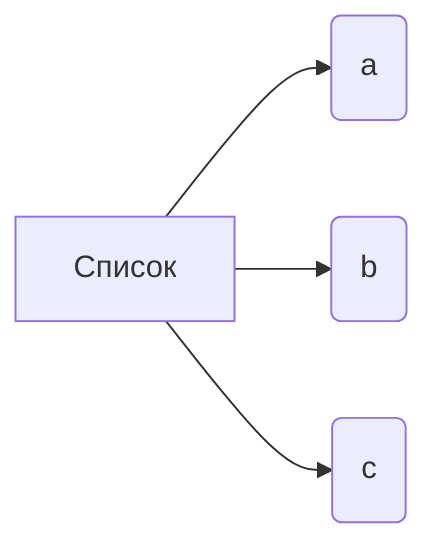

# Анализ кода

**<input code>**:

```
["a","b","c"]
```

**<algorithm>**:

Код представляет собой простую строковую последовательность, состоящую из трех элементов: "a", "b" и "c".  Алгоритм работы заключается в представлении этой последовательности в виде списка.  На данном уровне нет явных вызовов функций или сложной логики.

**Пример:**

```
Список: ["a", "b", "c"]
```

**<mermaid>**:



**<explanation>**:

Данный код не является фрагментом функционального программного кода, а скорее представляет собой простейшую строковую константу (список) содержащую три элемента,  "a", "b", "c". Он не содержит импортов, классов или функций.  Это просто набор строк, которые могут использоваться как входные данные для другой программы или быть частью более сложной структуры данных.

**Взаимосвязь с другими частями проекта:**

В данном случае нет очевидной связи с другими частями проекта, так как код представляет собой изолированную последовательность. Он может быть частью большего проекта,  например, в качестве входных данных для обработки или для инициализации данных.  Понимание контекста (в каком файле/блоке кода он находится, какие переменные используются) позволит определить взаимосвязь с другими частями проекта.

**Возможные ошибки или области для улучшений:**

Нет ошибок, но нет и никакой функциональности.  Для более эффективной работы, данные должны быть использованы с какой-то целью. Например, возможно, это часть входных данных для функции, которая обрабатывает строки в этом списке.