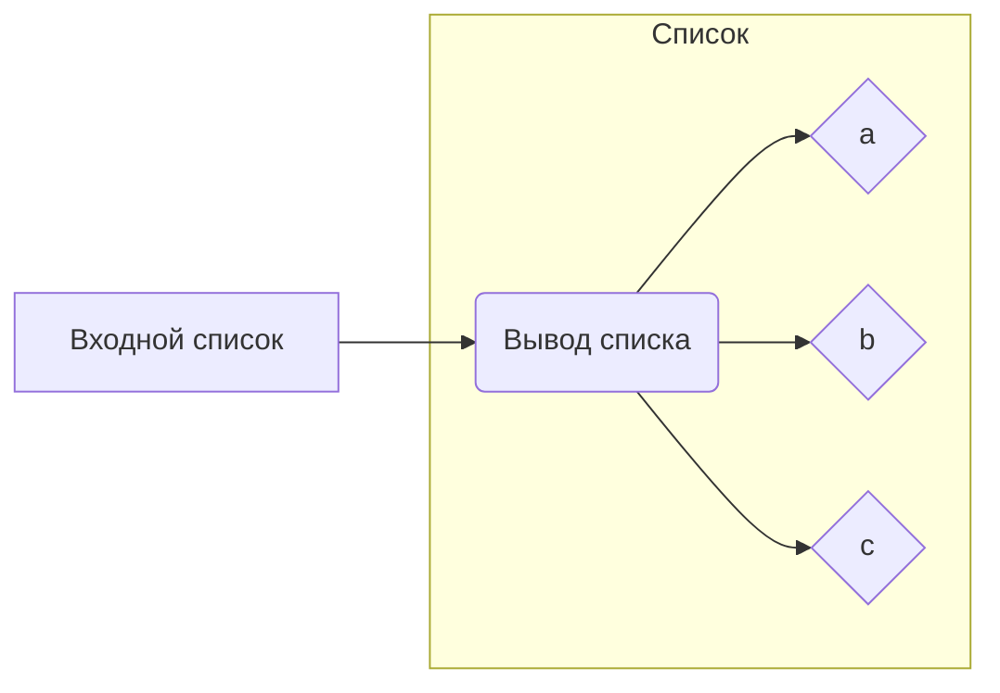

# Анализ кода

**1. <input code>**

```
["a","b","c"]
```

**2. <algorithm>**

Код представляет собой список строк.  Алгоритм работы сводится к непосредственному представлению этого списка.  Нет циклов, вызовов функций или сложных операций.

**Пример:**

Входные данные: `["a","b","c"]`

Результат:  `["a","b","c"]`

**3. <mermaid>**



**Диаграмма** отображает простое отображение входного списка на вывод.  Нет сложных зависимостей или подключаемых модулей.

**4. <explanation>**

Код представляет собой простой список строк, содержащий элементы `"a"`, `"b"`, и `"c"`.  Это не функция, класс или модуль, а просто данные.  Поэтому нет импортов, классов, функций или других сложных элементов для анализа.

* **Импорты:** Отсутствуют, так как это не код программы, а просто данные.
* **Классы:** Отсутствуют.
* **Функции:** Отсутствуют.
* **Переменные:**  Список `["a","b","c"]` можно рассматривать как переменную, содержащую список строк.  Тип переменной - список строк.
* **Возможные ошибки или области для улучшений:** Нет ошибок, так как код представляет собой просто данные.  Для улучшения, если бы это был фрагмент кода, работающего в каком-то контексте, то лучше было бы определить его как переменную или использовать в контексте с соответствующими данными.

**Цепочка взаимосвязей с другими частями проекта:**

Без контекста, нет взаимосвязей с другими частями проекта. Данные являются просто списком элементов, без функций, классов или зависимостей от внешних файлов.  Чтобы определить взаимосвязи, нужно увидеть, как этот список используется в контексте более крупного кода.