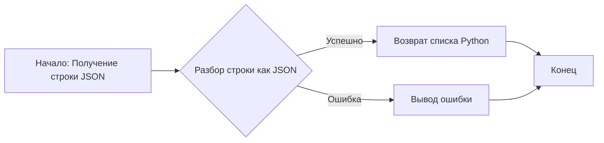
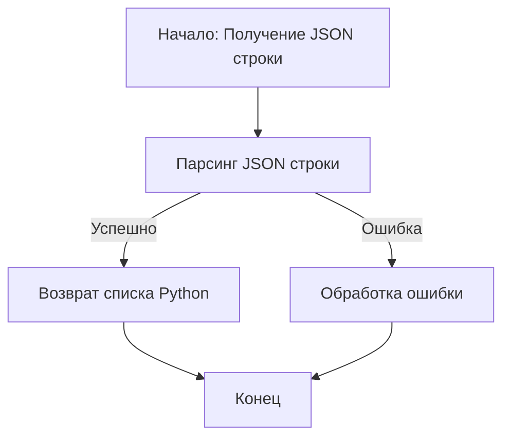

## АНАЛИЗ КОДА

### 1. <алгоритм>

**Описание:**

1. **Получение данных:** На вход подается строка, представляющая список в формате JSON: `["a", "b", "c"]`.
2. **Разбор JSON:** Строка проходит синтаксический анализ (парсинг) как JSON, что преобразует ее в объект списка Python: `['a', 'b', 'c']`.
3. **Возврат данных:** Полученный список возвращается как результат.

**Примеры:**

*   **Вход:** `["apple", "banana", "cherry"]`
    **Результат:** `['apple', 'banana', 'cherry']`

*   **Вход:** `["1", "2", "3"]`
    **Результат:** `['1', '2', '3']`

*   **Вход:** `[]`
    **Результат:** `[]`

**Блок-схема:**



### 2. <mermaid>


**Описание зависимостей `mermaid`:**

Диаграмма `mermaid` описывает процесс обработки входных данных. 
1.  `Start`: Начало процесса с получения строки JSON. 
2.  `ParseJSONString`: Происходит парсинг строки JSON, в результате которого строка преобразуется в объект списка Python.
3.  `ReturnList`:  Если парсинг успешен, возвращается объект списка Python. 
4.  `ErrorHandling`: Если парсинг не успешен, происходит обработка ошибки. 
5.  `End`: Конец процесса.

### 3. <объяснение>

**Импорты:**

В предоставленном коде нет импортов, поскольку это просто строка, а не код Python. Однако подразумевается, что эту строку нужно проанализировать, используя библиотеку, которая будет это делать, например `json` из стандартной библиотеки Python.

**Классы:**

В предоставленном коде нет классов.

**Функции:**

В предоставленном коде нет функций. Но, если представить что этот JSON будет распарсен Python функцией, то это могла бы быть функция следующего вида:

```python
import json
def parse_json_string(json_string):
    """
    Парсит JSON строку в список Python.

    Аргументы:
        json_string (str): Строка в формате JSON, представляющая список.

    Возвращает:
        list: Список Python, полученный из JSON строки.
              Возвращает None, если происходит ошибка во время разбора.

    Пример:
        >>> parse_json_string('["a", "b", "c"]')
        ['a', 'b', 'c']
    """
    try:
        return json.loads(json_string)
    except json.JSONDecodeError:
        print(f"Ошибка: Неправильный формат JSON - {json_string}")
        return None
```

*   `parse_json_string(json_string)`:
    *   **Аргументы:** `json_string` (строка): Строка, представляющая список в формате JSON.
    *   **Возвращает:** Список Python, полученный из JSON строки.
        *   Если разбор JSON успешен, возвращается список.
        *   Если разбор JSON не удался (например, неверный формат), возвращается `None`.
    *   **Назначение:** Разбирает JSON строку и преобразует ее в список Python.

**Переменные:**

*   `json_string` (строка): Входная строка в формате JSON.
*   `result` (список): Результат разбора JSON строки (если разбор успешен),
    либо `None` в случае неудачи.

**Потенциальные ошибки и улучшения:**

*   **Ошибка обработки JSON:** Если входная строка не является допустимым JSON, возникнет ошибка `JSONDecodeError`.
    В примере функции это обрабатывается через `try...except` блок.
*   **Улучшение:** Можно добавить проверки типов входных данных и добавить дополнительную логику обработки, если, к примеру, будет подан не список, а словарь, или другое значение.

**Цепочка взаимосвязей с другими частями проекта:**

Представленная строка, скорее всего, используется как данные для `pprint`, и она передается ему для дальнейшего форматирования, но пока это просто строка, до тех пор, пока она не будет использована.

Этот анализ обеспечивает всестороннее понимание предоставленного кода и его потенциального использования.