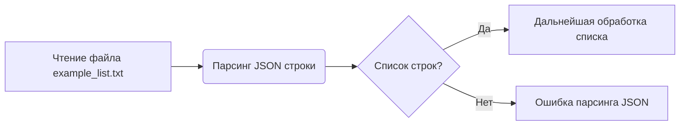

## Анализ кода: `example_list.txt`

### 1. <алгоритм>

**Описание:**
Файл `example_list.txt` содержит простую строку, представляющую собой JSON-массив строк. Задача заключается в интерпретации и понимании структуры данных, а именно - это список строковых литералов.

**Пошаговая блок-схема:**

1. **Чтение файла:**
   -  Файл `example_list.txt` читается как строка.
   -  Пример: Содержимое файла `"[\"a\",\"b\",\"c\"]"` становится строкой.

2. **Разбор JSON:**
   - Строка, представляющая JSON-массив, разбирается (парсится) с использованием JSON-библиотеки (в контексте Python - `json.loads()`).
   -  Пример: Строка `"[\"a\",\"b\",\"c\"]"` преобразуется в список `["a", "b", "c"]`.

3. **Обработка списка:**
    - Полученный список может быть использован в дальнейшем коде.
    - В данном случае, поскольку это пример, предполагается, что список обрабатывается в соответствии с целями использующего его скрипта. 

4. **Завершение:**
   - Результат обработки списка (если таковой имеется) используется для дальнейших операций.

### 2. <mermaid>

**Объяснение диаграммы `mermaid`:**

-   **A[Чтение файла `example_list.txt`]:**  Начало процесса, где файл читается и его содержимое сохраняется в виде строки. Это действие представляет собой начальную точку обработки данных.
-   **B(Парсинг JSON строки):**  Следующий шаг -  строка с содержимым JSON разбирается (парсится) в структуру данных (в данном случае, список строк). Этот шаг критически важен для преобразования строки в полезные данные.
-   **C{Список строк?}:**  Проверка. Определяет, был ли парсинг JSON успешным и является ли результатом список строк.
-   **D[Дальнейшая обработка списка]:** Если парсинг прошел успешно и получен список строк, этот шаг представляет собой использование списка в других частях кода.
-   **E[Ошибка парсинга JSON]:** Если парсинг завершается с ошибкой, это означает, что данные не могут быть использованы как список строк и требуется обработка ошибки.

**Зависимости диаграммы:**

В данном примере, диаграмма показывает основной поток управления, связанный с обработкой данных из файла. Нет прямых зависимостей от внешних модулей на уровне диаграммы. Однако, подразумевается использование модуля для парсинга JSON, как `json` в Python, что не явно отображено на диаграмме.

### 3. <объяснение>

**Импорты:**
В данном примере не происходит явных импортов, так как файл содержит только данные. Однако, при дальнейшей обработке, потребуется импорт модуля `json` (в Python) для парсинга строки в список.

**Классы:**
Классы не используются в этом примере.

**Функции:**
Не используются функции, но предполагается использование функции `json.loads()` из стандартной библиотеки Python для парсинга JSON-строки.

- `json.loads(string)`: принимает строку JSON и возвращает объект Python (в данном случае список строк).

**Переменные:**
- В файле находится строка, представляющая собой JSON-массив строк: `"[\"a\",\"b\",\"c\"]"`.
- При обработке эта строка может быть сохранена в переменную, например, `json_string`.
- После разбора, список строк будет сохранен в переменную, например, `string_list`.

**Потенциальные ошибки и области для улучшения:**

1.  **Ошибка парсинга JSON:** Если файл содержит невалидный JSON, `json.loads()` выдаст исключение. Необходимо добавить обработку исключений.
2.  **Отсутствие файла:** Обработать ситуацию, когда файл не найден.
3.  **Неверный формат данных:** Файл может содержать данные не в формате JSON-массива строк, что приведет к ошибке парсинга.
4.  **Использование в контексте:** Для реального применения необходимо знать, что именно нужно сделать со списком.

**Взаимосвязи с другими частями проекта:**

Этот файл `example_list.txt` может использоваться в качестве входных данных для:
*  **PowerShell скриптов:** Для обработки данных и вывода информации в командной строке.
*  **Python скриптов:** Для парсинга данных, дальнейшей обработки и манипуляций со списком.
*  **Тестов:** Для проверки корректности работы других модулей, обрабатывающих списки.

Файл предоставляет простой способ хранения и передачи списка строк.