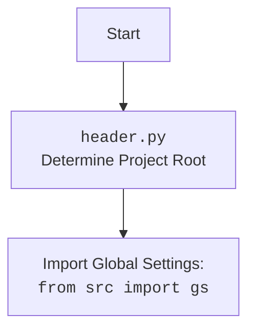

## АНАЛИЗ КОДА: `example_pprint.py`

### 1. <алгоритм>

1.  **Начало:** Запуск скрипта `example_pprint.py`.

    *   _Пример:_ `python example_pprint.py`
2.  **Импорт `header`:** Выполняется импорт модуля `header`. Этот модуль, вероятно, отвечает за определение корневой директории проекта и, возможно, за загрузку глобальных настроек.

    *   _Пример:_ `import header`
3.  **Импорт `pretty_print`:** Импортируется функция `pprint` из стандартной библиотеки Python `pprint` и переименовывается в `pretty_print`.

    *   _Пример:_ `from pprint import pprint as pretty_print`
4.  **Импорт `pprint` (из `src.printer`):** Импортируется функция `pprint` из пользовательского модуля `src.printer`. Это, вероятно, кастомная реализация функции `pprint`.

    *   _Пример:_ `from src.printer import pprint`
5.  **Вызов `pprint`:** Вызывается функция `pprint` (из `src.printer`) для вывода строки "Hello, world!".

    *   _Пример:_ `pprint("Hello, world!")`
6.  **Конец:** Завершение работы скрипта.
### 2. <mermaid>

```mermaid
flowchart TD
    Start[Start] --> ImportHeader[Import <code>header.py</code><br>Determine Project Root]
    ImportHeader --> ImportPrettyPrint[Import <code>pprint</code> from standard library <br>as <code>pretty_print</code>]
    ImportPrettyPrint --> ImportCustomPPrint[Import <code>pprint</code> from <code>src.printer</code>]
    ImportCustomPPrint --> CallCustomPPrint[Call <code>pprint("Hello, world!")</code> from <code>src.printer</code>]
    CallCustomPPrint --> End[End]
```



### 3. <объяснение>

**Импорты:**

*   `import header`: Импортирует модуль `header`. Предполагается, что этот модуль находится в той же директории или в одной из родительских директорий. Назначение этого модуля - определить корень проекта и, возможно, загрузить глобальные настройки, которые используются в других частях проекта, обеспечивая согласованность и доступность конфигураций.  Он инициализируется в начале работы скрипта и выполняет важные подготовительные действия перед использованием других модулей.
*   `from pprint import pprint as pretty_print`: Импортирует стандартную функцию `pprint` из модуля `pprint` и переименовывает ее в `pretty_print`. Эта функция используется для "красивой" печати данных, особенно сложных структур, таких как списки и словари. В данном коде эта функция не используется, но она импортирована.
*   `from src.printer import pprint`: Импортирует функцию `pprint` из модуля `printer`, находящегося в пакете `src`.  Это, вероятно, кастомная реализация функции pretty print, которая может отличаться от стандартной библиотеки `pprint`.  Это может быть сделано для расширения функциональности, настройки форматирования или интеграции с другими компонентами проекта. Зависимость от пакета `src` указывает на то, что это часть внутренней логики проекта.

**Функции:**

*   `pprint("Hello, world!")`: Вызывает функцию `pprint` из модуля `src.printer` и передает ей строку "Hello, world!".  Эта функция, скорее всего, выводит переданный аргумент на консоль, но с возможным форматированием, зависящим от реализации `src.printer.pprint`.

**Переменные:**

*   В данном коде явных переменных не объявлено, используются только импортированные функции и строка в качестве аргумента.

**Объяснение:**

Скрипт начинается с импорта необходимых модулей, включая кастомную функцию `pprint` из пакета `src.printer` и стандартную библиотеку `pprint`,  хотя последняя в коде не используется. Затем вызывается функция `pprint` с аргументом "Hello, world!",  которая, вероятно, выводит эту строку в консоль.

**Цепочка взаимосвязей:**

1.  Скрипт `example_pprint.py` зависит от модуля `header`, используемого для определения корня проекта и глобальных настроек.
2.  Скрипт зависит от модуля `src.printer`, в частности, от функции `pprint`. Этот модуль, вероятно, содержит кастомные функции для вывода данных.
3.  Скрипт использует стандартную библиотеку Python `pprint` (хотя в коде она и не вызывается), но при этом использует псевдоним.

**Потенциальные ошибки и области для улучшения:**

*   Импорт `pretty_print` из `pprint`, при этом не используется. Это может привести к замешательству и излишнему потреблению ресурсов. Этот импорт следует убрать.
*   Использование `...` является ошибкой, т.к. это невалидный код.
*   Отсутствие явного описания назначения модуля в начале файла, хотя есть комментарии с пометкой "HERE SHOULD BE A DESCRIPTION OF THE MODULE OPERATION !".
*   Отсутствуют проверки на наличие файла `header.py`, что может привести к ошибкам времени выполнения, если файл отсутствует.
*   Необходимость в пояснении функциональности кастомной реализации `src.printer.pprint` чтобы понимать разницу между библиотечной `pprint`.