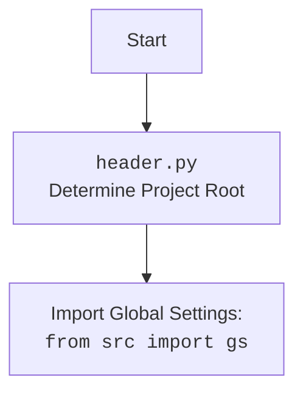

## Анализ кода `header.py`

### 1. `<алгоритм>`:

1. **Получение текущей директории:**
   - Используется `os.getcwd()` для получения абсолютного пути текущей рабочей директории. Например: `/home/user/projects/hypotez/src/utils/powershell/examples/pprint`.
2. **Определение корневой директории проекта:**
   - Используется `os.getcwd().rfind(r'hypotez')` для поиска индекса последнего вхождения подстроки `hypotez` в пути текущей директории.
   - К индексу добавляется 7 (`+7`) для получения конца директории 'hypotez'. 
   - Отрезается строка пути до найденного индекса, создавая путь к корню проекта. Например: `/home/user/projects/hypotez`.
3. **Преобразование пути в объект Path:**
   - Полученная строка пути преобразуется в объект `Path` из библиотеки `pathlib` для удобства работы с путями.
4. **Добавление корневой директории в `sys.path`:**
   - Корневой путь проекта добавляется в `sys.path`, позволяя импортировать модули и пакеты из любой точки проекта, независимо от текущей директории.

### 2. `<mermaid>`:

```mermaid
flowchart TD
    Start(Start) --> GetCurrentDir[GetCurrentDir: <code>os.getcwd()</code> <br> Get current working directory: /home/user/projects/hypotez/src/utils/powershell/examples/pprint]
    GetCurrentDir --> FindHypotezIndex[FindHypotezIndex: <code>os.getcwd().rfind('hypotez')</code><br> Find the last index of 'hypotez' : 20]
    FindHypotezIndex --> CalculateRootPathEnd[CalculateRootPathEnd: index + 7<br> Calculate end of the project root path : 27]
    CalculateRootPathEnd --> SliceRootPathString[SliceRootPathString: <code>os.getcwd()[:index + 7]</code> <br> Slice string of path to root directory: /home/user/projects/hypotez]
    SliceRootPathString --> CreatePathObject[CreatePathObject: <code>Path(...)</code><br> Create Path object from root directory string]
    CreatePathObject --> AppendToSysPath[AppendToSysPath: <code>sys.path.append(...)</code><br> Append project root to sys.path]
    AppendToSysPath --> End(End)
```


### 3. `<объяснение>`:

#### Импорты:
- `import sys, os`:
    - `sys`: Предоставляет доступ к некоторым переменным и функциям, которые взаимодействуют с интерпретатором Python. Используется для изменения пути поиска модулей `sys.path`.
    - `os`: Обеспечивает переносимый способ использования функций, зависящих от операционной системы. В данном случае используется функция `os.getcwd()` для получения текущей рабочей директории.
- `from pathlib import Path`:
    - `pathlib.Path`: Представляет пути к файлам и директориям как объекты, что упрощает манипуляции с ними. В данном случае используется для создания объекта `Path` из строки, представляющей путь к корню проекта.

#### Переменные:
- `__root__: Path`: 
    - Переменная типа `Path`, хранящая абсолютный путь к корневой директории проекта.
    - Вычисляется динамически на основе текущей рабочей директории и используется для добавления корня проекта в `sys.path`.

#### Функции:
- В коде нет явно определенных функций. Код в файле `header.py` выполняется при импорте, инициализирует переменную `__root__` и добавляет её в `sys.path`.
- `os.getcwd()`: Возвращает строку, представляющую путь к текущей рабочей директории.
- `str.rfind(sub)`: Возвращает индекс последнего вхождения подстроки `sub` в строке или -1, если подстрока не найдена.
- `sys.path.append(path)`: Добавляет путь `path` в список путей, по которым Python ищет модули при импорте.

#### Взаимосвязь с другими частями проекта:

- `header.py` используется в качестве базового файла для определения корневой директории проекта. Это необходимо для правильного импорта модулей и пакетов из других частей проекта, особенно когда скрипты запускаются из разных директорий.
- Переменная `__root__` используется другими модулями, импортирующими `header`, для доступа к корневой директории.
- Присутствие `sys.path.append (__root__)` позволяет использовать импорты вида `from src import gs`, `from src.utils import module`.

#### Потенциальные ошибки и области для улучшения:

- **Жестко закодированная подстрока `'hypotez'`:**
    - Если имя папки будет изменено, то код будет нерабочим. Было бы лучше сделать настройку в `gs.py`, чтобы задать имя папки проекта.
- **Отсутствие обработки ошибки:**
  -  `os.getcwd().rfind(r'hypotez')` вернет `-1` если `hypotez` не найдено.  В таком случае код `[:os.getcwd().rfind(r'hypotez\')+7]` выдаст ошибку `IndexError`. Нужно добавить проверку.
- **Комментарии:**
    - Комментарии в начале файла неинформативны и не соответствуют PEP-257. Нужно пересмотреть их.
- **Условность:**
  - Если файл выполняется не в директории, где есть `hypotez`, скрипт упадет с ошибкой `IndexError`. Нужно предусмотреть случай, если файл `header.py` вызывается где-либо кроме как в `hypotez`.