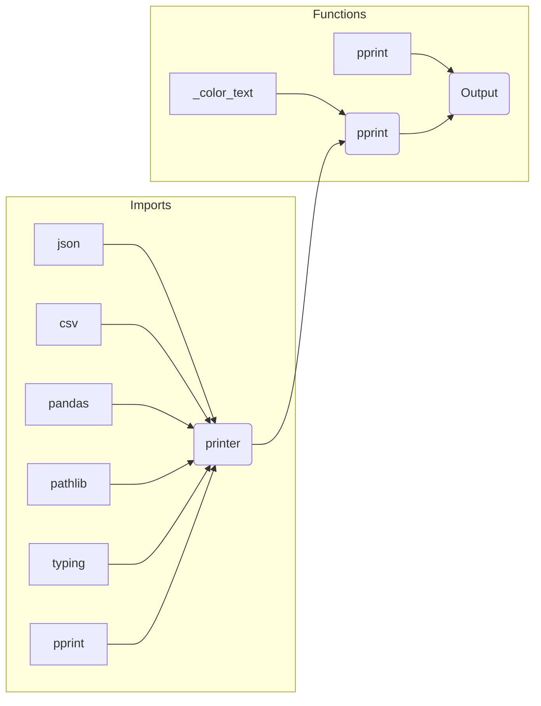

# <input code>

```python
## \file hypotez/src/utils/printer.py
# -*- coding: utf-8 -*-\
#! venv/Scripts/python.exe
#! venv/bin/python/python3.12

"""
.. module:: src.utils
    :platform: Windows, Unix
    :synopsis: Utility functions for pretty printing and text styling.

This module provides functions to print data in a human-readable format with optional text styling, including color, background, and font styles.

Functions:
    - :func:`_color_text`
    - :func:`pprint`
"""

MODE = 'dev'

import json
import csv
import pandas as pd
from pathlib import Path
from typing import Any
from pprint import pprint as pretty_print

# ANSI escape codes
RESET = "\\033[0m"

TEXT_COLORS = {
    "red": "\\033[31m",
    "green": "\\033[32m",
    "blue": "\\033[34m",
    "yellow": "\\033[33m",
    "white": "\\033[37m",
    "cyan": "\\033[36m",
    "magenta": "\\033[35m",
    "light_gray": "\\033[37m",
    "dark_gray": "\\033[90m",
    "light_red": "\\033[91m",
    "light_green": "\\033[92m",
    "light_blue": "\\033[94m",
    "light_yellow": "\\033[93m",
}

BG_COLORS = {
    "bg_red": "\\033[41m",
    "bg_green": "\\033[42m",
    "bg_blue": "\\033[44m",
    "bg_yellow": "\\033[43m",
    "bg_white": "\\033[47m",
    "bg_cyan": "\\033[46m",
    "bg_magenta": "\\033[45m",
    "bg_light_gray": "\\033[47m",
    "bg_dark_gray": "\\033[100m",
    "bg_light_red": "\\033[101m",
    "bg_light_green": "\\033[102m",
    "bg_light_blue": "\\033[104m",
    "bg_light_yellow": "\\033[103m",
}


FONT_STYLES = {
    "bold": "\\033[1m",
    "underline": "\\033[4m",
}


def _color_text(text: str, text_color: str = "", bg_color: str = "", font_style: str = "") -> str:
    """Apply color, background, and font styling to the text."""
    return f"{font_style}{text_color}{bg_color}{text}{RESET}"


def pprint(print_data: Any = None, text_color: str = "white", bg_color: str = "", font_style: str = "") -> None:
    """Pretty prints the given data with optional color, background, and font style."""
    # ... (rest of the pprint function)
```

# <algorithm>

```mermaid
graph TD
    A[Input print_data, text_color, bg_color, font_style] --> B{Is print_data None?};
    B -- Yes --> C[Print "No data to print!" (red)];
    B -- No --> D{Is print_data dict?};
    D -- Yes --> E[Print json.dumps(print_data, indent=4) (colored)];
    D -- No --> F{Is print_data list?};
    F -- Yes --> G[Loop through print_data items, print each item (colored)];
    F -- No --> H{Is print_data str/Path and file exists?};
    H -- Yes --> I{Is file .csv or .xls?};
    I -- Yes --> J[Print "File reading supported for .csv, .xls only." (colored)];
    I -- No --> K[Print "Unsupported file type." (colored)];
    H -- No --> L[Print str(print_data) (colored)];
    L --> M[Error Handling (catch exceptions)];
    M --> N[Print "Error: {ex}" (red)];
    C --> O[End];
    E --> O;
    G --> O;
    J --> O;
    K --> O;
    L --> O;
	N --> O;

```
**Пример:**
Входные данные: `pprint({"name": "Bob", "age": 30}, text_color="green")`
1. `print_data` не `None`.
2. `print_data` - словарь.
3. Выполняется `json.dumps({"name": "Bob", "age": 30}, indent=4)`.
4. Возвращается отформатированная строка JSON.
5. `_color_text` применяет цвет "зеленый" к строке JSON.
6. Выводится на консоль.


# <mermaid>




# <explanation>

**Импорты:**

- `json`: Для сериализации и десериализации данных в формате JSON.
- `csv`: Для работы с файлами CSV.  Важен, т.к. предоставляет возможность читать данные из CSV, но в этом коде обработка CSV не используется для всех файлов.
- `pandas as pd`: Для работы с файлами в формате Excel (`.xls`). Этот импорт не используется напрямую, но нужен для проверки расширения файла.
- `pathlib`: Предоставляет классы для работы с путями к файлам.
- `typing`: Используется для улучшения типажа, но не в полной мере.
- `pprint`: Используется для красивой печати данных,  что делает вывод более удобным для чтения.

**Классы:**

- Нет явных классов.

**Функции:**

- `_color_text(text, text_color="", bg_color="", font_style="")`:  Эта вспомогательная функция применяет стили (цвет текста, цвет фона, стиль шрифта) к строке, используя ANSI escape коды.  Она принимает строку и необязательные параметры для стилизации. Возвращает отформатированную строку.  Это позволяет выводить информацию на консоль в разных стилях.  
- `pprint(print_data, text_color="white", bg_color="", font_style="")`:  Функция для красивой печати данных на консоль. Принимает данные любого типа (кроме массивов NumPy, которые не обрабатываются).  В зависимости от типа данных печатает его с помощью `json.dumps()` (для словарей), итерирует по элементам списка.  Принимает параметры `text_color`, `bg_color`, `font_style` для стилизации вывода. Возвращает `None`.

**Переменные:**

- `MODE = 'dev'`: Вероятно, параметр для выбора режима работы.
- `RESET`, `TEXT_COLORS`, `BG_COLORS`, `FONT_STYLES`:  Словари, содержащие ANSI escape коды для различных стилей текста.

**Возможные ошибки или области для улучшений:**

- **Обработка ошибок:**  Функция `pprint` обрабатывает исключения (`try...except`) при работе с JSON, но не обрабатывает все потенциальные ошибки. Например, при работе с файлами она проверяет тип `.csv` или `.xls`, но не проверяет корректность самих данных в файлах. Должна быть более полная проверка ошибок.
- **Поддержка дополнительных типов:** Функция могла бы поддерживать больше типов данных, например, массивы NumPy.  
- **Типизация:**  В целом, используется типизация `typing.Any`, что может привести к ошибкам в дальнейшем. При использовании функций в других частях приложения, не рекомендуется, лучше использовать конкретные типы данных.
- **Возможность обработки NumPy массивов**


**Взаимосвязи с другими частями проекта:**

Функция `pprint` предназначена для вывода информации на консоль.  Она может использоваться в различных частях приложения для вывода результатов работы, отладки,  представления данных пользователю.  Её вызовы будут находиться в других модулях приложения.