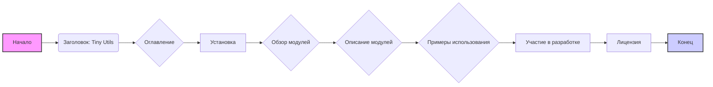

## Анализ кода

### <алгоритм>

**Описание:** Этот документ представляет собой README-файл для библиотеки `Tiny Utils`, написанный на русском языке. Он структурирован для описания назначения, установки и использования библиотеки.

**Блок-схема:**

1.  **Начало**: Загрузка README.md.
2.  **Заголовок**: Отображение основной информации о библиотеке (название, ссылка на github).
3.  **Оглавление**: Перечисление основных разделов документа для навигации.
    *   Пример: `Tiny Utils`, `Установка`, `Обзор модулей`.
4.  **Установка**: Предоставление инструкций для клонирования репозитория и установки зависимостей.
    *   Пример:  `git clone https://github.com/hypo69/tiny-utils.git`, `pip install -r requirements.txt`.
5.  **Обзор модулей**: Общее описание подмодулей библиотеки.
    *   Пример: "Преобразователи", "Утилиты для строк", "Утилиты для работы с файлами".
6.  **Описание модулей**: Подробное описание каждого подмодуля с перечислением утилит.
    *   Пример: Модуль `Преобразователи` включает `text2png.py`, `tts.py`, `webp2png.py`.
7.  **Примеры использования**: Демонстрация использования библиотеки на конкретных примерах.
    *   Пример: Преобразование текста в изображение PNG, преобразование XML в словарь, манипуляции JSON.
8.  **Участие в разработке**: Раздел, предоставляющий информацию для тех, кто хочет участвовать в развитии библиотеки.
9.  **Лицензия**: Указание лицензии, под которой распространяется библиотека.
10. **Конец**: Завершение документа README.md.

**Поток данных:**
В этом файле нет явного потока данных между функциями или классами, так как это README.md файл. Он служит для предоставления документации и информации.

### <mermaid>

**Анализ зависимостей:**

*   **graph LR**: Определяет тип диаграммы как направленный граф, где связи идут слева направо.
*   **A[Начало]**:  Начальная точка процесса, обозначает начало загрузки README.md.
*   **B(Заголовок: Tiny Utils)**: Отображение заголовка документа с названием библиотеки.
*   **C{Оглавление}**: Раздел с оглавлением, где перечислены основные разделы.
*   **D[Установка]**:  Раздел с инструкциями по установке.
*  **E{Обзор модулей}**: Раздел с обзором подмодулей библиотеки.
*   **F{Описание модулей}**: Раздел с подробным описанием модулей.
*   **G{Примеры использования}**:  Раздел с примерами использования библиотеки.
*   **H[Участие в разработке]**: Раздел для информации о разработке библиотеки.
*  **I[Лицензия]**: Раздел с информацией о лицензировании.
*   **J[Конец]**: Конечная точка процесса.

Все имена переменных являются осмысленными и описательными, отражающими разделы документа.

### <объяснение>

**Импорты:**

*   В данном файле нет импортов, так как это файл `markdown`, а не программный код.

**Классы:**

*   В данном файле нет классов, так как это файл `markdown`, а не программный код.

**Функции:**

*   В данном файле нет функций, так как это файл `markdown`, а не программный код.

**Переменные:**

*   В данном файле нет переменных, так как это файл `markdown`, а не программный код.

**Объяснение:**

Этот файл является README.md для библиотеки `Tiny Utils`. Он предназначен для того, чтобы объяснить пользователям, как установить, использовать и взаимодействовать с библиотекой.

*   **Структура**: Документ хорошо структурирован, разделен на логические разделы, что упрощает навигацию и понимание.
*   **Содержание**:
    *   Содержит обзор библиотеки, включая её назначение и функциональность.
    *   Предоставляет инструкции по установке, что позволяет пользователям быстро начать работу с библиотекой.
    *   Описывает различные модули и их назначение, что помогает пользователям ориентироваться в коде.
    *   Примеры использования показывают, как библиотека может быть применена в реальных сценариях.
*   **Цепочка взаимосвязей**:
    *   Файл `readme.ru.md` находится в директории `hypotez/src/utils/`, что показывает его принадлежность к утилитам проекта.
    *   Он является частью документации для библиотеки `Tiny Utils`, которая, вероятно, используется в других частях проекта `hypotez`.

**Потенциальные ошибки или области для улучшения:**

*   **Примеры использования**: Можно добавить больше примеров использования для каждого модуля, чтобы лучше продемонстрировать его возможности.
*   **Развитие**: Можно добавить раздел "Изменения", чтобы отслеживать историю изменений в библиотеке.
*   **Глобализация**: Если есть необходимость в поддержке других языков, можно создать аналогичные README-файлы на других языках.

**Заключение:**

Этот README.md является важной частью проекта, обеспечивая пользователей необходимой информацией для понимания и использования библиотеки. Документ хорошо структурирован и предоставляет подробное описание функциональности библиотеки, включая инструкции по установке и примеры использования. Небольшие дополнения в виде примеров использования для каждого модуля могли бы еще больше упростить использование библиотеки.