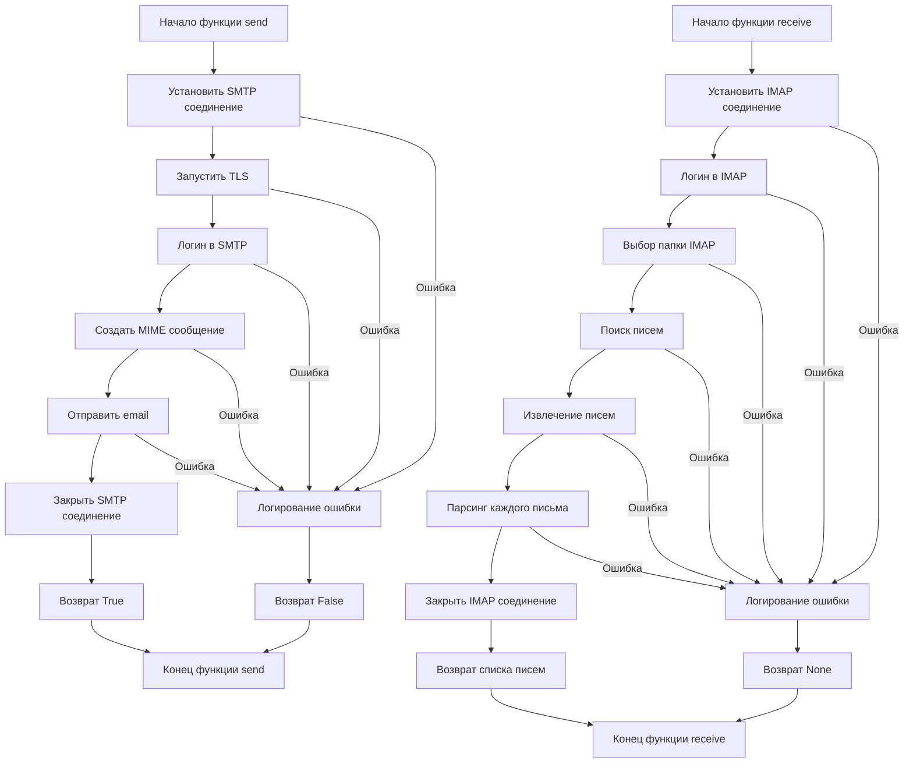

## <алгоритм>

**send(subject, body, to)**

1.  **Начало:** Функция `send` принимает `subject` (тема письма), `body` (тело письма), и `to` (адрес получателя). По умолчанию, `to` установлен в `'one.last.bit@gmail.com'`.
    *   Пример: `send(subject="Тест", body="Это тестовое письмо.", to="test@example.com")`

2.  **Создание SMTP-соединения:** Создается SMTP-соединение с сервером и портом, полученными из `_connection`.
    *   `smtp = smtplib.SMTP(_connection['server'], _connection['port'])`
    *   Пример: Соединение с `smtp.example.com` по порту `587`.

3.  **Начало TLS:** Запускается TLS-шифрование соединения.
    *   `smtp.ehlo()`
    *   `smtp.starttls()`

4.  **Аутентификация:** Происходит вход на SMTP-сервер с использованием имени пользователя и пароля из `_connection`.
    *   `smtp.login(_connection['user'], _connection['password'])`
    *   Пример: Вход с именем пользователя `testuser` и паролем `testpass`.

5.  **Создание MIME-сообщения:** Создается MIME-сообщение с телом письма, темой, отправителем и получателем.
    *   `message = MIMEText(body)`
    *   `message["Subject"] = subject`
    *   `message["From"] = _connection['user']`
    *   `message["To"] = to`
    *   Пример: Тело письма `Это тестовое письмо`, тема `Тест`, отправитель `testuser`, получатель `test@example.com`.

6.  **Отправка письма:** Письмо отправляется с использованием созданного SMTP-соединения.
    *   `smtp.sendmail(_connection['user'], to, message.as_string())`

7.  **Закрытие SMTP-соединения:** Соединение с SMTP-сервером закрывается.
    *   `smtp.quit()`

8.  **Успешное завершение:** Функция возвращает `True`.

9.  **Обработка ошибок:** Если в процессе происходит исключение, оно логируется с использованием `logger.error`, и функция возвращает `False`.

**receive(imap_server, user, password, folder)**

1.  **Начало:** Функция `receive` принимает `imap_server` (адрес IMAP сервера), `user` (имя пользователя), `password` (пароль) и `folder` (папка для просмотра почты, по умолчанию 'inbox').
    *   Пример: `receive(imap_server="imap.example.com", user="testuser", password="testpass", folder="INBOX")`

2.  **Создание IMAP-соединения:** Создается IMAP-соединение с сервером.
    *   `mail = imaplib.IMAP4_SSL(imap_server)`

3.  **Аутентификация:** Происходит вход на IMAP-сервер.
    *    `mail.login(user, password)`

4.  **Выбор папки:** Выбирается папка для работы.
    *   `mail.select(folder)`

5.  **Поиск писем:** Ищутся все письма в выбранной папке.
    *   `status, data = mail.search(None, 'ALL')`
    *   `email_ids = data[0].split()`

6.  **Цикл по письмам:** Для каждого найденного письма выполняется:
    *   **Получение письма:** Запрашивается письмо по его идентификатору.
        *    `status, data = mail.fetch(email_id, '(RFC822)')`
        *    `raw_email = data[0][1]`
    *   **Парсинг письма:** Извлекается сообщение из байтов.
         *    `msg = email.message_from_bytes(raw_email)`
    *   **Извлечение данных:** Извлекается тема, отправитель и тело письма.
        *    `email_data = {
                'subject': msg['subject'],
                'from': msg['from'],
                'body': msg.get_payload(decode=True, _charset="utf-8").decode("utf-8", "ignore")
            }`
    *   **Сохранение данных:** Данные письма добавляются в список.
        *   `emails.append(email_data)`

7.  **Закрытие IMAP-соединения:** Закрывается соединение с сервером.
    *   `mail.close()`
    *   `mail.logout()`

8.  **Успешное завершение:** Функция возвращает список словарей с данными писем.

9.  **Обработка ошибок:** Если в процессе происходит исключение, оно логируется с использованием `logger.error`, и функция возвращает `None`.

## <mermaid>



## <объяснение>

**Импорты:**

*   `smtplib`: Используется для отправки электронной почты через протокол SMTP.
*   `imaplib`: Используется для получения электронной почты через протокол IMAP.
*   `email`: Содержит классы и функции для обработки email сообщений.
*   `os`:  Предоставляет функции для взаимодействия с операционной системой, используется для получения переменных окружения.
*   `email.mime.text.MIMEText`: Используется для создания текстовых MIME-сообщений, которые могут быть отправлены по электронной почте.
*    `typing.List, typing.Dict, typing.Optional`: Используются для статической типизации, улучшения читаемости и предотвращения ошибок.
*    `src.logger.logger.logger`: Используется для логирования ошибок и сообщений.

**Переменные:**

*   `_connection`: Словарь, содержащий параметры SMTP-соединения (сервер, порт, имя пользователя, пароль, получатель). Данные берутся из переменных окружения, и если переменные окружения не установлены, используются значения по умолчанию (для сервера и порта), но **НЕ ДЛЯ ИМЕНИ ПОЛЬЗОВАТЕЛЯ И ПАРОЛЯ**.

**Функции:**

*   **`send(subject: str = '', body: str = '', to: str = 'one.last.bit@gmail.com') -> bool`**:
    *   **Аргументы:**
        *   `subject` (str): Тема письма (по умолчанию пустая строка).
        *   `body` (str): Тело письма (по умолчанию пустая строка).
        *   `to` (str): Адрес электронной почты получателя (по умолчанию 'one.last.bit@gmail.com').
    *   **Возвращаемое значение:** `True`, если письмо успешно отправлено, `False` в случае ошибки.
    *   **Назначение:** Отправляет email с заданными параметрами, используя параметры из словаря `_connection`.
    *   **Пример:**
        ```python
        send(subject="Привет", body="Это тестовое письмо", to="test@example.com")
        ```

*   **`receive(imap_server: str, user: str, password: str, folder: str = 'inbox') -> Optional[List[Dict[str, str]]]`**:
    *   **Аргументы:**
        *   `imap_server` (str): Адрес IMAP-сервера.
        *   `user` (str): Имя пользователя для IMAP-сервера.
        *   `password` (str): Пароль для IMAP-сервера.
        *   `folder` (str): Папка для чтения писем (по умолчанию 'inbox').
    *   **Возвращаемое значение:** Список словарей с данными писем (тема, отправитель, тело), или `None` в случае ошибки.
    *   **Назначение:** Получает email сообщения из указанной папки IMAP сервера и возвращает их в виде списка словарей.
    *   **Пример:**
        ```python
        emails = receive(imap_server="imap.example.com", user="testuser", password="testpass", folder="INBOX")
        if emails:
           for email in emails:
              print(f"Subject: {email['subject']}, From: {email['from']}")
        ```

**Потенциальные ошибки и области для улучшения:**

*   **Безопасность:**
    *   **Ключевой момент:** `_connection` не должен содержать учетные данные жестко прописанные в коде. Использование переменных окружения обязательно.
    *   В текущей реализации есть значения по умолчанию для сервера и порта. Это может быть приемлемо для случаев, когда нет необходимости использовать другое значения.
*   **Обработка ошибок:**
    *   Код содержит общую обработку исключений, логирует ошибку и возвращает `False` или `None` при неудаче.
    *  Хотя  `logger.error` предоставляет полезные детали, было бы более информативно логировать конкретный тип ошибки.
*   **Улучшения:**
    *   Добавить возможность отправлять HTML-письма, при помощи `MIMEText(body, 'html')`.
    *   Реализовать более детальный анализ заголовков письма в функции `receive`.
    *  Добавить возможность отправлять письма с вложениями.
    *  Реализовать поддержку других методов аутентификации, кроме логина по имени пользователя и паролю.
    * Добавить обработку ошибок при декодировании тела письма в `receive`, например, указать кодировку явно и обработать ошибки.

**Взаимосвязь с другими частями проекта:**

*   Модуль `smtp.py` является частью модуля `src.utils`. Он использует модуль `src.logger.logger` для ведения журнала.
*   Модуль может быть использован любым другим модулем проекта, которому требуется отправлять email уведомления или обрабатывать входящие сообщения.

**Дополнительные заметки:**

*   Код предоставляет базовые функции для работы с SMTP и IMAP.
*   В коде есть комментарии, поясняющие функциональность.
*   Код хорошо структурирован.