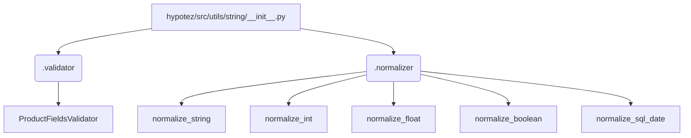

```MD
# Анализ кода hypotez/src/utils/string/__init__.py

1. **<input code>**:

```python
## \file hypotez/src/utils/string/__init__.py
# -*- coding: utf-8 -*-\
#! venv/Scripts/python.exe
#! venv/bin/python/python3.12

"""
.. module: src.utils.string 
	:platform: Windows, Unix
	:synopsis:

"""
MODE = 'dev'

from .validator import ProductFieldsValidator
from .normalizer import (
		normalize_string,
		normalize_int,
		normalize_float,
		normalize_boolean,
		normalize_sql_date,
		)
```

2. **<algorithm>**:

Этот код представляет собой инициализационную часть модуля `hypotez/src/utils/string`. Он не содержит логики выполнения, а лишь импортирует функции и классы из подмодулей `validator` и `normalizer`.  Пошаговая блок-схема  не применима, так как нет вычислений или циклов. Данные не перемещаются, т.к. нет операций.


3. **<mermaid>**:



**Объяснение зависимостей:**

Диаграмма отображает импорты из подмодулей `validator` и `normalizer` в `__init__.py`.  Это указывает на то, что `ProductFieldsValidator` и функции нормализации будут доступны для использования в других модулях проекта, которые импортируют `hypotez/src/utils/string/__init__.py`.


4. **<explanation>**:

* **Импорты**:
    * `from .validator import ProductFieldsValidator`: Импортирует класс `ProductFieldsValidator` из подмодуля `validator`.  Это указывает, что в проекте `hypotez`  имеется функциональность для валидации полей продукта.
    * `from .normalizer import ...`: Импортирует функции `normalize_string`, `normalize_int`, `normalize_float`, `normalize_boolean`, `normalize_sql_date` из подмодуля `normalizer`.  Это говорит о наличии в `hypotez` функций для нормализации различных типов данных (строки, целые, вещественные, булевы и даты в формате SQL).


* **Классы**:
    * `ProductFieldsValidator`: Этот класс, вероятно, используется для валидации данных, связанных с полями продукта. Подробности реализации скрыты в `validator.py`.

* **Функции**:
    * `normalize_*`: Эти функции предназначены для преобразования входных значений в стандартный формат. Например, `normalize_string` вероятно приводит строку к нижнему регистру, удаляет лишние пробелы, и т.п.

* **Переменные**:
    * `MODE = 'dev'`:  Переменная глобального уровня. Вероятно, используется для настройки режима работы приложения (например, 'dev', 'prod').


* **Возможные ошибки/улучшения**:
    * Отсутствует документация внутри модуля, что затрудняет понимание назначения и использования функций. Не указаны типы возвращаемых значений функций.
    * Не определены обработчики ошибок. В случае некорректного входного значения, нормализующие функции могут порождать исключения. Нужно обеспечить обработку ошибок, например, используя try-except блоки.
    * Не указаны входные типы аргументов функций нормализации. Указывайте типы аргументов и возможные исключения.
    * Не указана логика валидации в `ProductFieldsValidator`. 


**Цепочка взаимосвязей**:

Модуль `utils/string` предоставляет вспомогательные функции и классы для работы со строками и данными, которые, вероятно, используются в других частях проекта `hypotez` (например, в модулях для обработки данных, управления продуктами или в представлении данных).


**Заключение**:

Код представляет собой набор вспомогательных инструментов для работы со строками и данными. Для более глубокого понимания необходимо изучить файлы `.validator` и `.normalizer`.  Необходимо дополнить код документацией и обработкой ошибок.