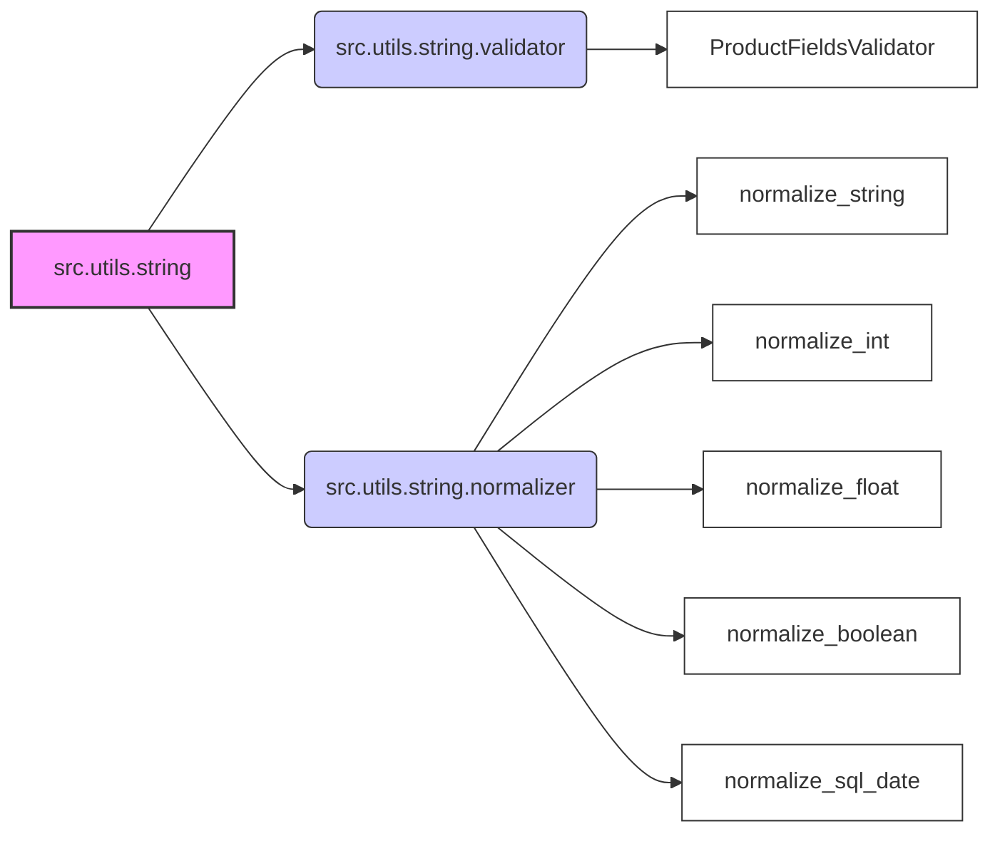

## Анализ кода `hypotez/src/utils/string/__init__.py`

### 1. <алгоритм>

**Блок-схема:**

1.  **Начало:** Инициализация модуля `src.utils.string`.
2.  **Установка режима:** Переменная `MODE` устанавливается в значение `'dev'`.
    *   Пример: `MODE = 'dev'`.
3.  **Импорт `ProductFieldsValidator`:** Импортируется класс `ProductFieldsValidator` из модуля `src.utils.string.validator`.
    *   Пример: `from .validator import ProductFieldsValidator`
4.  **Импорт функций нормализации:** Импортируются функции `normalize_string`, `normalize_int`, `normalize_float`, `normalize_boolean`, `normalize_sql_date` из модуля `src.utils.string.normalizer`.
    *   Пример: `from .normalizer import ( normalize_string, normalize_int, normalize_float, normalize_boolean, normalize_sql_date )`
5.  **Конец:** Модуль готов к использованию, предоставляя доступ к импортированным классам и функциям.

**Поток данных:**

*   Модуль `src.utils.string` импортирует `ProductFieldsValidator` из `src.utils.string.validator`.
*   Модуль `src.utils.string` импортирует функции нормализации из `src.utils.string.normalizer`.
*   Другие части проекта могут импортировать этот модуль и использовать `ProductFieldsValidator` и функции нормализации.

### 2. <mermaid>

**Анализ зависимостей:**

*   `src.utils.string` (A) является главным модулем, который импортирует `src.utils.string.validator` (B) и `src.utils.string.normalizer` (C).
*   `src.utils.string.validator` (B) предоставляет класс `ProductFieldsValidator` (D).
*   `src.utils.string.normalizer` (C) предоставляет функции нормализации: `normalize_string` (E), `normalize_int` (F), `normalize_float` (G), `normalize_boolean` (H), и `normalize_sql_date` (I).
*   Стрелки показывают зависимости импорта: модуль `A` зависит от `B` и `C`, а `B` и `C` предоставляют функциональность.
    *   `ProductFieldsValidator` - класс для валидации полей продукта.
    *   `normalize_string` - функция для нормализации строк.
    *   `normalize_int` - функция для нормализации целых чисел.
    *   `normalize_float` - функция для нормализации чисел с плавающей запятой.
    *   `normalize_boolean` - функция для нормализации булевых значений.
    *   `normalize_sql_date` - функция для нормализации дат в формате SQL.

### 3. <объяснение>

**Импорты:**

*   `from .validator import ProductFieldsValidator`:
    *   Импортирует класс `ProductFieldsValidator` из модуля `validator`, расположенного в том же пакете `src.utils.string`.
    *   Этот класс, вероятно, предназначен для проверки корректности значений полей продукта перед их использованием.
    *   Взаимосвязь с другими пакетами `src`: `ProductFieldsValidator` используется для валидации данных внутри проекта, что может быть частью бизнес-логики или обработки пользовательского ввода.
*  `from .normalizer import ( normalize_string, normalize_int, normalize_float, normalize_boolean, normalize_sql_date )`:
    *  Импортирует функции `normalize_string`, `normalize_int`, `normalize_float`, `normalize_boolean`, `normalize_sql_date` из модуля `normalizer`, расположенного в том же пакете `src.utils.string`.
    *  Эти функции, вероятно, предназначены для приведения данных к стандартному формату.
    *  Взаимосвязь с другими пакетами `src`: функции нормализации используются в разных частях проекта для обеспечения консистентности данных, обрабатываемых разными модулями.

**Переменные:**

*   `MODE = 'dev'`:
    *   Глобальная переменная, устанавливающая режим работы модуля (в данном случае `'dev'` - режим разработки).
    *   Тип: `str`.
    *   Использование: эта переменная может использоваться для условной компиляции кода, например, для активации отладочного вывода или специфической логики для разных сред (разработка, тестирование, продакшн).

**Функции:**

*   `normalize_string(value)`:
    *   Аргументы: `value` - строка для нормализации.
    *   Возвращаемое значение: нормализованная строка.
    *   Назначение:  Удаление лишних пробелов, преобразование регистра и т.д.
    *   Пример: `normalize_string("  Пример строки  ")` может вернуть `"Пример строки"`.
*   `normalize_int(value)`:
    *   Аргументы: `value` - значение для нормализации.
    *   Возвращаемое значение: нормализованное целое число.
    *   Назначение: Преобразование строки или числа в целое число, если это возможно.
    *   Пример: `normalize_int("123")` может вернуть `123`.
*   `normalize_float(value)`:
    *   Аргументы: `value` - значение для нормализации.
    *   Возвращаемое значение: нормализованное число с плавающей точкой.
    *   Назначение: Преобразование строки или числа в число с плавающей точкой, если это возможно.
    *   Пример: `normalize_float("12.34")` может вернуть `12.34`.
*   `normalize_boolean(value)`:
    *   Аргументы: `value` - значение для нормализации.
    *   Возвращаемое значение: нормализованное булевое значение.
    *   Назначение: Преобразование различных представлений булевых значений (строки, числа) в `True` или `False`.
    *   Пример: `normalize_boolean("true")` может вернуть `True`.
*   `normalize_sql_date(value)`:
    *   Аргументы: `value` - значение для нормализации.
    *   Возвращаемое значение: нормализованная строка даты в формате SQL.
    *   Назначение: Преобразование даты в формат, подходящий для SQL-запросов.
    *   Пример: `normalize_sql_date("2023-10-26")` может вернуть `"2023-10-26"`.

**Классы:**

*   `ProductFieldsValidator`:
    *   Роль: Класс для валидации полей продукта.
    *   Атрибуты: Определяются внутри класса.
    *   Методы: Содержит методы для проверки правильности форматов и значений разных полей.
    *   Взаимодействие: Может использоваться другими модулями для валидации данных, прежде чем сохранять их или отправлять на обработку.

**Потенциальные ошибки и области для улучшения:**

*   **Отсутствие обработки исключений:** Функции нормализации могут неявно вызывать исключения, если входные данные имеют неожиданный формат. Стоит добавить обработку исключений (например, `try-except`) для более стабильной работы.
*   **Неопределенность логики нормализации:** Не ясно, какая именно логика применяется внутри функций нормализации, например, что происходит с пустой строкой в `normalize_string` или что возвращает `normalize_sql_date` при неверном формате.
*   **Режим `MODE`:** Режим `dev` может быть недостаточно гибким. Возможно, стоит использовать более развернутую систему конфигураций с разными режимами (тестирование, продакшн).
*  **Отсутствие документации**: Отсутствует подробная документация на функции и класс, что затруднит их использование в других частях проекта.
*  **Зависимости**: В коде не показана прямая зависимость от других пакетов, но по логике ясно, что данный модуль используется в других частях проекта, но неявно.
* **Разделение ответственности**: Возможно стоит вынести константу `MODE` в отдельный конфигурационный файл.

**Цепочка взаимосвязей:**

1.  Модуль `src.utils.string` предоставляет базовую функциональность для работы со строками, целыми числами, числами с плавающей запятой, булевыми значениями и датами.
2.  Функции нормализации и класс валидации могут использоваться в различных частях проекта, например, при обработке данных из базы данных, пользовательского ввода, API и т.д.
3.  Другие модули `src`, например, `src.database`, `src.api` и `src.ui`, могут использовать этот модуль для обеспечения корректности данных и их консистентности.
4.  Конкретно, `ProductFieldsValidator` используется для проверки данных продукта, что будет необходимо для работы других частей проекта, связанных с продуктами.

В итоге, данный модуль предоставляет инструменты для валидации и нормализации данных, что обеспечивает консистентность и корректность данных в рамках всего проекта `hypotez`.