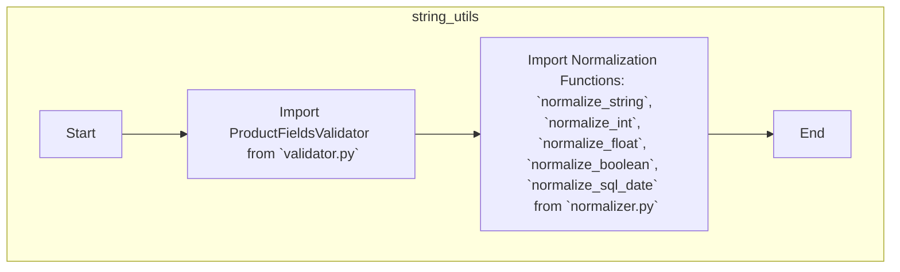

## ИНСТРУКЦИЯ:

Анализируй предоставленный код подробно и объясни его функциональность. Ответ должен включать три раздела:  

1. **<алгоритм>**: Опиши рабочий процесс в виде пошаговой блок-схемы, включая примеры для каждого логического блока, и проиллюстрируй поток данных между функциями, классами или методами.  
2. **<mermaid>**: Напиши код для диаграммы в формате `mermaid`, проанализируй и объясни все зависимости, 
    которые импортируются при создании диаграммы. 
    **ВАЖНО!** Убедитесь, что все имена переменных, используемые в диаграмме `mermaid`, 
    имеют осмысленные и описательные имена. Имена переменных вроде `A`, `B`, `C`, и т.д., не допускаются!  
    
    **Дополнительно**: Если в коде есть импорт `import header`, добавьте блок `mermaid` flowchart, объясняющий `header.py`:\
    ```mermaid
    flowchart TD
        Start --> Header[<code>header.py</code><br> Determine Project Root]
    
        Header --> import[Import Global Settings: <br><code>from src import gs</code>] 
    ```

3. **<объяснение>**: Предоставьте подробные объяснения:  
   - **Импорты**: Их назначение и взаимосвязь с другими пакетами `src.`.  
   - **Классы**: Их роль, атрибуты, методы и взаимодействие с другими компонентами проекта.  
   - **Функции**: Их аргументы, возвращаемые значения, назначение и примеры.  
   - **Переменные**: Их типы и использование.  
   - Выделите потенциальные ошибки или области для улучшения.  

Дополнительно, постройте цепочку взаимосвязей с другими частями проекта (если применимо).  

Это обеспечивает всесторонний и структурированный анализ кода.
## Формат ответа: `.md` (markdown)
**КОНЕЦ ИНСТРУКЦИИ**
### <алгоритм>

1.  **Импорт `ProductFieldsValidator`**:
    *   Из модуля `validator.py` импортируется класс `ProductFieldsValidator`.
    *   Этот класс, вероятно, используется для проверки корректности данных полей продукта (например, соответствие типа данных, допустимые значения).
    *   Пример использования: `validator = ProductFieldsValidator()`
2.  **Импорт функций нормализации**:
    *   Из модуля `normalizer.py` импортируются функции:
        *   `normalize_string`: нормализация строковых данных (например, обрезка пробелов, приведение к нижнему регистру).
            *   Пример: `normalized_string = normalize_string("  Some String  ")`
        *   `normalize_int`: нормализация целых чисел.
            *   Пример: `normalized_int = normalize_int("123")`
        *   `normalize_float`: нормализация чисел с плавающей точкой.
            *   Пример: `normalized_float = normalize_float("123.45")`
        *   `normalize_boolean`: нормализация логических значений.
            *   Пример: `normalized_boolean = normalize_boolean("true")`
        *   `normalize_sql_date`: нормализация даты в формат SQL.
            *   Пример: `normalized_date = normalize_sql_date("2024-01-01")`
    *   Эти функции используются для стандартизации данных перед их обработкой или сохранением.

### <mermaid>



### <объяснение>

**Импорты:**

*   `from .validator import ProductFieldsValidator`:
    *   Импортирует класс `ProductFieldsValidator` из модуля `validator.py`, находящегося в том же пакете (`src.utils.string`).
    *   `ProductFieldsValidator`, вероятно, содержит методы для проверки полей данных продукта, такие как проверка типов данных, допустимых значений и т.д.
    *   Этот класс используется для обеспечения целостности и корректности данных, связанных с продуктами.
*   `from .normalizer import normalize_string, normalize_int, normalize_float, normalize_boolean, normalize_sql_date`:
    *   Импортирует набор функций из модуля `normalizer.py`, который также находится в текущем пакете.
    *   Каждая функция выполняет нормализацию данных определенного типа.
        *   `normalize_string` - приводит строку к определенному формату (удаляет лишние пробелы, приводит к нижнему регистру и т.д.)
        *   `normalize_int` - пытается преобразовать входное значение в целое число
        *   `normalize_float` - пытается преобразовать входное значение в число с плавающей точкой.
        *   `normalize_boolean` - приводит входное значение к логическому значению (True или False).
        *   `normalize_sql_date` - преобразует входное значение в формат даты, совместимый с SQL.
    *   Эти функции используются для стандартизации входных данных перед их использованием, например, для сохранения в базу данных, что предотвращает ошибки и повышает надежность программы.

**Классы:**

*   `ProductFieldsValidator`:
    *   Предполагается, что это класс для валидации полей данных, связанных с продуктами.
    *   Он, вероятно, будет содержать методы для проверки правильности типов данных, соответствия форматам и валидации бизнес-правил.
    *   Например, он может проверять, что поле "цена" является числом, а поле "дата" соответствует допустимому формату.

**Функции:**

*   `normalize_string(value)`:
    *   Аргумент: `value` - строка, которую нужно нормализовать.
    *   Возвращает: нормализованную строку.
    *   Назначение: приведение строки к стандартному виду.
*   `normalize_int(value)`:
    *   Аргумент: `value` - значение, которое нужно преобразовать в целое число.
    *   Возвращает: целое число или None, если преобразование невозможно.
    *   Назначение: преобразование входного значения в целое число.
*   `normalize_float(value)`:
    *   Аргумент: `value` - значение, которое нужно преобразовать в число с плавающей точкой.
    *   Возвращает: число с плавающей точкой или None, если преобразование невозможно.
    *   Назначение: преобразование входного значения в число с плавающей точкой.
*   `normalize_boolean(value)`:
    *   Аргумент: `value` - значение, которое нужно преобразовать в логическое значение.
    *   Возвращает: логическое значение (True или False) или None, если преобразование невозможно.
    *   Назначение: преобразование входного значения в логический тип.
*   `normalize_sql_date(value)`:
    *   Аргумент: `value` - значение даты, которое нужно преобразовать в формат SQL.
    *   Возвращает: строку с датой в формате SQL или None, если преобразование невозможно.
    *   Назначение: преобразование даты в формат SQL.

**Переменные:**

*   В данном файле переменные не определены, используются импортированные функции и класс.

**Взаимосвязи с другими частями проекта:**

*   Пакет `src.utils.string` предназначен для работы со строками и данными различных типов. Он предоставляют функциональность для нормализации и валидации данных, которая может быть использована в различных частях проекта, где требуется корректная и стандартизированная обработка информации. Например, при работе с данными, полученными от пользователя, или при взаимодействии с базой данных.
*   `ProductFieldsValidator` может использоваться в модулях, которые работают с моделями данных продуктов для валидации полей перед записью в БД.
*   Функции нормализации могут использоваться в любом месте проекта, где необходимо преобразовать данные к определенному типу или формату.
*   Данный пакет способствует повышению качества и надежности данных в проекте.

**Потенциальные ошибки и области для улучшения:**

*   Необходимо добавить обработку исключений (try-except) в функции нормализации, чтобы корректно обрабатывать некорректные входные данные.
*   Добавить логирование для отслеживания ошибок, которые могут возникнуть при нормализации или валидации данных.
*   Может потребоваться более сложная логика валидации и нормализации для конкретных случаев использования, которые можно расширить, добавив дополнительные функции или классы.

**Пример использования**
В другом модуле проекта, где необходимо использовать валидацию и нормализацию данных:

```python
from src.utils.string import ProductFieldsValidator, normalize_string, normalize_int

def process_product_data(name, price, quantity):
    # Использование валидатора
    validator = ProductFieldsValidator()
    
    # Использование функций нормализации
    normalized_name = normalize_string(name)
    normalized_price = normalize_int(price)
    normalized_quantity = normalize_int(quantity)
    
    # Проверка валидности и обработка данных...
    
    return normalized_name, normalized_price, normalized_quantity
```
```python