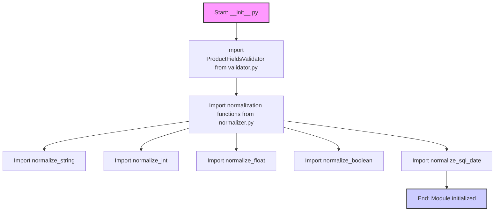

## Анализ кода `src/utils/string/__init__.py`

### 1. <алгоритм>

**Назначение:** Файл `__init__.py` в пакете `src.utils.string` служит для объявления пакета и импорта его подмодулей. Это позволяет использовать функции валидации и нормализации строк, чисел, дат и булевых значений из других частей проекта через пакет `src.utils.string`.

**Блок-схема:**

**Пример:**

1.  **`from .validator import ProductFieldsValidator`**: Импортирует класс `ProductFieldsValidator` из модуля `validator.py`, который вероятно содержит логику для валидации определенных полей данных.

2.  **`from .normalizer import ...`**: Импортирует функции для нормализации данных:
    *   `normalize_string`:  Преобразует строку к стандартному виду (например, обрезает пробелы, приводит к нижнему регистру).
    *   `normalize_int`:  Преобразует строку в целое число.
    *   `normalize_float`: Преобразует строку в число с плавающей точкой.
    *   `normalize_boolean`:  Преобразует строку в булево значение (True/False).
    *   `normalize_sql_date`:  Преобразует строку в дату, совместимую с SQL.

**Поток данных:**

1.  При вызове модуля `src.utils.string` в других частях проекта, сначала выполняется `__init__.py`.
2.  `__init__.py` импортирует необходимые классы и функции из подмодулей `validator.py` и `normalizer.py`.
3.  Теперь эти классы и функции доступны для использования через `src.utils.string`.
    Например: `from src.utils.string import normalize_string, ProductFieldsValidator`.

### 2. <mermaid>

**Описание зависимостей:**

1.  `__init__.py` зависит от двух модулей, находящихся в той же директории:
    *   `validator.py` (через `import ProductFieldsValidator`).
    *   `normalizer.py` (через `import normalize_string, normalize_int, normalize_float, normalize_boolean, normalize_sql_date`).
2.  Импортируемые имена из `normalizer.py` - это функции, предназначенные для преобразования данных к нужному формату.
3.  `ProductFieldsValidator` это класс, предназначенный для валидации структуры данных.

### 3. <объяснение>

**Импорты:**

*   `from .validator import ProductFieldsValidator`: Импортирует класс `ProductFieldsValidator` из файла `validator.py`, который находится в той же директории, что и `__init__.py`. Точка `.` в начале пути означает, что импорт происходит из текущего пакета.
*   `from .normalizer import (...)`: Импортирует функции `normalize_string`, `normalize_int`, `normalize_float`, `normalize_boolean` и `normalize_sql_date` из файла `normalizer.py`, находящегося в той же директории, что и `__init__.py`. Эти функции, вероятно, используются для обработки и стандартизации данных различных типов.

**Функции:**

*   `normalize_string`: Предназначена для приведения строк к единому формату (удаление лишних пробелов, приведение к нижнему регистру и т.д.).
*   `normalize_int`:  Предназначена для преобразования строки в целое число.
*   `normalize_float`: Предназначена для преобразования строки в число с плавающей точкой.
*   `normalize_boolean`: Предназначена для преобразования строки в логическое значение (True/False).
*   `normalize_sql_date`: Предназначена для преобразования строки в дату, совместимую с форматом SQL.

**Классы:**

*   `ProductFieldsValidator`: Класс, вероятно, предназначен для проверки соответствия структуры данных определенным правилам. Его точное назначение будет понятно при анализе `validator.py`.

**Переменные:**

В этом файле нет явных переменных, так как основная его задача – импорт и экспорт функциональности из других модулей пакета `src.utils.string`.

**Взаимосвязи:**

*   `__init__.py` является точкой входа в пакет `src.utils.string`.
*   Он связывает `validator.py` и `normalizer.py` с остальной частью проекта, предоставляя доступ к их функциям и классам через `src.utils.string`.
*   Другие модули проекта, которым требуется валидация или нормализация строк, чисел, дат или булевых значений, импортируют соответствующие функции или классы из `src.utils.string`, например, `from src.utils.string import normalize_string`.

**Потенциальные улучшения:**

*   Модуль может быть расширен добавлением новых функций нормализации (например, нормализация телефонных номеров или почтовых индексов).
*   В `normalizer.py` можно добавить обработку исключений для более надежного преобразования данных (например, когда строка не может быть преобразована в число).
*   В `validator.py` можно расширить класс `ProductFieldsValidator` или добавить новые валидаторы для разных типов данных.

**Дополнительно:**

В данном коде нет `import header`, поэтому дополнительный `mermaid` блок для `header.py` не требуется.

**Заключение:**

Файл `__init__.py` служит точкой входа для пакета `src.utils.string`, предоставляя удобный интерфейс для использования функций нормализации и классов валидации, импортированных из соответствующих подмодулей `validator.py` и `normalizer.py`. Это обеспечивает модульность и повторное использование функциональности в различных частях проекта.