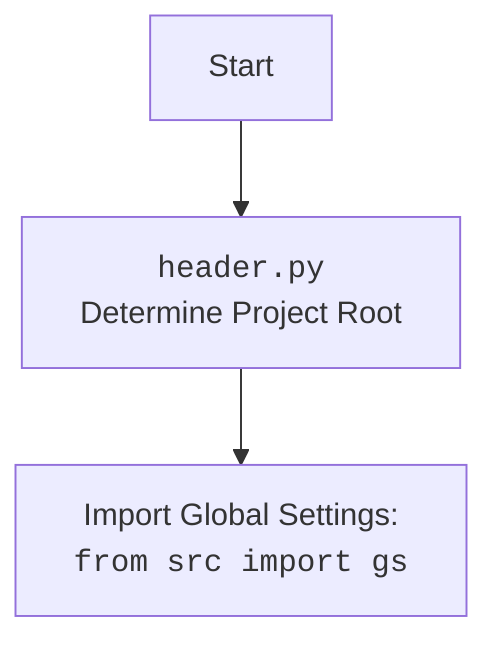

## <алгоритм>

1.  **`set_project_root(marker_files)`**:
    *   **Вход**: `marker_files` (кортеж строк, представляющих маркерные файлы/директории). По умолчанию `('__root__', '.git')`.
    *   **Инициализация**:
        *   `current_path` получает абсолютный путь к директории, в которой находится текущий файл (`header.py`).
        *   `__root__` инициализируется значением `current_path`.
    *   **Поиск корневой директории**:
        *   Проходит циклом по текущей директории и её родительским директориям.
        *   Для каждой директории (`parent`) проверяет наличие любого из маркерных файлов/директорий.
        *   Если маркер найден, `__root__` обновляется до `parent` и цикл прерывается.
    *   **Обновление `sys.path`**:
        *   Проверяет, если путь к корневой директории `__root__` не в системной переменной `sys.path`, то добавляет его.
    *   **Выход**: Возвращает `__root__` (путь к корневой директории проекта).
    
    *Пример:*
    *   Допустим, `header.py` находится в `C:\projects\hypotez\src\utils\string`.
    *   `marker_files` = `('__root__', '.git')`.
    *   Если `.git` находится в `C:\projects\hypotez`, то функция вернет `C:\projects\hypotez`.
    *   Если ни один маркер не найден, вернет `C:\projects\hypotez\src\utils\string`.
2.  **`__root__ = set_project_root()`**: Вызов функции `set_project_root()` без аргументов, присваивает возвращенное значение переменной `__root__` (глобальная переменная, представляющая путь к корневой директории проекта).
3.  **`import src.gs`**: Импорт модуля `gs` из пакета `src`. Предполагается, что `gs` содержит глобальные настройки проекта. 
4.  **Загрузка настроек из `settings.json`**:
    *   Инициализация `settings` как `None`.
    *   Попытка открыть и прочитать файл `settings.json`, путь к которому формируется как `gs.path.root / 'src' / 'settings.json'`.
    *   Если файл успешно прочитан и декодирован (JSON), то результат сохраняется в переменную `settings`.
    *   Если происходит ошибка (`FileNotFoundError` или `json.JSONDecodeError`), `settings` остается `None`.
5.  **Загрузка документации из `README.MD`**:
    *   Инициализация `doc_str` как `None`.
    *   Попытка открыть и прочитать файл `README.MD`, путь к которому формируется как `gs.path.root / 'src' / 'README.MD'`.
    *   Если файл успешно прочитан, то результат сохраняется в переменную `doc_str`.
    *   Если происходит ошибка (`FileNotFoundError` или `json.JSONDecodeError`), `doc_str` остается `None`.
6.  **Инициализация глобальных переменных**:
    *   `__project_name__`: Если `settings` загружены, берёт значение из поля `project_name`, иначе устанавливает `'hypotez'`.
    *   `__version__`: Если `settings` загружены, берет значение из поля `version`, иначе устанавливает `''`.
    *   `__doc__`: Присваивает значение `doc_str`, если то не равно `None`, иначе `''`.
    *   `__details__`: Присваивает значение пустой строки `''`.
    *   `__author__`: Если `settings` загружены, берет значение из поля `author`, иначе устанавливает `''`.
    *    `__copyright__`: Если `settings` загружены, берет значение из поля `copyrihgnt`, иначе устанавливает `''`.
    *   `__cofee__`:  Если `settings` загружены, берет значение из поля `cofee`, иначе устанавливает значение по умолчанию "Treat the developer to a cup of coffee for boosting enthusiasm in development: https://boosty.to/hypo69".

## <mermaid>

```mermaid
flowchart TD
    Start[Start] --> FindRoot[<code>set_project_root()</code><br>Find Project Root Directory]
    FindRoot --> UpdatePath[Update <code>sys.path</code> if root not in paths]
    UpdatePath --> ImportGS[Import Global Settings: <br><code>from src import gs</code>]
    ImportGS --> LoadSettings[Try to Load <code>settings.json</code>]
    LoadSettings -- Success --> LoadDoc[Try to Load <code>README.MD</code>]
    LoadSettings -- Fail --> LoadDoc
    LoadDoc -- Success --> SetGlobalVars[Set Global Variables: <br><code>__project_name__</code>, <code>__version__</code>, etc.]
    LoadDoc -- Fail --> SetGlobalVars
    SetGlobalVars --> End[End]
```



## <объяснение>

**Импорты:**

*   `sys`:  Модуль `sys` используется для работы с параметрами среды выполнения, такими как `sys.path`. `sys.path`  – список строк, указывающих пути поиска модулей при импорте. 
*   `json`:  Модуль `json` используется для работы с JSON-форматом данных. Используется для загрузки настроек из файла `settings.json`.
*   `packaging.version.Version`: Используется для работы с версиями программного обеспечения. В данном коде не используется, но импортируется. Это говорит о возможном использовании в будущем.
*   `pathlib.Path`:  Модуль `pathlib` предоставляет объектно-ориентированный способ работы с файловыми путями.  `Path` используется для представления файловых путей и выполнения операций над ними.

    **Взаимосвязь с `src`**:

*   `from src import gs`:  Импортирует модуль `gs` (предположительно, "global settings" - глобальные настройки) из пакета `src`. Этот импорт предполагает, что структура проекта имеет пакет `src`, который содержит модули с глобальными настройками, переменными. Этот импорт также предполагает, что `__root__` была добавлена в `sys.path` до импорта.

**Функции:**

*   **`set_project_root(marker_files)`**:
    *   **Назначение**: Определяет корневой каталог проекта, поднимаясь по директориям, пока не найдет один из маркерных файлов (по умолчанию `__root__` или `.git`). Этот механизм позволяет расположить проект в произвольной директории.
    *   **Аргументы**:
        *   `marker_files` (tuple): Кортеж строк, содержащих имена маркерных файлов или директорий для поиска. По умолчанию: `('__root__', '.git')`.
    *   **Возвращаемое значение**: `pathlib.Path`: Объект `Path`, представляющий путь к корневому каталогу проекта. Если маркер не найден, возвращает путь директории, где находится сам файл `header.py`.
    *   **Примеры**:
        *   Вызов `set_project_root()` без аргументов ищет маркеры `__root__` и `.git`.
        *   Вызов `set_project_root(marker_files=('.project',))` ищет маркер `.project`.
    *   **Логика**:
        *   Начинает с директории, где находится текущий файл.
        *   Проверяет текущую и все родительские директории на наличие любого из маркерных файлов.
        *   Возвращает путь к первой директории, где найден маркер.
        *   Добавляет путь к корневой директории в `sys.path`, если он там отсутствует. Это необходимо для корректного импорта модулей из проекта.
**Переменные:**

*   `__root__`:
    *   **Тип**: `pathlib.Path`.
    *   **Назначение**: Хранит абсолютный путь к корневому каталогу проекта, полученный вызовом `set_project_root()`.
    *   **Использование**: Используется для формирования абсолютных путей к файлам конфигурации и документации.
*   `settings`:
    *   **Тип**: `dict` или `None`.
    *   **Назначение**: Хранит настройки проекта, загруженные из `settings.json`. Если файл не найден или имеет некорректный формат, то `settings` присваивается `None`.
    *   **Использование**:  Используется для получения информации о проекте, такой как имя, версия, автор и т.д.
*   `doc_str`:
    *   **Тип**: `str` или `None`.
    *   **Назначение**: Хранит строку документации проекта, загруженную из `README.MD`. Если файл не найден, то `doc_str` присваивается `None`.
*   `__project_name__`:
    *   **Тип**: `str`.
    *   **Назначение**: Имя проекта, полученное из `settings`, если загружены, или `'hypotez'` по умолчанию.
*   `__version__`:
    *   **Тип**: `str`.
    *   **Назначение**: Версия проекта, полученная из `settings`, если загружены, или `''` по умолчанию.
*   `__doc__`:
    *   **Тип**: `str`.
    *   **Назначение**: Документация проекта, полученная из `doc_str`, если загружена, или `''` по умолчанию.
*    `__details__`:
    *   **Тип**: `str`.
    *   **Назначение**: Описание проекта (в коде не определено, но определена пустая строка).
*   `__author__`:
    *   **Тип**: `str`.
    *   **Назначение**: Автор проекта, полученное из `settings`, если загружены, или `''` по умолчанию.
*   `__copyright__`:
    *   **Тип**: `str`.
    *    **Назначение**: Информация об авторских правах проекта, полученная из `settings`, если загружены, или `''` по умолчанию.
*   `__cofee__`:
    *   **Тип**: `str`.
    *   **Назначение**: Текст с призывом к поддержке разработчика, полученное из `settings`, если загружены, или "Treat the developer to a cup of coffee for boosting enthusiasm in development: https://boosty.to/hypo69" по умолчанию.

**Потенциальные ошибки и области для улучшения:**

*   **Обработка ошибок:**  Обработка `FileNotFoundError` и `json.JSONDecodeError` при загрузке `settings.json` и `README.MD` выполняется "молча" (`...`).  Для улучшения можно добавить логирование ошибок для упрощения диагностики.
*   **`packaging.version`:**  Модуль импортируется, но не используется.
*   **`__details__`**:  Инициализируется пустой строкой и нигде не используется. Можно убрать переменную или добавить функционал.
*   **Зависимости:** Жестко заданные пути ('src/settings.json' , 'src/README.MD') могут усложнить перенос проекта, если изменится структура каталогов.
*   **Неявные предположения**: Код предполагает существование файла `settings.json` и `README.MD` в подкаталоге `src`, который находится на одном уровне с корневой директорией проекта.
*   **Отсутствие проверок типов**:  Код предполагает, что JSON-файл `settings.json` имеет определенную структуру. Хорошей практикой было бы добавить проверки типов загруженных данных.
*   **Логирование**:  Отсутствует логирование, что затрудняет отслеживание проблем.

**Взаимосвязь с другими частями проекта:**

*   Этот модуль является базовым для всего проекта, т.к. он определяет корневую директорию и устанавливает путь для импорта других модулей.
*   Модуль `gs` (из `src.gs`) зависит от корректного определения `__root__`, так как он использует эту переменную для доступа к файлам проекта.
*   Остальные модули проекта используют глобальные переменные, такие как `__project_name__`, `__version__`, `__doc__`, для доступа к основной информации о проекте.

Таким образом, `header.py` отвечает за начальную настройку среды проекта, определение корневого каталога, загрузку настроек и документации, что делает его критически важным для правильной работы всего проекта.