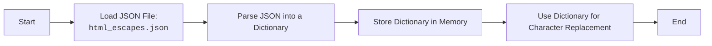

## ИНСТРУКЦИЯ:

Анализируй предоставленный код подробно и объясни его функциональность. Ответ должен включать три раздела:

1.  **<алгоритм>**: Опиши рабочий процесс в виде пошаговой блок-схемы, включая примеры для каждого логического блока, и проиллюстрируй поток данных между функциями, классами или методами.
2.  **<mermaid>**: Напиши код для диаграммы в формате `mermaid`, проанализируй и объясни все зависимости,
    которые импортируются при создании диаграммы.
    **ВАЖНО!** Убедитесь, что все имена переменных, используемые в диаграмме `mermaid`,
    имеют осмысленные и описательные имена. Имена переменных вроде `A`, `B`, `C`, и т.д., не допускаются!

    **Дополнительно**: Если в коде есть импорт `import header`, добавьте блок `mermaid` flowchart, объясняющий `header.py`:\
    ```mermaid
    flowchart TD
        Start --> Header[<code>header.py</code><br> Determine Project Root]

        Header --> import[Import Global Settings: <br><code>from src import gs</code>]
    ```

3.  **<объяснение>**: Предоставьте подробные объяснения:
    -   **Импорты**: Их назначение и взаимосвязь с другими пакетами `src.`.
    -   **Классы**: Их роль, атрибуты, методы и взаимодействие с другими компонентами проекта.
    -   **Функции**: Их аргументы, возвращаемые значения, назначение и примеры.
    -   **Переменные**: Их типы и использование.
    -   Выделите потенциальные ошибки или области для улучшения.

Дополнительно, постройте цепочку взаимосвязей с другими частями проекта (если применимо).

Это обеспечивает всесторонний и структурированный анализ кода.
## Формат ответа: `.md` (markdown)
**КОНЕЦ ИНСТРУКЦИИ**

### <алгоритм>

Представленный JSON-файл является статическим словарем, который отображает HTML-символы на их соответствующие HTML-сущности.

**Блок-схема:**
1.  **Начало**: Загрузка JSON-файла.
2.  **Чтение**: JSON-файл обрабатывается, и его содержимое интерпретируется как словарь.
3.  **Хранение**: Словарь сохраняется в памяти программы.
4.  **Использование**: Этот словарь может быть использован в программе для преобразования символов в HTML-сущности.
5.  **Конец**: Словарь используется для замены символов.

**Примеры:**

| Логический блок | Пример использования                                                                                                     |
| ------------- | ----------------------------------------------------------------------------------------------------------------------- |
| Загрузка JSON | Загружается файл `html_escapes.json`                                                                                    |
| Чтение        | JSON-файл преобразуется в словарь Python: `{"&": "&amp;", "<": "&lt;", ...}`                                          |
| Хранение      | Словарь `html_escapes` сохраняется в памяти                                                                               |
| Использование   | Функция, получая на вход символ `'<'`, ищет его в словаре и возвращает `&lt;`. Или наоборот строка `&lt;` на символ `<`.  |
| Конец         | Если в тексте встречается `'<'`, он будет заменен на `&lt;`.                                                              |

### <mermaid>



**Объяснение:**

Диаграмма показывает простой процесс чтения JSON-файла и его использования в качестве словаря.

*   `Start` - Начало процесса.
*   `LoadFile` - Загрузка содержимого JSON-файла `html_escapes.json`.
*   `ParseJSON` - Разбор содержимого JSON-файла и преобразование его в словарь Python.
*   `StoreDictionary` - Хранение словаря в памяти программы.
*   `UseDictionary` - Использование словаря для поиска HTML-сущностей для заданного символа.
*    `End` - Конец процесса.

### <объяснение>

**Импорты**:

В данном коде нет импортов, так как это статический JSON файл.

**Классы**:

В данном коде нет классов.

**Функции**:

В данном коде нет функций.

**Переменные**:

*   `html_escapes`: Это словарь, где ключи - это символы (например, `"&"`, `" <"`), а значения - это соответствующие HTML-сущности (например, `"&amp;"`, `"&lt;"`). Этот словарь используется для замены символов их HTML-эквивалентами. Тип данных - `dict`.

**Детальное объяснение:**
Файл `html_escapes.json` представляет собой словарь, предназначенный для хранения соответствий между символами и их HTML-сущностями.

**Использование:**
Этот словарь обычно используется для экранирования HTML-символов в текстовых строках, чтобы предотвратить их неправильную интерпретацию браузером. Например, символ `<` должен быть преобразован в `&lt;`, чтобы браузер не интерпретировал его как начало HTML-тега.
Обычно этот словарь используется в функциях, которые обрабатывают пользовательский ввод или генерируют HTML.

**Возможные улучшения:**

*   **Валидация данных:** JSON-файл может быть валидирован на соответствие ожидаемому формату.
*   **Автоматическая генерация:** Этот словарь может быть сгенерирован автоматически на основе спецификаций HTML.

**Цепочка взаимосвязей:**
Этот файл является частью модуля `hypotez/src/utils/string`. Обычно, он используется в других модулях, которые отвечают за генерацию HTML или обработку строк, в частности, для экранирования html кода от XSS.

Этот файл предоставляет набор данных для `utils.string`, которые могут быть использованы в других частях проекта.