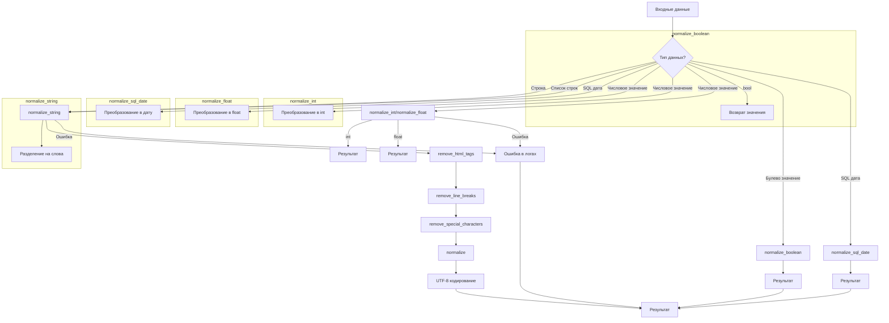

# <input code>

```python
## \file hypotez/src/utils/string/normalizer.py
# -*- coding: utf-8 -*-
#! venv/Scripts/python.exe
#! venv/bin/python/python3.12

"""
Модуль для нормализации строк и числовых данных
=========================================================================================

Этот модуль предоставляет функции для нормализации строк, булевых значений, целых и чисел с плавающей точкой.
Он также содержит вспомогательные методы для обработки текста, включая удаление HTML-тегов и специальных символов.

Пример использования
--------------------

.. code-block:: python

    from src.utils.string.normalizer import normalize_string, normalize_boolean

    normalized_str = normalize_string(" Пример строки <b>с HTML</b> ")
    normalized_bool = normalize_boolean("yes")
"""

import re
import html
from datetime import datetime
from decimal import Decimal, InvalidOperation
from typing import Any, List, Union
from src.logger import logger

MODE = 'dev'


def normalize_boolean(input_data: Any) -> bool:
    """Normalize data into a boolean.

    Args:
        input_data (Any): Data that can represent a boolean (e.g., bool, string, integer).

    Returns:
        bool: Boolean representation of the input.

    Example:
        >>> normalize_boolean('yes')
        True
    """
    original_input = input_data  # Сохраняется исходное значение
    if isinstance(input_data, bool):
        return input_data

    try:
        input_str = str(input_data).strip().lower()
        if input_str in {'true', '1', 'yes', 'y', 'on', True, 1}:
            return True
        if input_str in {'false', '0', 'no', 'n', 'off', False, 0}:
            return False
    except Exception as ex:
        logger.error('Ошибка в normalize_boolean: ', ex)

    logger.debug(f'Неожиданное значение для преобразования в bool: {input_data}')
    return original_input  # Возвращается исходное значение


def normalize_string(input_data: str | list) -> str:
    """Normalize a string or a list of strings.

    Args:
        input_data (str | list): Input data that can be either a string or a list of strings.

    Returns:
        str: Cleaned and normalized string in UTF-8 encoded format.

    Example:
        >>> normalize_string(['Hello', '  World!  '])
        'Hello World!'

    Raises:
        TypeError: If `input_data` is not of type `str` or `list`.
    """
    # ... (rest of the function)
```

# <algorithm>

**Алгоритм работы normalize_boolean:**

1. Сохраняет исходное значение `input_data` в `original_input`.
2. Проверяет, является ли `input_data` булевым значением. Если да, возвращает его.
3. Пытается преобразовать `input_data` в строку, привести к нижнему регистру и удалить пробелы.
4. Проверяет, соответствует ли строка одному из представлений `True` (true, 1, yes, y, on). Если да, возвращает `True`.
5. Проверяет, соответствует ли строка одному из представлений `False` (false, 0, no, n, off). Если да, возвращает `False`.
6. Если ни одно из вышеперечисленных условий не выполняется, регистрирует в логах сообщение об ошибке и возвращает исходное значение `original_input`.

**Алгоритм работы normalize_string:**

1. Сохраняет исходное значение `input_data` в `original_input`.
2. Проверяет, является ли `input_data` строкой или списком. Если нет, выбрасывает `TypeError`.
3. Если `input_data` - список, объединяет элементы списка в одну строку через пробелы.
4. Удаляет HTML-теги из строки.
5. Удаляет переводы строк.
6. Удаляет специальные символы.
7. Нормализует строку, удаляя лишние пробелы.
8. Кодирует строку в UTF-8, а затем декодирует обратно.
9. Если произошла ошибка, регистрирует ее в логах и возвращает исходное значение.


# <mermaid>



**Описание зависимостей:**

- `src.logger`: Модуль для регистрации сообщений об ошибках и отладки.
    - Связь: `normalize_string`, `normalize_boolean`, `normalize_int`, `normalize_float`, `normalize_sql_date` используют `logger` для логирования ошибок.
- `re`: Модуль для регулярных выражений.
    - Связь: `remove_html_tags`, `remove_special_characters`, `simplify_string` используют `re` для поиска и замены.
- `html`: Модуль для работы с HTML-данными.
    - Связь: `remove_html_tags` использует `html` для удаления тегов.
- `datetime`: Модуль для работы с датами.
    - Связь: `normalize_sql_date` использует `datetime` для парсинга дат.
- `decimal`: Модуль для работы с десятичными числами.
    - Связь: `normalize_int` использует `Decimal` для преобразования.

# <explanation>

**Импорты:**

- `re`, `html`, `datetime`, `Decimal`, `InvalidOperation`: Стандартные библиотечные модули для работы с регулярными выражениями, HTML, датами и десятичными числами соответственно.
- `Any`, `List`, `Union`: Типы данных из `typing`.
- `logger`: Модуль из `src.logger` для регистрации сообщений об ошибках и отладки.
  -  `src.logger` предполагает, что он определен в каком-то другом модуле в папке `src`.


**Классы:**

Нет определенных классов. Только функции.

**Функции:**

- `normalize_boolean(input_data: Any) -> bool`:  Нормализует входные данные в булево значение. Принимает различные типы данных (bool, str, int) и возвращает `True` или `False`. Обрабатывает ошибки при преобразовании.
- `normalize_string(input_data: str | list) -> str`: Нормализует строку или список строк. Удаляет HTML-теги, переводы строк, спецсимволы, лишние пробелы. Возвращает нормализованную строку в кодировке UTF-8.
- `normalize_int(input_data: Union[str, int, float, Decimal]) -> int`: Нормализует входные данные в целое число. Преобразует строку, float или Decimal в int. Обрабатывает ошибки при преобразовании.
- `normalize_float(value: Any) -> float | List[float] | None`: Преобразует числовое значение (или список числовых значений) в float (или список floats). Обрабатывает ошибки при преобразовании. Возвращает None, если преобразование не удалось.
- `normalize_sql_date(input_data: str) -> str`: Нормализует дату в формате YYYY-MM-DD. Обрабатывает различные форматы дат в строках.
- `simplify_string(input_str: str) -> str`: Упрощает строку, оставляя только буквы, цифры, заменяя пробелы на подчеркивания и удаляя лишние подчеркивания.
- `remove_line_breaks(input_str: str) -> str`: Удаляет все переводы строк `\n` и `\r` из строки.
- `remove_html_tags(input_html: str) -> str`: Удаляет все HTML-теги из строки.
- `remove_special_characters(input_str: str | list, chars: list[str] = None) -> str | list`: Удаляет указанные специальные символы из строки или списка строк.


**Переменные:**

- `MODE`: Строковая переменная, хранящая режим работы.  (Здесь `'dev'`)


**Возможные ошибки и улучшения:**

- **Обработка ошибок:**  Код содержит обработку `try-except` блоков, что предотвращает аварийный выход программы, если входные данные некорректны. Но можно добавить более подробную информацию об ошибках в логи.
- **Документация:** Документация написана хорошо, но можно дополнить более исчерпывающими примерами, особенно для `normalize_string` и `remove_special_characters`.
- **Универсальность:** Функция `remove_special_characters` могла бы принимать не строку, а список символов для удаления, а не список строк.
- **Проверка на пустоту:** Функции могли бы добавлять проверку на `None` и пустые строки/списки для предотвращения ошибок.

**Взаимосвязи с другими частями проекта:**

Модуль `src.utils.string.normalizer` скорее всего используется другими частями приложения для обработки строк и чисел.  Например, функции нормализации могут быть использованы в процессах обработки данных из базы данных, или при валидации пользовательского ввода, или для предобработки текста перед анализом.  Зависимость от `src.logger` указывает на то, что в проекте используется система логгирования.