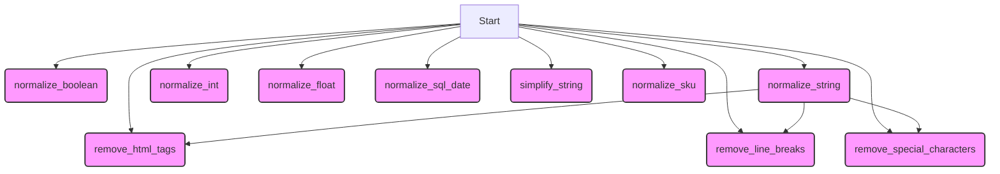

## <алгоритм>

1.  **`normalize_boolean(input_data)`**:
    *   Принимает `input_data` любого типа.
    *   Если `input_data` является булевым значением, возвращает его без изменений.
    *   Преобразует `input_data` в строку, удаляет лишние пробелы и приводит к нижнему регистру.
        *   Пример: `"  True " ` -> `"true"`
    *   Если строка соответствует одному из значений `{'true', '1', 'yes', 'y', 'on', True, 1}`, возвращает `True`.
        *   Пример: `"yes"` -> `True`
    *   Если строка соответствует одному из значений `{'false', '0', 'no', 'n', 'off', False, 0}`, возвращает `False`.
        *   Пример: `"0"` -> `False`
    *   При возникновении ошибки в процессе преобразования, логирует ее и возвращает исходное значение.
        *   Пример: `normalize_boolean([1,2])` -> `[1,2]` (с логированием ошибки)
    *   В случае, если значение не соответствует ни одному из булевых вариантов, логирует отладочное сообщение и возвращает исходное значение.
        *   Пример: `"abc"` -> `"abc"` (с логированием отладочного сообщения)

2.  **`normalize_string(input_data)`**:
    *   Принимает `input_data`, которое может быть строкой или списком строк.
    *   Если `input_data` равно `None`, возвращает пустую строку.
    *   Если `input_data` не является строкой или списком, вызывает `TypeError`.
    *   Если `input_data` является списком, объединяет его элементы в одну строку, разделяя их пробелами.
        *   Пример: `["hello", "world"]` -> `"hello world"`
    *   Удаляет HTML-теги.
        *   Пример: `"<a>test</a>"` -> `"test"`
    *   Удаляет разрывы строк.
        *   Пример: `"test \n string"` -> `"test   string"`
    *   Удаляет специальные символы.
    *   Нормализует строку, удаляя лишние пробелы.
        *   Пример: `" test   string  "` -> `"test string"`
    *   Кодирует строку в `utf-8` и возвращает.
    *   При возникновении ошибки в процессе преобразования, логирует ее и возвращает исходное значение, также закодированное в `utf-8`.

3.  **`normalize_int(input_data)`**:
    *   Принимает `input_data`, которое может быть строкой, целым числом, числом с плавающей точкой или `Decimal`.
    *   Если `input_data` является `Decimal`, преобразует его в целое число.
    *   Преобразует `input_data` в float, а затем в целое число.
        *   Пример: `"42.5"` -> `42`
    *   При возникновении ошибки в процессе преобразования, логирует ее и возвращает исходное значение.
         *   Пример: `normalize_int("abc")` -> `"abc"` (с логированием ошибки)

4.  **`normalize_float(value)`**:
    *   Принимает `value` любого типа.
    *  Если `value` равно `None`, возвращает `0`
    *   Если `value` является списком или кортежем, рекурсивно вызывает `normalize_float` для каждого элемента и возвращает список float значений. Пропускает `None` значения.
        *   Пример: `[1, "2.5", 3]` -> `[1.0, 2.5, 3.0]`
        *   Пример: `[1, None, 3]` -> `[1.0, 3.0]`
    *   Пытается преобразовать `value` в float.
        *   Пример: `"3.14"` -> `3.14`
    *   При возникновении ошибки в процессе преобразования, логирует предупреждение и возвращает исходное значение.
        *   Пример: `normalize_float("abc")` -> `"abc"` (с логированием предупреждения)

5.  **`normalize_sql_date(input_data)`**:
    *   Принимает `input_data`, которое может быть строкой или объектом `datetime`.
    *   Если `input_data` является строкой, пытается преобразовать ее в дату, используя форматы `%Y-%m-%d`, `%m/%d/%Y`, `%d/%m/%Y`.
        *   Пример: `"2024-12-06"` -> `"2024-12-06"`
        *   Пример: `"12/06/2024"` -> `"2024-12-06"`
    *   Если `input_data` является объектом `datetime`, преобразует его в строку в формате `YYYY-MM-DD`.
    *   При возникновении ошибки в процессе преобразования, логирует ее и возвращает исходное значение.
         *   Пример: `normalize_sql_date("invalid date")` -> `"invalid date"` (с логированием ошибки)
    *  Если значение не соответствует ни одному из форматов, логирует отладочное сообщение и возвращает исходное значение.
        *   Пример: `"abc"` -> `"abc"` (с логированием отладочного сообщения)

6. **`simplify_string(input_str)`**:
    *   Принимает строку `input_str`
    *   Удаляет все символы, кроме букв, цифр и пробелов.
        *   Пример: `"It's a test string!"` -> `"Its a test string"`
    *   Заменяет пробелы на символы подчеркивания.
        *   Пример: `"Its a test string"` -> `"Its_a_test_string"`
    *   Удаляет повторяющиеся символы подчеркивания.
        *   Пример: `"Its__a_test___string"` -> `"Its_a_test_string"`
    *  Возвращает измененную строку.
    *  При возникновении ошибки возвращает исходную строку и логгирует ошибку.

7.  **`remove_line_breaks(input_str)`**:
    *   Принимает строку `input_str`.
    *   Заменяет символы `\n` и `\r` на пробелы.
        *   Пример: `"string\nwith\rbreaks"` -> `"string with breaks"`
    *   Удаляет лишние пробелы в начале и конце строки.
    *   Возвращает измененную строку.

8.  **`remove_html_tags(input_html)`**:
    *   Принимает строку `input_html`.
    *   Удаляет все HTML-теги.
        *   Пример: `"
test
"` -> `"test"`
    *   Удаляет лишние пробелы в начале и конце строки.
    *   Возвращает измененную строку.

9.  **`remove_special_characters(input_str, chars=None)`**:
    *   Принимает `input_str`, который может быть строкой или списком строк, и список `chars` для удаления.
    *   Если `chars` не указан, по умолчанию удаляет `#`.
    *   Создает регулярное выражение для удаления указанных символов.
    *   Если `input_str` является списком, применяет регулярное выражение к каждому элементу списка.
    *   Применяет регулярное выражение к строке.
        *  Пример: `remove_special_characters("test#string")` -> `"teststring"`
        *   Пример: `remove_special_characters(["test#string", "another#string"], chars=["#", "!"])` -> `["teststring", "anotherstring"]`
    *   Возвращает измененную строку или список строк.

10. **`normalize_sku(input_str)`**:
    *  Принимает строку `input_str` содержащую SKU.
    *   Удаляет  ключевые слова на иврите  `"מקט"` и `"מק'ט"` регистронезависимо.
        *   Пример: `"מקט: 303235"` -> `": 303235"`
        *   Пример: `"Мак\'\'т: 12345"` -> `": 12345"`
    *   Удаляет все не алфавитно-цифровые символы.
        *   Пример: `": 303235"` -> `"303235"`
    *   Возвращает нормализованную строку.
    *   При возникновении ошибки возвращает исходную строку и логирует ее.
        *   Пример:  `normalize_sku(None)` -> `None` (с логированием ошибки)

## <mermaid>

**Объяснение `mermaid` диаграммы:**

*   `flowchart TD`: Объявляет тип диаграммы как блок-схему, с направлением сверху вниз.
*   `Start[Start]`: Начало блок схемы.
*   `normalizeBoolean(normalize_boolean)`, `normalizeString(normalize_string)`, `normalizeInt(normalize_int)`, `normalizeFloat(normalize_float)`, `normalizeSqlDate(normalize_sql_date)`, `simplifyString(simplify_string)`,  `removeLineBreaks(remove_line_breaks)`, `removeHtmlTags(remove_html_tags)`, `removeSpecialCharacters(remove_special_characters)`, `normalizeSku(normalize_sku)`: Представляют собой узлы диаграммы, каждый из которых соответствует отдельной функции, объявленной в `normalizer.py`.
*   `Start --> normalizeBoolean`, `Start --> normalizeString`, `Start --> normalizeInt`, `Start --> normalizeFloat`, `Start --> normalizeSqlDate`, `Start --> simplifyString`,  `Start --> removeLineBreaks`, `Start --> removeHtmlTags`, `Start --> removeSpecialCharacters`, `Start --> normalizeSku`: Указывают на то, что поток управления начинается с начала и может идти к любой из этих функций.
*   `normalizeString --> removeHtmlTags`, `normalizeString --> removeLineBreaks`, `normalizeString --> removeSpecialCharacters`: Указывают зависимости. Функция `normalize_string` вызывает функции `remove_html_tags`, `remove_line_breaks` и `remove_special_characters`.
*   `classDef functionClass fill:#f9f,stroke:#333,stroke-width:2px`:  Определяет стиль для всех узлов-функций.
*   `class normalizeBoolean,normalizeString,normalizeInt,normalizeFloat,normalizeSqlDate,simplifyString,removeLineBreaks,removeHtmlTags,removeSpecialCharacters,normalizeSku functionClass`: Применяет стиль `functionClass` ко всем узлам-функциям.

## <объяснение>

**Импорты:**

*   `re`: Модуль для работы с регулярными выражениями, используется для поиска и замены строк в функциях `normalize_string`, `remove_html_tags`, `remove_special_characters` и `normalize_sku`
*   `html`: Модуль для работы с HTML, здесь не используется.
*   `datetime` из `datetime`: Модуль для работы с датой и временем, используется в функции `normalize_sql_date`.
*   `Decimal` и `InvalidOperation` из `decimal`: Используется для точной работы с числами с плавающей точкой и обработки ошибок в функции `normalize_int`.
*   `Any`, `List`, `Union` из `typing`: Используются для аннотации типов, делая код более читаемым и позволяя статической типизации проверять код.
*   `logger` из `src.logger.logger`: Используется для логирования ошибок и отладочной информации. Позволяет отслеживать работу функций и выявлять потенциальные проблемы.

**Функции:**

*   **`normalize_boolean(input_data: Any) -> bool`**:
    *   Аргументы: `input_data` (может быть любого типа).
    *   Возвращает: `bool` (логическое значение).
    *   Назначение: Приводит входные данные к булевому значению, обрабатывая различные строковые и числовые представления.
    *   Примеры:
        *   `normalize_boolean("yes")` возвращает `True`.
        *   `normalize_boolean(0)` возвращает `False`.
        *   `normalize_boolean("invalid")` возвращает `"invalid"` (с логированием).
*   **`normalize_string(input_data: str | list) -> str`**:
    *   Аргументы: `input_data` (строка или список строк).
    *   Возвращает: `str` (нормализованная строка в кодировке utf-8).
    *   Назначение: Нормализует строку, удаляя HTML-теги, разрывы строк и специальные символы, а также лишние пробелы.
    *   Примеры:
        *   `normalize_string("  Test <b>string</b>  ")` возвращает `"Test string"`.
        *   `normalize_string(["test", "string"])` возвращает `"test string"`.
*   **`normalize_int(input_data: Union[str, int, float, Decimal]) -> int`**:
    *   Аргументы: `input_data` (строка, целое число, число с плавающей точкой или `Decimal`).
    *   Возвращает: `int` (целое число).
    *   Назначение: Приводит входные данные к целому числу, обрабатывая различные числовые форматы.
    *   Примеры:
        *   `normalize_int("42.5")` возвращает `42`.
        *   `normalize_int(Decimal("42"))` возвращает `42`.
        *   `normalize_int("invalid")` возвращает `"invalid"` (с логированием ошибки).
*   **`normalize_float(value: Any) -> float | None`**:
    *   Аргументы: `value` (может быть любого типа).
    *   Возвращает: `float` или `None` (число с плавающей точкой или `None`, если преобразование не удалось).
    *   Назначение: Приводит входные данные к числу с плавающей точкой, обрабатывая различные строковые и числовые представления.
    *  Примеры:
        *   `normalize_float("3.14")` возвращает `3.14`.
        *   `normalize_float([1, "2.5", 3])` возвращает `[1.0, 2.5, 3.0]`.
         *   `normalize_float("invalid")` возвращает `"invalid"` (с логированием).
*   **`normalize_sql_date(input_data: str) -> str`**:
    *   Аргументы: `input_data` (строка, представляющая дату, или объект `datetime`).
    *   Возвращает: `str` (дата в формате `YYYY-MM-DD`).
    *   Назначение: Приводит входные данные к дате в формате `YYYY-MM-DD`, обрабатывая различные форматы строк и объекты `datetime`.
    *   Примеры:
        *   `normalize_sql_date("2024-12-06")` возвращает `"2024-12-06"`.
        *   `normalize_sql_date("12/06/2024")` возвращает `"2024-12-06"`.
        *   `normalize_sql_date("invalid")` возвращает `"invalid"` (с логированием).
*    **`simplify_string(input_str: str) -> str`**:
     *   Аргументы: `input_str` (строка).
     *   Возвращает: `str` (упрощенная строка).
     *   Назначение: Упрощает строку, оставляя только буквы, цифры, пробелы, заменяя пробелы на подчеркивание и удаляя дубликаты подчеркиваний.
      *   Примеры:
         * `simplify_string("It's a test string!")` возвращает `Its_a_test_string`.
*   **`remove_line_breaks(input_str: str) -> str`**:
    *   Аргументы: `input_str` (строка).
    *   Возвращает: `str` (строка без разрывов строк).
    *   Назначение: Удаляет символы разрыва строк из строки.
    *   Примеры:
        *   `remove_line_breaks("Test\nstring\r")` возвращает `"Test string"`.
*   **`remove_html_tags(input_html: str) -> str`**:
    *   Аргументы: `input_html` (строка, содержащая HTML-теги).
    *   Возвращает: `str` (строка без HTML-тегов).
    *   Назначение: Удаляет HTML-теги из строки.
    *   Примеры:
        *   `remove_html_tags("
Test
")` возвращает `"Test"`.
*   **`remove_special_characters(input_str: str | list, chars: list[str] = None) -> str | list`**:
    *   Аргументы: `input_str` (строка или список строк), `chars` (список символов для удаления, по умолчанию `['#']`).
    *   Возвращает: `str | list` (строка или список строк с удаленными специальными символами).
    *   Назначение: Удаляет заданные специальные символы из строки или списка строк.
    *   Примеры:
        *   `remove_special_characters("Test#string")` возвращает `"Teststring"`.
        *   `remove_special_characters(["Test#string", "Another#string"], chars=["#", "!"])` возвращает `["Teststring", "Anotherstring"]`.
*   **`normalize_sku(input_str: str) -> str`**:
    *   Аргументы: `input_str` (строка).
    *   Возвращает: `str` (нормализованный SKU).
    *   Назначение: Удаляет из строки специфические слова на иврите и все не-буквенно-цифровые символы.
    *   Примеры:
        *  `normalize_sku("מקט: 303235")` возвращает `"303235"`.
        *  `normalize_sku("Мак\'\'т: 12345")` возвращает `"12345"`.
        *  `normalize_sku(None)` возвращает `None` (с логированием ошибки).

**Переменные:**

*   `original_input`, `original_value` : Эти переменные используются во многих функциях для хранения исходных входных данных. Они возвращаются в случае ошибки обработки, обеспечивая, что функция всегда вернет значение, даже если преобразование не удалось.
*   `input_str`:  Используется для хранения входных данных, которые должны быть строкой.
*   `cleaned_str`, `normalized_str`: Используются для хранения промежуточных и конечных результатов обработки строк.
*   `date_format` :  Переменная используется для хранения одного из форматов даты.

**Потенциальные ошибки и области для улучшения:**

1.  **Жестко заданные значения**: В `normalize_boolean` жестко заданы значения для `true` и `false`. Возможно стоит добавить поддержку других языков.
2.  **Обработка ошибок**: Хотя функции и логируют ошибки, можно предусмотреть более гибкую обработку ошибок, например, возврат `None` или выброс кастомных исключений.
3.  **`normalize_string`**: Функция  `remove_special_characters` по умолчанию удаляет только `#`. Можно передавать список символов в качестве параметра по умолчанию для  гибкости.
4.  **Производительность**: В функциях `remove_html_tags`, `remove_special_characters`, `simplify_string` и `normalize_sku` используются регулярные выражения, что может быть ресурсоемким для больших строк. Возможно, стоит рассмотреть оптимизацию регулярных выражений или альтернативные подходы для обработки больших объемов данных.
5.  **Логирование**: В некоторых функциях используется `.debug` вместо `.info`. Нужно придерживаться единого стандарта для логирования.
6.  **`normalize_float`**: В случае, когда `value` является `None` функция возвращает `0` вместо `None`.

**Взаимосвязи с другими частями проекта:**

*   Модуль `normalizer.py` используется для очистки и стандартизации данных перед их использованием в других частях проекта, таких как:
    *   Обработка данных из различных источников, например, веб-форм, баз данных или API.
    *   Подготовка данных для машинного обучения, где важна консистентность и точность.
    *   Создание отчетов и визуализаций, где данные должны быть в стандартизированном формате.
    *  Формирование запросов в БД.
*   Функция `normalize_string` используется в других частях проекта для очистки строковых данных, например, при обработке пользовательского ввода или извлечения текста из HTML-документов.
*   `logger` используется для отслеживания ошибок и отладки в других модулях.

Этот анализ предоставляет полное понимание функциональности, зависимостей и возможных улучшений в модуле `normalizer.py`.