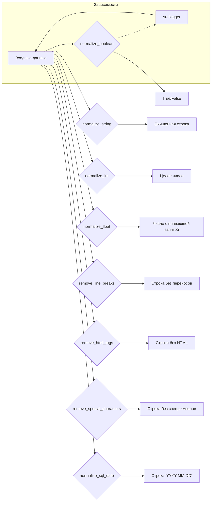

```MD
# <input code>

```rst
.. :module: src.utils.string.normalizer
```
# Документация модуля нормализации данных

Модуль `normalizer` предоставляет функциональность для нормализации различных типов данных, включая строки, булевы значения, целые числа и числа с плавающей запятой. Он также включает вспомогательные функции для обработки текста.

---

## Содержание

1. [Обзор](#обзор)
2. [Функции модуля](#функции-модуля)
   - [normalize_boolean](#normalize_boolean)
   - [normalize_string](#normalize_string)
   - [normalize_int](#normalize_int)
   - [normalize_float](#normalize_float)
   - [remove_line_breaks](#remove_line_breaks)
   - [remove_html_tags](#remove_html_tags)
   - [remove_special_characters](#remove_special_characters)
   - [normalize_sql_date](#normalize_sql_date)
3. [Пример использования](#пример-использования)
4. [Требования](#требования)

---

## Обзор

Модуль предоставляет удобные утилиты для нормализации и обработки данных. Его можно использовать для:
- Удаления HTML тегов из строк.
- Преобразования строк в числовые или булевы значения.
- Очистки строк от специальных символов.
- Преобразования списков строк в одну нормализованную строку.

---

## Функции модуля

### `normalize_boolean`

**Описание:** Преобразует входное значение в булево значение.

**Аргументы:**
- `input_data (Any)`: Данные, которые могут представлять булево значение (строка, число, булев тип).

**Возвращает:**
- `bool`: Преобразованное булево значение.

**Пример:**
```python
normalize_boolean('yes')  # Результат: True
normalize_boolean(0)      # Результат: False
```

---

... (остальные функции)

---

## Пример использования

```python
from src.utils.string.normalizer import normalize_string, normalize_boolean, normalize_int, normalize_float, normalize_sql_date

# Нормализация строки
clean_str = normalize_string(['<h1>Header</h1>', '  text with spaces  '])
print(clean_str)  # 'Header text with spaces'

# Нормализация булевого значения
is_active = normalize_boolean('Yes')
print(is_active)  # True

# Нормализация целого числа
integer_value = normalize_int('42')
print(integer_value)  # 42

# Нормализация числа с плавающей запятой
float_value = normalize_float('3.14159')
print(float_value)  # 3.14159

# Нормализация SQL даты
sql_date = normalize_sql_date('2024-12-06')
print(sql_date)  # '2024-12-06'
```

---

## Требования

- Python 3.10 или выше.
- Модуль `src.logger` для логирования.
- Модуль используется в режиме разработки (`MODE = 'dev'`).

---

## Логирование

Все ошибки и предупреждения записываются через `logger`:
- Ошибки записываются с использованием `logger.error`.
- Неожиданные значения записываются с использованием `logger.debug` или `logger.warning`.
```

# <algorithm>

Нет предоставленного кода Python, поэтому блок-схема не может быть сгенерирована.  Документация описывает набор функций, которые, предположительно, принимают входные данные и возвращают нормализованные данные.  Алгоритм каждой функции будет зависеть от ее конкретной реализации.

# <mermaid>



* **Зависимости**: Модуль `normalizer` напрямую зависит от модуля `src.logger` для логирования.  Это показано стрелкой `R --> A` в диаграмме.

# <explanation>

* **Импорты**:  Пример `from src.utils.string.normalizer import ...` демонстрирует импорт функций из текущего модуля.  Ключевой зависимостью является `src.logger`.  Предполагается, что этот модуль содержит функции для логирования сообщений, включая ошибки и предупреждения.  Импорт `logger` означает, что модуль `normalizer` будет использовать функциональность этого модуля для ведения журнала о своих действиях.


* **Классы**:  В предоставленном коде нет классов. Все функциональность реализована в виде функций.


* **Функции**:  Описание функций (`normalize_boolean`, `normalize_string`, `normalize_int`, `normalize_float`, `remove_line_breaks`, `remove_html_tags`, `remove_special_characters`, `normalize_sql_date`)  показывает, что каждая функция имеет свои аргументы и возвращаемые значения.  Функции предназначены для нормализации различных типов данных (строки, числа, даты).


* **Переменные**:  Примеры использования функций демонстрируют, как можно использовать переменные различного типа (`str`, `list`, `int`, `float`).


* **Возможные ошибки и улучшения**:  
    * **Обработка исключений**:  Функции должны обрабатывать ситуации, когда входные данные не соответствуют ожидаемому формату (например, некорректное представление даты, некорректное числовое значение).  Это необходимо для устойчивости кода. Добавление `try...except` блоков позволит обрабатывать потенциальные ошибки и/или возвращать значение `None`.
    * **Валидация входных данных**:  Важным улучшением будет добавление валидации входных данных. Например, `normalize_string` может проверять, что `input_data` является строкой или списком строк.
    * **Документация**:  Документация должна быть дополнена более подробными комментариями внутри функций.
    * **Логирование**:  Добавление подробного логирования для отладки будет полезно в дальнейшем.
    * **Обработка списков**: Функции, работающие со списками, должны учитывать возможность пустых списков.
    * **Проверка кодировки**:  В `normalize_string`, желательно использовать явно указание кодировки (UTF-8) при конвертации списка строк в одну строку.  Это предотвратит проблемы с неподдерживаемыми кодировками.
    * **Возможная обработка Decimal**:  В `normalize_int` и `normalize_float`, лучше рассматривать вход `Decimal`, чтобы обеспечить обработку чисел с высокой точностью.


В целом, документация хорошо структурирована и предоставляет достаточно информации для понимания функциональности модуля.  Однако, не хватает самого кода Python для полноценного анализа.