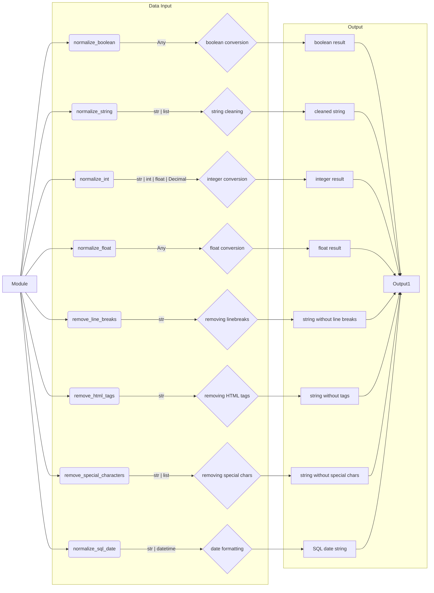

# <input code>

```rst
.. :module: src.utils.string
```

Data Normalizer Module Documentation
=====================================

The `normalizer` module provides functionality for normalizing various data types, including strings, booleans, integers, and floating-point numbers. It also includes helper functions for text processing.

---

## Table of Contents

1. [Overview](#overview)
2. [Module Functions](#module-functions)
   - [normalize_boolean](#normalize_boolean)
   - [normalize_string](#normalize_string)
   - [normalize_int](#normalize_int)
   - [normalize_float](#normalize_float)
   - [remove_line_breaks](#remove_line_breaks)
   - [remove_html_tags](#remove_html_tags)
   - [remove_special_characters](#remove_special_characters)
   - [normalize_sql_date](#normalize_sql_date)
3. [Usage Example](#usage-example)
4. [Requirements](#requirements)

---

## Overview

The module provides convenient data normalization and processing utilities. It can be used to:
- Remove HTML tags from strings.
- Convert strings to numeric or boolean values.
- Clean strings from special characters.
- Convert lists of strings into a single normalized string.

---

## Module Functions

### `normalize_boolean`

**Description:**  
Converts the input value into a boolean.

**Arguments:**  
- `input_data (Any)`: The data that can represent a boolean value (string, number, boolean type).

**Returns:**  
- `bool`: The converted boolean value.

**Example:**  
```python
normalize_boolean('yes')  # Result: True
normalize_boolean(0)      # Result: False
```

---

### `normalize_string`

**Description:**  
Converts a string or a list of strings into a normalized string by removing extra spaces, HTML tags, and special characters.

**Arguments:**  
- `input_data (str | list)`: A string or list of strings.

**Returns:**  
- `str`: A cleaned UTF-8 string.

**Example:**  
```python
normalize_string(['  Example string  ', '<b>with HTML</b>'])  # Result: 'Example string with HTML'
```

---
... (rest of the code)
```

# <algorithm>

The algorithm for each function is described in the docstrings, which are part of the input code.  A general algorithm for the functions can be represented as follows:

* **normalize_boolean:** Takes input, converts to boolean if possible (e.g., 'yes' -> True, 'no'/0 -> False), handling errors gracefully.
* **normalize_string:** Takes string or list of strings, removes whitespace, HTML tags and special characters, joins list of strings.
* **normalize_int:** Takes input, converts to integer. Handles errors, likely returning default value or raising an exception (depends on implementation).
* **normalize_float:** Similar to normalize_int, converting to float.
* **remove_line_breaks:** Takes string, removes newline and carriage return characters.
* **remove_html_tags:** Takes string, removes HTML tags using a regular expression or other appropriate method.
* **remove_special_characters:** Takes string, removes special characters, potentially using a regular expression.
* **normalize_sql_date:** Takes a date string or datetime object, formats it into `YYYY-MM-DD` format.


# <mermaid>



**Explanation of Dependencies:**

The diagram shows the module's internal functions and their inputs/outputs. There are no explicit dependencies between functions beyond the data flow.  It is implicit that this module is part of a larger project ("src").  There is a dependency on Python's built-in types (str, int, float, bool, list, etc) and potentially on the `datetime` module for `normalize_sql_date`.  `logger` from `src.logger` is used implicitly for logging (as indicated in the Requirements section).  The diagram does not show these implicit dependencies.


# <explanation>

* **Imports:** The code shows the Python docstrings and examples but no actual imports.  The `from src.utils.string.normalizer import ...` imports in the usage example indicate that the module exists and likely contains the function definitions.  The dependency on `src.logger` for logging is also clear.

* **Classes:**  There are no classes defined in the provided code snippet. The module contains only functions.

* **Functions:** Each function (`normalize_boolean`, `normalize_string`, `normalize_int`, etc.) has a well-defined purpose (data type conversion, string manipulation) as described in its docstring.  The arguments and return types are documented clearly, including examples.

* **Variables:** Input and output variables are described in the docstrings.  Data types (strings, booleans, integers, lists) are used for inputs, consistent with the documented parameter types.

* **Possible Errors and Improvements:**
    * **Error Handling:** While the docstrings mention handling errors, the actual code is missing. Error handling (e.g., using `try...except` blocks) should be implemented within each function to catch potential exceptions (e.g., `ValueError` for invalid input types). This improves robustness.
    * **Regular Expressions:** For string cleaning, the docstrings indicate potential use of regular expressions. Using regular expressions can be more efficient for complex patterns than manual string manipulation.
    * **Input Validation:** Explicit validation of input types (e.g., checking if a string can be converted to an integer) would make the functions more robust.
    * **Edge Cases:** Consider edge cases such as empty strings, empty lists, `None` values, or special characters that might cause unexpected behavior.

* **Project Relationships:** The module is part of a larger project (`src`), potentially `utils`, where it provides utility functions related to string manipulation and data normalization.  The `src.logger` module is required and suggests other modules exist in the project.


This module is designed to normalize various data types and clean strings. The clear documentation and the examples allow easy integration into other parts of the project.