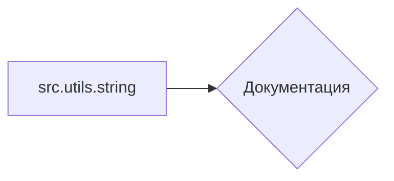

```MD
1. **<input code>**

```rst
.. :module: src.utils.string
```

2. **<algorithm>**

Этот код не содержит никакого исполняемого кода. Он всего лишь задаёт контекст для документации, определяя модуль `src.utils.string` в формате reStructuredText (rst).  В нём нет алгоритма, который можно изобразить в виде блок-схемы.  Он используется для организации документации, а не для реализации функциональности.

3. **<mermaid>**



4. **<explanation>**

- **Импорты**:  Отсутствуют какие-либо импорты.  Код не содержит функционального кода для импорта библиотек или других модулей.  Вместо этого, он определяет контекст документации для модуля `src.utils.string`.

- **Классы**:  Нет определённых классов.  Этот код не содержит ни одного класса.

- **Функции**:  Нет определённых функций.  Этот код не содержит ни одной функции.

- **Переменные**: Нет определённых переменных.

- **Возможные ошибки или области для улучшений**:  Код сам по себе не содержит ошибок и не нуждается в исправлении.  Он просто устанавливает контекст документации.  Для улучшения документации нужно обеспечить дальнейшее описание модуля `src.utils.string`, например, добавив описание функций и классов, которые он содержит.  Возможно, нужно дополнить его описанием внутренних механизмов, если они есть.

**Цепочка взаимосвязей с другими частями проекта**:

Этот код является частью системы документации проекта.  Он связывает документацию с подмодулем `src.utils.string`, указывая его место в структуре проекта.  Далее, предполагается, что в папке `src/utils/string` будут находятся файлы с определением классов, функций и констант, которые, в свою очередь, будут описаны в документации, искореняя дальнейшие зависимости и связи в проекте.