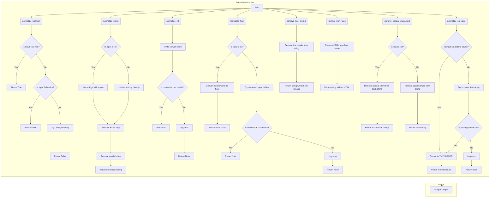

## ИНСТРУКЦИЯ:

Анализируй предоставленный код подробно и объясни его функциональность. Ответ должен включать три раздела:

1. **<алгоритм>**: Опиши рабочий процесс в виде пошаговой блок-схемы, включая примеры для каждого логического блока, и проиллюстрируй поток данных между функциями, классами или методами.
2.  **<mermaid>**: Напиши код для диаграммы в формате `mermaid`, проанализируй и объясни все зависимости,
    которые импортируются при создании диаграммы.
    **ВАЖНО!** Убедитесь, что все имена переменных, используемые в диаграмме `mermaid`,
    имеют осмысленные и описательные имена. Имена переменных вроде `A`, `B`, `C`, и т.д., не допускаются!

    **Дополнительно**: Если в коде есть импорт `import header`, добавьте блок `mermaid` flowchart, объясняющий `header.py`:
    ```mermaid
    flowchart TD
        Start --> Header[<code>header.py</code><br> Determine Project Root]

        Header --> import[Import Global Settings: <br><code>from src import gs</code>]
    ```

3.  **<объяснение>**: Предоставьте подробные объяснения:
    -   **Импорты**: Их назначение и взаимосвязь с другими пакетами `src.`.
    -   **Классы**: Их роль, атрибуты, методы и взаимодействие с другими компонентами проекта.
    -   **Функции**: Их аргументы, возвращаемые значения, назначение и примеры.
    -   **Переменные**: Их типы и использование.
    -   Выделите потенциальные ошибки или области для улучшения.

Дополнительно, постройте цепочку взаимосвязей с другими частями проекта (если применимо).

Это обеспечивает всесторонний и структурированный анализ кода.
## Формат ответа: `.md` (markdown)
**КОНЕЦ ИНСТРУКЦИИ**

## <алгоритм>

Модуль `normalizer` предоставляет набор функций для нормализации данных различных типов. Вот блок-схема, описывающая работу основных функций:



**Примеры:**

*   **`normalize_boolean`**:
    *   Вход: `"yes"` -> Результат: `True`
    *   Вход: `0` -> Результат: `False`
    *   Вход: `"invalid"` -> Результат: `False` (логируется предупреждение)
*   **`normalize_string`**:
    *   Вход: `["  текст  ", "<b>HTML</b>"]` -> Результат: `"текст HTML"`
    *   Вход: `"  текст  "` -> Результат: `"текст"`
*   **`normalize_int`**:
    *   Вход: `"42"` -> Результат: `42`
    *   Вход: `3.14` -> Результат: `3`
    *   Вход: `"invalid"` -> Результат: `None` (логируется ошибка)
*   **`normalize_float`**:
    *   Вход: `"3.14"` -> Результат: `3.14`
    *   Вход: `[1, "2.5", 3]` -> Результат: `[1.0, 2.5, 3.0]`
     *   Вход: `"invalid"` -> Результат: `None` (логируется ошибка)
*   **`remove_line_breaks`**:
    *   Вход: `"строка\nс переносами\r"` -> Результат: `"строкас переносами"`
*   **`remove_html_tags`**:
    *   Вход: `<p>текст</p>` -> Результат: `"текст"`
*   **`remove_special_characters`**:
    *   Вход: `"Привет@Мир!"` -> Результат: `"ПриветМир"`
    *  Вход: `["Прив@ет", "Ми#р"]` -> Результат: `["Привет", "Мир"]`
*   **`normalize_sql_date`**:
    *   Вход: `"2024-12-06"` -> Результат: `"2024-12-06"`
    *   Вход: `datetime(2024, 12, 6)` -> Результат: `"2024-12-06"`
    *   Вход: `"invalid"` -> Результат: `None` (логируется ошибка)

## <mermaid>

```mermaid
flowchart TD
    subgraph normalizer.py
        A[normalize_boolean(input_data)] --> B{input_data is True-like?}
        B -- Yes --> C[return True]
        B -- No --> D{input_data is False-like?}
        D -- Yes --> E[return False]
        D -- No --> F[log.debug/warning]
        F --> G[return False]
        
        H[normalize_string(input_data)] --> I{input_data is list?}
        I -- Yes --> J[Join strings with space]
        I -- No --> K[Use input string]
        J --> L[remove_html_tags()]
        K --> L
        L --> M[remove_special_characters()]
        M --> N[return normalized string]
        
        O[normalize_int(input_data)] --> P[try convert to int]
        P --> Q{conversion success?}
        Q -- Yes --> R[return int]
        Q -- No --> S[log.error]
        S --> T[return None]

        U[normalize_float(value)] --> V{value is list?}
        V -- Yes --> W[convert list elements to float]
        W --> X[return list of floats]
        V -- No --> Y[try convert to float]
        Y --> Z{conversion success?}
        Z -- Yes --> AA[return float]
        Z -- No --> AB[log.error]
        AB --> AC[return None]
        
        AD[remove_line_breaks(input_str)] --> AE[Remove line breaks]
        AE --> AF[return string]

        AG[remove_html_tags(input_html)] --> AH[Remove HTML tags]
        AH --> AI[return string]

        AJ[remove_special_characters(input_str)] --> AK{input_str is list?}
        AK -- Yes --> AL[remove special chars from each string]
        AL --> AM[return list]
        AK -- No --> AN[remove special chars from string]
        AN --> AO[return string]

        AP[normalize_sql_date(input_data)] --> AQ{input_data is datetime?}
        AQ -- Yes --> AR[format to YYYY-MM-DD]
        AR --> AS[return formatted date string]
       AQ -- No --> AT[try parse date string]
       AT --> AU{parsing success?}
       AU -- Yes --> AR
       AU -- No --> AV[log.error]
       AV --> AW[return None]
    end

    subgraph Usage Example
    AS --> UsageExample
     end

```

**Зависимости:**

*   **`logger`**: Этот модуль используется для логирования ошибок, предупреждений и отладочных сообщений. Он необходим для отслеживания проблем и неожидаемого поведения функций нормализации.
*   Нет прямых зависимостей от других модулей `src.`, но подразумевается, что `logger` находится в `src.logger`, что является общей практикой для структурирования проекта.
*   **`datetime`**: Импортируется для работы с датами, в частности в функции `normalize_sql_date`, если на вход приходит объект `datetime`
*   **`Decimal`**: Импортируется для обработки значений с десятичной точкой, в частности в функции `normalize_int`, что бы не потерять точность.

## <объяснение>

**Импорты:**

*   `from src.logger import logger`: Импортирует объект `logger` из модуля `src.logger`. Этот объект используется для записи сообщений об ошибках, предупреждений и отладочной информации, что помогает в отладке и мониторинге работы модуля. Это часть системы логирования проекта, расположенной в `src`, что позволяет централизованно управлять логированием.
*   `from datetime import datetime`: Используется для работы с датами и временем, для корректной обработки дат в функции `normalize_sql_date`.
*   `from decimal import Decimal`: Используется для точной обработки чисел с плавающей точкой в `normalize_int`.

**Классы:**

В данном коде отсутствуют классы. Модуль `normalizer` состоит только из набора функций.

**Функции:**

1.  **`normalize_boolean(input_data)`**:
    *   **Аргументы**:
        *   `input_data (Any)`: Любое значение, которое может быть интерпретировано как булево.
    *   **Возвращает**:
        *   `bool`: `True` или `False` в зависимости от входных данных.
    *   **Назначение**: Конвертирует входные данные в булев тип. Строки "yes", "true", "1" (без учета регистра) и числа, не равные 0, конвертируются в `True`. Строки "no", "false", "0" и число 0 конвертируются в `False`. Остальные значения вызывают логирование предупреждения и возвращают `False`.
    *   **Примеры**:
        ```python
        normalize_boolean('yes') # True
        normalize_boolean(0) # False
        normalize_boolean('invalid') # False (логируется warning)
        ```

2.  **`normalize_string(input_data)`**:
    *   **Аргументы**:
        *   `input_data (str | list)`: Строка или список строк.
    *   **Возвращает**:
        *   `str`: Нормализованная строка в кодировке UTF-8.
    *   **Назначение**: Приводит строку к нормализованному виду, удаляя лишние пробелы, HTML-теги и специальные символы. Если на вход приходит список строк, они объединяются через пробел.
    *   **Примеры**:
        ```python
        normalize_string(['  Example string  ', '<b>with HTML</b>']) # 'Example string with HTML'
         normalize_string('  Example string  ') # 'Example string'
        ```

3.  **`normalize_int(input_data)`**:
    *   **Аргументы**:
        *   `input_data (str | int | float | Decimal)`: Число или его строковое представление.
    *   **Возвращает**:
        *   `int`: Целое число или `None` в случае ошибки.
    *   **Назначение**: Конвертирует входные данные в целое число. В случае ошибки возвращает `None` и логирует ошибку.
    *   **Примеры**:
        ```python
        normalize_int('42') # 42
        normalize_int(3.14) # 3
        normalize_int('invalid') # None (логируется error)
        ```

4.  **`normalize_float(value)`**:
    *   **Аргументы**:
        *   `value (Any)`: Число, строка или список чисел.
    *   **Возвращает**:
        *   `float | List[float] | None`: Число с плавающей точкой, список чисел или `None` в случае ошибки.
    *   **Назначение**: Конвертирует входные данные в число с плавающей точкой. Если вход - список, конвертирует все его элементы. При ошибке возвращает `None` и логирует ошибку.
    *   **Примеры**:
        ```python
        normalize_float('3.14') # 3.14
        normalize_float([1, '2.5', 3]) # [1.0, 2.5, 3.0]
        normalize_float('invalid') # None (логируется error)
        ```

5.  **`remove_line_breaks(input_str)`**:
    *   **Аргументы**:
        *   `input_str (str)`: Строка.
    *   **Возвращает**:
        *   `str`: Строка без символов переноса строки.
    *   **Назначение**: Удаляет символы `\n` и `\r` из строки.
    *   **Примеры**:
        ```python
        remove_line_breaks('String\nwith line breaks\r') # 'Stringwith line breaks'
        ```

6.  **`remove_html_tags(input_html)`**:
    *   **Аргументы**:
        *   `input_html (str)`: Строка с HTML-тегами.
    *   **Возвращает**:
        *   `str`: Строка без HTML-тегов.
    *   **Назначение**: Удаляет HTML-теги из строки, используя регулярные выражения.
    *   **Примеры**:
        ```python
        remove_html_tags('<p>Example text</p>') # 'Example text'
        ```

7.  **`remove_special_characters(input_str)`**:
    *   **Аргументы**:
        *   `input_str (str | list)`: Строка или список строк.
    *   **Возвращает**:
        *  `str | list`: Строка или список строк без специальных символов.
    *   **Назначение**: Удаляет все символы, не являющиеся буквами или цифрами.
    *   **Примеры**:
         ```python
        remove_special_characters('Hello@World!') # 'HelloWorld'
        remove_special_characters(['Hello@', 'World!']) # ['Hello', 'World']
        ```

8.  **`normalize_sql_date(input_data)`**:
    *   **Аргументы**:
        *   `input_data (str | datetime)`: Строка или объект `datetime`, представляющие дату.
    *   **Возвращает**:
        *   `str`: Дата в формате `YYYY-MM-DD` или `None`, в случае ошибки.
    *   **Назначение**: Конвертирует входные данные в строку с датой в формате SQL.
    *   **Примеры**:
        ```python
        normalize_sql_date('2024-12-06') # '2024-12-06'
        normalize_sql_date(datetime(2024, 12, 6)) # '2024-12-06'
        normalize_sql_date('invalid') # None (логируется error)
        ```

**Переменные:**

В данном коде нет глобальных переменных. Внутри функций используются локальные переменные для хранения и обработки данных.

**Потенциальные ошибки и области для улучшения:**

*   **`normalize_boolean`**:
    *   Можно добавить поддержку других вариантов "true" и "false", например, "да", "нет".
*   **`normalize_int`**:
    *   В текущей версии  `normalize_int` возвращает `None` при ошибке конвертации. Можно добавить возможность вызова исключения, либо возможность указать значение по умолчанию.
*   **`normalize_float`**:
    *   Аналогично `normalize_int` функция возвращает `None` при ошибке. Можно добавить возможность выбрасывания исключения или возможность указать значение по умолчанию.
*   **`normalize_string`**:
    *   Удаление HTML-тегов реализовано через регулярные выражения, что может быть уязвимо для сложных HTML-структур. Можно рассмотреть использование специализированных библиотек, например `BeautifulSoup`.
*   **`remove_special_characters`**:
    *   Текущая реализация удаляет все символы, не являющиеся буквами или цифрами. Можно добавить возможность настраивать набор удаляемых символов.
*  **Общие замечания**
   *   Улучшить обработку ошибок во всех функциях, предоставляя пользователю более подробную информацию.
   *   Добавить unit тесты для каждой функции, чтобы убедиться в их надежности и корректности работы.

**Цепочка взаимосвязей:**

Модуль `normalizer` является частью пакета `src.utils.string`. Он используется для предобработки данных перед их использованием в других частях проекта. Зависимость от `src.logger` показывает, что модуль является частью общего механизма логирования проекта.

В целом, модуль `normalizer` выполняет важную роль в очистке и нормализации данных, обеспечивая их корректное использование в дальнейшей обработке.