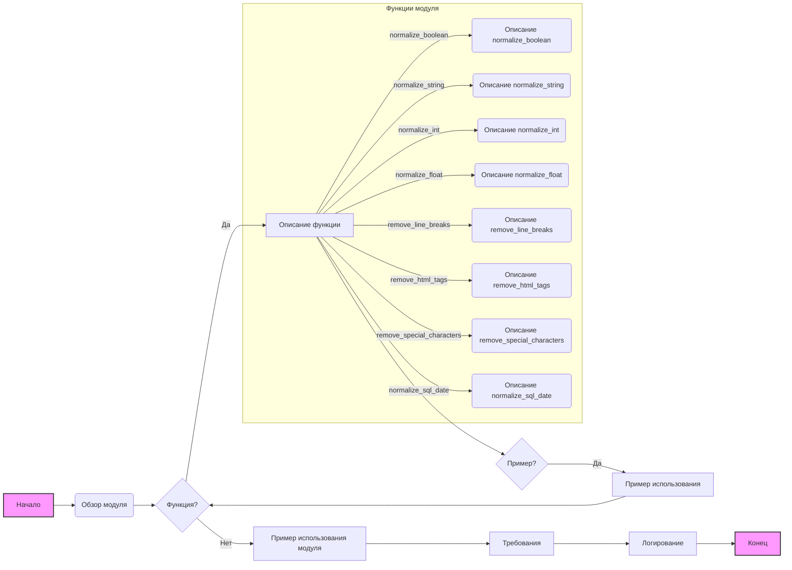

## Анализ кода `src/utils/string/readme.md`

### <алгоритм>

1. **Начало:** Чтение документации модуля `normalizer`.
2. **Обзор модуля:**
   - Описание назначения: Модуль предоставляет функциональность для нормализации различных типов данных.
   - Описание возможностей: Удаление HTML-тегов, преобразование в числовые или логические значения, очистка от специальных символов, конвертация списка строк в одну строку.
3. **Функции модуля:**
   - `normalize_boolean(input_data)`:
      - **Пример:** `normalize_boolean('yes')` -> `True`, `normalize_boolean(0)` -> `False`.
      - **Описание:** Преобразует входное значение в boolean.
   - `normalize_string(input_data)`:
      - **Пример:** `normalize_string(['  Example string  ', '<b>with HTML</b>'])` -> `'Example string with HTML'`.
      - **Описание:**  Преобразует строку или список строк в нормализованную строку, удаляя лишние пробелы, HTML-теги и спецсимволы.
   - `normalize_int(input_data)`:
      - **Пример:** `normalize_int('42')` -> `42`, `normalize_int(3.14)` -> `3`.
      - **Описание:**  Преобразует входное значение в целое число.
   - `normalize_float(value)`:
      - **Пример:** `normalize_float('3.14')` -> `3.14`, `normalize_float([1, '2.5', 3])` -> `[1.0, 2.5, 3.0]`.
      - **Описание:**  Преобразует входное значение в число с плавающей точкой или список чисел с плавающей точкой.
   - `remove_line_breaks(input_str)`:
      - **Пример:** `remove_line_breaks('String\nwith line breaks\r')` -> `'String with line breaks'`.
      - **Описание:**  Удаляет символы новой строки из строки.
   - `remove_html_tags(input_html)`:
      - **Пример:** `remove_html_tags('
Example text
')` -> `'Example text'`.
      - **Описание:**  Удаляет HTML-теги из строки.
   - `remove_special_characters(input_str)`:
      - **Пример:** `remove_special_characters('Hello@World!')` -> `'HelloWorld'`.
      - **Описание:**  Удаляет специальные символы из строки или списка строк.
   - `normalize_sql_date(input_data)`:
      - **Пример:** `normalize_sql_date('2024-12-06')` -> `'2024-12-06'`, `normalize_sql_date(datetime(2024, 12, 6))` -> `'2024-12-06'`.
      - **Описание:**  Преобразует строку или объект datetime в формат SQL-даты (`YYYY-MM-DD`).
4. **Пример использования:**
   - Показывает импорт и использование функций `normalize_string`, `normalize_boolean`, `normalize_int`, `normalize_float`, `normalize_sql_date` с демонстрацией результатов.
5. **Требования:**
   - Python 3.10 или выше.
   - Использование модуля `src.logger` для логирования.
   - Работа в режиме разработки (`MODE = 'dev'`).
6. **Логирование:**
   - Ошибки и предупреждения регистрируются с помощью `logger.error`, `logger.debug` и `logger.warning`.
7. **Конец:** Документация модуля завершена.

### <mermaid>

**Описание диаграммы:**

- **Начало (A):** Начальная точка процесса анализа документации.
- **Обзор модуля (B):** Описание общего назначения и функциональности модуля `normalizer`.
- **Функция? (C):** Условный блок, определяющий, есть ли в документе описание конкретной функции.
- **Описание функции (D):** Блок, описывающий конкретную функцию модуля (аргументы, возвращаемое значение, назначение).
- **Пример? (E):** Условный блок, определяющий, есть ли пример использования данной функции.
- **Пример использования (F):** Блок с примером использования функции и ее результатов.
- **Пример использования модуля (G):** Показывает пример использования нескольких функций из модуля.
- **Требования (H):** Блок, описывающий требования к окружению (версия Python, наличие зависимостей).
- **Логирование (I):** Блок, описывающий процесс логирования ошибок и предупреждений.
- **Конец (J):** Конечная точка процесса анализа документации.

**Зависимости:**

Диаграмма не отображает импорт библиотек, поскольку `mermaid` в основном отображает логические связи, а не импорт кода. В документации указана зависимость от модуля `src.logger`. 

### <объяснение>

**Импорты:**

- **`src.logger`**: Этот модуль используется для логирования ошибок, предупреждений и отладочной информации. Поскольку это внутренний модуль проекта, он не требует импорта из внешних библиотек. Его назначение - ведение журнала работы модуля `normalizer` для упрощения отладки и мониторинга.

**Классы:**
В данном коде нет классов.

**Функции:**

- **`normalize_boolean(input_data)`:**
    -   **Аргументы:** `input_data` - входные данные любого типа (могут быть строками, числами, булевыми значениями), представляющие собой логическое значение.
    -   **Возвращает:** `bool` - преобразованное логическое значение.
    -   **Назначение:** Преобразует входные данные в булевое значение.
    -   **Примеры:**
        -   `normalize_boolean('yes')` вернет `True`
        -   `normalize_boolean(0)` вернет `False`
        -   `normalize_boolean(True)` вернет `True`

- **`normalize_string(input_data)`:**
    -   **Аргументы:** `input_data` - строка или список строк.
    -   **Возвращает:** `str` - нормализованная строка в кодировке UTF-8.
    -   **Назначение:** Нормализует входную строку или список строк, удаляя лишние пробелы, HTML-теги и специальные символы.
    -   **Примеры:**
        -   `normalize_string(['  Example string  ', '<b>with HTML</b>'])` вернет `'Example string with HTML'`
        -   `normalize_string('  text with   spaces  ')` вернет `text with spaces`

- **`normalize_int(input_data)`:**
    -   **Аргументы:** `input_data` - строка, целое число, число с плавающей точкой или `Decimal`.
    -   **Возвращает:** `int` - преобразованное целое число.
    -   **Назначение:** Преобразует входные данные в целое число.
    -   **Примеры:**
        -   `normalize_int('42')` вернет `42`
        -   `normalize_int(3.14)` вернет `3`
        -   `normalize_int(42)` вернет `42`

- **`normalize_float(value)`:**
    -   **Аргументы:** `value` - число, строка или список чисел.
    -   **Возвращает:** `float | List[float] | None` - число с плавающей точкой, список чисел с плавающей точкой, или `None` в случае ошибки.
    -   **Назначение:** Преобразует входное значение или список значений в число с плавающей точкой.
    -   **Примеры:**
        -   `normalize_float('3.14')` вернет `3.14`
        -   `normalize_float([1, '2.5', 3])` вернет `[1.0, 2.5, 3.0]`

- **`remove_line_breaks(input_str)`:**
    -   **Аргументы:** `input_str` - входная строка.
    -   **Возвращает:** `str` - строка без символов новой строки.
    -   **Назначение:** Удаляет символы новой строки (`\n`, `\r`) из входной строки.
    -   **Примеры:**
        -   `remove_line_breaks('String\nwith line breaks\r')` вернет `'String with line breaks'`

- **`remove_html_tags(input_html)`:**
    -   **Аргументы:** `input_html` - входная строка с HTML-тегами.
    -   **Возвращает:** `str` - строка без HTML-тегов.
    -   **Назначение:** Удаляет HTML-теги из входной строки.
    -   **Примеры:**
        -   `remove_html_tags('
Example text
')` вернет `'Example text'`

- **`remove_special_characters(input_str)`:**
    -   **Аргументы:** `input_str` - строка или список строк.
    -   **Возвращает:** `str | list` - строка или список строк без специальных символов.
    -   **Назначение:** Удаляет специальные символы из входной строки или списка строк.
    -   **Примеры:**
        -   `remove_special_characters('Hello@World!')` вернет `'HelloWorld'`
        -   `remove_special_characters(['Hel!lo', '@World!'])` вернет `['Hello', 'World']`

- **`normalize_sql_date(input_data)`:**
    -   **Аргументы:** `input_data` - строка или объект `datetime` представляющие дату.
    -   **Возвращает:** `str` - нормализованная дата в формате SQL (`YYYY-MM-DD`).
    -   **Назначение:** Преобразует входную строку или объект datetime в строку SQL-даты.
    -   **Примеры:**
        -   `normalize_sql_date('2024-12-06')` вернет `'2024-12-06'`
        -   `normalize_sql_date(datetime(2024, 12, 6))` вернет `'2024-12-06'`

**Переменные:**

В предоставленном коде (readme.md) нет переменных, которые были бы явно определены. Это документация, а не код. 

**Потенциальные ошибки и области для улучшения:**

- **Обработка ошибок:** Хотя логирование ошибок упоминается, в описании функций нет явного указания на то, как конкретно обрабатываются ошибки (например, выбрасывание исключений или возвращение `None`). Было бы полезно явно указать в документации, как обрабатываются различные случаи ошибок в каждой функции.
- **Производительность:** Для функций обработки строк, таких как `remove_html_tags` и `remove_special_characters`, могут возникнуть проблемы с производительностью при обработке больших объемов текста. Необходимо рассмотреть возможность использования более эффективных алгоритмов или библиотек.
- **Унификация:** Для повышения гибкости можно было бы унифицировать использование функций, принимая на вход либо одну строку, либо список строк. В текущем варианте, некоторые функции работают с одним типом данных, другие с обоими.

**Взаимосвязь с другими частями проекта:**

- Модуль `normalizer` зависит от `src.logger` для логирования. Это означает, что для работы модуля `normalizer` должен быть доступен и корректно настроен модуль `src.logger`.
- Этот модуль, скорее всего, будет использоваться в других частях проекта, где требуется нормализация и очистка данных. Например, при обработке пользовательского ввода, данных из API или файлов.

В заключение, `src/utils/string/readme.md` предоставляет подробную документацию по модулю `normalizer`, который является важным инструментом для обработки и нормализации данных в проекте. Для дальнейшего улучшения, документация могла бы быть расширена информацией об обработке ошибок и более явным описанием поведения функций в крайних случаях.