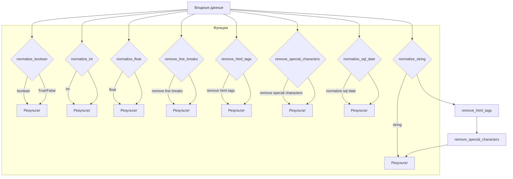

```MD
# <input code>

```rst
.. :module: src.utils.string.normalizer
```
Документация модуля нормализации данных
=========================================

Модуль `normalizer` предоставляет функциональность для нормализации различных типов данных, включая строки, булевы значения, целые числа и числа с плавающей запятой. Он также включает вспомогательные функции для обработки текста.

---

## Содержание

1. [Обзор](#обзор)
2. [Функции модуля](#функции-модуля)
   - [normalize_boolean](#normalize_boolean)
   - [normalize_string](#normalize_string)
   - [normalize_int](#normalize_int)
   - [normalize_float](#normalize_float)
   - [remove_line_breaks](#remove_line_breaks)
   - [remove_html_tags](#remove_html_tags)
   - [remove_special_characters](#remove_special_characters)
   - [normalize_sql_date](#normalize_sql_date)
3. [Пример использования](#пример-использования)
4. [Требования](#требования)

---

# <algorithm>

Алгоритм работы функций модуля `normalizer` достаточно прост и состоит из следующих шагов:

**1. `normalize_boolean`:**

* Принимает любое значение.
* Проверяет, соответствует ли введенное значение одному из булевых представлений (например, 'true', 'yes', 1).
* Возвращает `True` или `False` в зависимости от результата.

**Пример:**

```
Вход: 'yes'
Выход: True
```

**2. `normalize_string`:**

* Принимает строку или список строк.
* Если вход - список, объединяет все строки в одну, удаляя лишние пробелы.
* Удаляет HTML теги (`remove_html_tags`).
* Удаляет специальные символы (`remove_special_characters`).
* Возвращает очищенную строку.

**Пример:**

```
Вход: ['  Example string  ', '<b>with HTML</b>']
Выход: 'Example string with HTML'
```

**3. `normalize_int`:**

* Принимает число или его строковое представление.
* Преобразует вход в целое число.
* Возвращает целое число.

**Пример:**

```
Вход: '42'
Выход: 42
```

**4. `normalize_float`:**

* Принимает число, строку или список чисел.
* Преобразует каждое значение в список чисел с плавающей запятой.
* Возвращает список чисел с плавающей запятой или `None` при ошибке.

**Пример:**

```
Вход: [1, '2.5', 3]
Выход: [1.0, 2.5, 3.0]
```

**5. `remove_line_breaks`:**

* Удаляет символы новой строки из входной строки.
* Возвращает строку без символов новой строки.

**Пример:**

```
Вход: 'String\nwith line breaks\r'
Выход: 'String with line breaks'
```

**6. `remove_html_tags`, `remove_special_characters`:**

* Удаляют HTML теги или специальные символы из строки или списка строк.
* Возвращают обработанную строку или список строк.


**7. `normalize_sql_date`:**

* Принимает дату в строковом формате или как объект `datetime`.
* Преобразует дату в формат `YYYY-MM-DD`.
* Возвращает строку в формате `YYYY-MM-DD`.


# <mermaid>



**Зависимости:** Функции модуля зависят от стандартных библиотек Python, таких как `datetime`. Модуль `src.logger` не используется напрямую в приведенном коде документации, но упоминается как требование.


# <explanation>

**Импорты:**

Документация не содержит импортов. Примеры использования импортируют необходимые функции из модуля `src.utils.string.normalizer`. Это указывает на то, что код из документации является частью большего проекта.

**Классы:**

В предоставленном коде нет классов.  Документация описывает функции, которые, скорее всего, реализованы внутри модуля `normalizer.py`.

**Функции:**

* **`normalize_boolean(input_data)`**: Преобразует различные типы данных в булево значение.
* **`normalize_string(input_data)`**: Нормализует строки, удаляя пробелы, HTML-теги и специальные символы.
* **`normalize_int(input_data)`**: Преобразует данные в целое число.
* **`normalize_float(value)`**: Преобразует данные в число с плавающей запятой. Обрабатывает и списки чисел.
* **`remove_line_breaks(input_str)`**: Удаляет символы новой строки из строки.
* **`remove_html_tags(input_html)`**: Удаляет HTML теги из строки.
* **`remove_special_characters(input_str)`**: Удаляет специальные символы из строки или списка строк.
* **`normalize_sql_date(input_data)`**: Преобразует строку или объект `datetime` в формат SQL даты `YYYY-MM-DD`.

**Переменные:**

Документация описывает аргументы функций, которые являются переменными.  Их типы и использование (строки, целые числа, списки и т.д.) описаны в документации к функциям.

**Возможные ошибки и улучшения:**

* **Обработка исключений:** Функция `normalize_float` должна обрабатывать исключения, которые могут возникнуть при преобразовании строк в числа с плавающей запятой (например, если строка не является валидным числом).  Добавление try/except блоков существенно улучшит надежность.
* **Документация к функциям:**  Дополнительно можно описать, какие типы ошибок могут возвращаться и как их интерпретировать.
* **Типизация:** Добавление аннотаций типов (например, `-> str`) в определения функций улучшит читаемость и поддерживаемость кода.


**Взаимосвязи с другими частями проекта:**

Модуль явно зависит от `src.logger` для логирования. Возможно, он также зависит от других частей проекта, если функции `remove_html_tags` и `remove_special_characters` используют внешние библиотеки (например, для обработки регулярных выражений). Необходимо посмотреть реализацию этих функций в `normalizer.py`, чтобы получить полное представление о зависимостях.