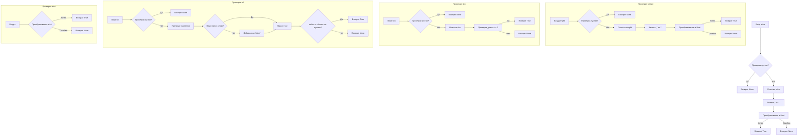

# <input code>

```python
## \file hypotez/src/utils/string/validator.py
# -*- coding: utf-8 -*-\n#! venv/Scripts/python.exe
#! venv/bin/python/python3.12

"""
.. module: src.utils.string 
	:platform: Windows, Unix
	:synopsis: Модуль валидации строк
Модуль может предоставлять функции для проверки строк на соответствие определенным критериям или форматам.
Валидация может включать в себя проверку наличия определенных символов, длины строки, формата электронной почты, URL и т. д.

"""
...
MODE = 'dev'
import re, html
from urllib.parse import urlparse, parse_qs
from typing import Union
from urllib.parse import urlparse, parse_qs

from src.logger import logger

class ProductFieldsValidator:
    """
     StringValidator (Валидатор строк):
    @details 
    - Задача: Проверка строки на соответствие определенным критериям или шаблонам.
    - Действия: Проверка наличия определенных символов, длины строки, соответствие регулярным выражениям и другие проверки.
    - Пример использования: Проверка корректности электронной почты, пароля или номера кредитной карты.
    """

    @staticmethod
    def validate_price(price: str) -> bool:
        """
         [Function's description]

        Parameters : 
            @param price : str  :  [description]
        Returns : 
            @return bool  :  [description]

        """
        """
        Валидация цены
        """
        if not price:
            return
        price = Ptrn.clear_price.sub('', price)
        price = price.replace(',', '.')
        try:
            float(price)
        except:
            return
        return True


    @staticmethod
    def validate_weight(weight: str) -> bool:
        """
         [Function's description]

        Parameters : 
            @param weight : str  : [description]
        Returns : 
            @return bool  : [description]

        """
        """
        Валидация веса
        """
        if not weight:
            return
        weight = Ptrn.clear_number.sub('', weight)
        weight = weight.replace(',', '.')
        try:
            float(weight)
        except:
            return
        return True


    @staticmethod
    def validate_sku(sku: str) -> bool:
        """
         [Function's description]

        Parameters : 
            @param sku : str  : [description]
        Returns : 
            @return bool  : [description]

        """
        """
        Валидация артикула
        """
        if not sku:
            return
        sku = StringFormatter.remove_special_characters(sku)
        sku = StringFormatter.remove_line_breaks(sku)
        sku = sku.strip()
        if len(sku) < 3:
            return
        return True


    @staticmethod
    def validate_url(url: str) -> bool:
        """
         [Function's description]

        Parameters : 
            @param url : str  : [description]
        Returns : 
            @return bool  : [description]

        """
        """
        Валидация URL
        """
        if not url:
            return

        url = url.strip()

        if not url.startswith('http'):
            url = 'http://' + url

        parsed_url = urlparse(url)

        if not parsed_url.netloc or not parsed_url.scheme:
            return

        return True


    @staticmethod
    def isint(s: str) -> bool:
        """
         [Function's description]

        Parameters : 
            @param s : str  : [description]
        Returns : 
            @return bool  : [description]

        """
        try:
            s = int(s)
            return True
        except Exception as ex:
            return
```

# <algorithm>

**validate_price(price):**

1. Проверяет, пустая ли строка `price`. Если да, возвращает `None`.
2. Удаляет нечисловые символы из `price` используя `Ptrn.clear_price`.
3. Заменяет запятые на точки в `price`.
4. Пытается преобразовать `price` в число с плавающей точкой `float()`.
5. Если преобразование не удалось, возвращает `None`.
6. Возвращает `True`, если преобразование прошло успешно.


**validate_weight(weight):**

Аналогично `validate_price`, но использует `Ptrn.clear_number` для удаления нечисловых символов.


**validate_sku(sku):**

1. Проверяет, пустая ли строка `sku`. Если да, возвращает `None`.
2. Удаляет специальные символы из `sku` используя `StringFormatter.remove_special_characters`.
3. Удаляет переводы строк из `sku` используя `StringFormatter.remove_line_breaks`.
4. Удаляет пробелы с начала и конца `sku` используя `strip()`.
5. Проверяет, длина `sku` больше или равна 3. Если нет, возвращает `None`.
6. Возвращает `True`, если все проверки пройдены.


**validate_url(url):**

1. Проверяет, пустая ли строка `url`. Если да, возвращает `None`.
2. Удаляет пробелы с начала и конца `url` используя `strip()`.
3. Если `url` не начинается с 'http', добавляет префикс 'http://'.
4. Парсит `url` используя `urlparse`.
5. Проверяет, `parsed_url.netloc` и `parsed_url.scheme` не пустые. Если нет, возвращает `None`.
6. Возвращает `True`, если все проверки пройдены.


**isint(s):**

1. Пытается преобразовать `s` в целое число `int()`.
2. Если преобразование не удалось, возвращает `None`.
3. Возвращает `True`, если преобразование прошло успешно.


# <mermaid>



# <explanation>

**Импорты:**

* `re`, `html`: Стандартные библиотеки Python для работы с регулярными выражениями и HTML.
* `urllib.parse`: Модуль для работы с URL-адресами (парсинг, обработка параметров).
* `typing.Union`: Для указания возможности возвращать разные типы данных.
* `src.logger`: Логгер, вероятнее всего, из собственного модуля логирования.

**Классы:**

* `ProductFieldsValidator`:  Класс, содержащий статические методы для валидации различных полей (цена, вес, артикул, URL).

**Функции:**

* `validate_price(price: str) -> bool`: Валидирует значение цены. Проверяет, является ли `price` числом с плавающей точкой после очистки от нечисловых символов и замены запятых на точки. Возвращает `True` при успешной валидации, иначе `None`.
* `validate_weight(weight: str) -> bool`: Аналогично `validate_price`, но для валидации веса.
* `validate_sku(sku: str) -> bool`: Валидирует артикул (SKU).  Удаляет специальные символы, переводы строк и пробелы, и проверяет, что длина `sku` не меньше 3 символов. Возвращает `True` при успешной валидации, иначе `None`.
* `validate_url(url: str) -> bool`: Валидирует URL.  Проверяет, что URL начинается с 'http' и содержит корректный домен (`netloc`).
* `isint(s: str) -> bool`:  Проверяет, является ли строка целым числом. Возвращает `True`, если это целое число.

**Переменные:**

* `MODE`: Вероятно, переменная для обозначения режима работы (например, `dev` или `prod`).

**Возможные ошибки и улучшения:**

* **Не указан тип `Ptrn` и `StringFormatter`**:  Код использует классы `Ptrn` и `StringFormatter`, которые не определены.  Нужно либо определить эти классы, либо использовать готовые решения из стандартной библиотеки для работы с регулярными выражениями и очисткой строк.
* **Недостаточная валидация input**:  Функции могли бы проверять на пустые строки или `None` input.
* **Отсутствие явного возврата None**:  Функции возвращают `None`, если валидация не прошла.  Это может привести к неожиданным ошибкам.  Рекомендуется возвращать `False` или `None`.
* **Плохие имена переменных**: Имена переменных `price`, `weight` и `sku` немного не информативны.  Может быть лучше использовать более описательные имена.
* **Дополнения**: Добавить валидацию для других типов данных (например, email, phone).

**Взаимосвязи с другими частями проекта:**

Код зависит от `src.logger` для записи сообщений, и `StringFormatter` для обработки строк.  Логирование может использоваться для отслеживания ошибок валидации.  `StringFormatter` в свою очередь зависит от других модулей, если он собственный.  В целом, код является частью более крупного проекта, связанного с обработкой и валидацией данных о продуктах.