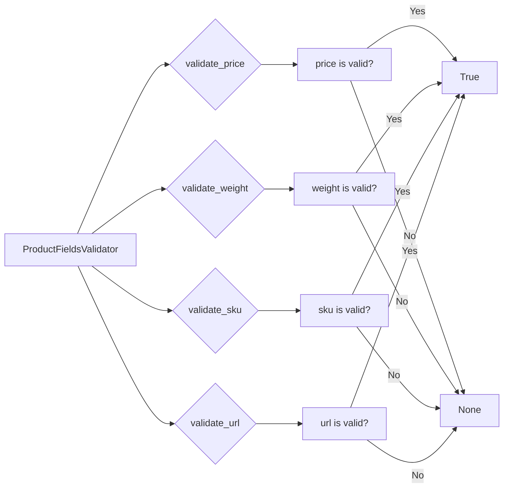

# <input code>

```python
## \file hypotez/src/utils/string/validator.py
# -*- coding: utf-8 -*-\
#! venv/Scripts/python.exe
#! venv/bin/python/python3.12

"""
.. module: src.utils.string 
	:platform: Windows, Unix
	:synopsis: Модуль валидации строк
Модуль может предоставлять функции для проверки строк на соответствие определенным критериям или форматам.
Валидация может включать в себя проверку наличия определенных символов, длины строки, формата электронной почты, URL и т. д.

"""
...
MODE = 'dev'
import re, html
from urllib.parse import urlparse, parse_qs
from typing import Union
from urllib.parse import urlparse, parse_qs

from src.logger import logger

class ProductFieldsValidator:
    """
     StringValidator (Валидатор строк):
    @details 
    - Задача: Проверка строки на соответствие определенным критериям или шаблонам.
    - Действия: Проверка наличия определенных символов, длины строки, соответствие регулярным выражениям и другие проверки.
    - Пример использования: Проверка корректности электронной почты, пароля или номера кредитной карты.
    """

    @staticmethod
    def validate_price(price: str) -> bool:
        """
         [Function's description]

        Parameters : 
            @param price : str  :  [description]
        Returns : 
            @return bool  :  [description]

        """
        """
        Валидация цены
        """
        if not price:
            return
        price = Ptrn.clear_price.sub('', price)
        price = price.replace(',', '.')
        try:
            float(price)
        except:
            return
        return True


    @staticmethod
    def validate_weight(weight: str) -> bool:
        """
         [Function's description]

        Parameters : 
            @param weight : str  : [description]
        Returns : 
            @return bool  :  [description]

        """
        """
        Валидация веса
        """
        if not weight:
            return
        weight = Ptrn.clear_number.sub('', weight)
        weight = weight.replace(',', '.')
        try:
            float(weight)
        except:
            return
        return True


    @staticmethod
    def validate_sku(sku: str) -> bool:
        """
         [Function's description]

        Parameters : 
            @param sku : str  : [description]
        Returns : 
            @return bool  : [description]

        """
        """
        Валидация артикула
        """
        if not sku:
            return
        sku = StringFormatter.remove_special_characters(sku)
        sku = StringFormatter.remove_line_breaks(sku)
        sku = sku.strip()
        if len(sku) < 3:
            return
        return True


    @staticmethod
    def validate_url(url: str) -> bool:
        """
         [Function's description]

        Parameters : 
            @param url : str  : [description]
        Returns : 
            @return bool  : [description]

        """
        """
        Валидация URL
        """
        if not url:
            return

        url = url.strip()

        if not url.startswith('http'):
            url = 'http://' + url

        parsed_url = urlparse(url)

        if not parsed_url.netloc or not parsed_url.scheme:
            return

        return True


    @staticmethod
    def isint(s: str) -> bool:
        """
         [Function's description]

        Parameters : 
            @param s : str  : [description]
        Returns : 
            @return bool  : [description]

        """
        try:
            s = int(s)
            return True
        except Exception as ex:
            return
```

# <algorithm>

**validate_price(price):**

1. Проверяет, пустая ли строка price. Если да, возвращает `None`.
2. Удаляет ненужные символы из строки `price` с помощью регулярного выражения `Ptrn.clear_price`.
3. Заменяет запятые на точки в строке `price`.
4. Пытается преобразовать строку `price` в число с плавающей точкой `float(price)`.
5. Если преобразование не удается, возвращает `None`.
6. Если преобразование успешно, возвращает `True`.

**validate_weight(weight):**

1. Проверяет, пустая ли строка weight. Если да, возвращает `None`.
2. Удаляет ненужные символы из строки `weight` с помощью регулярного выражения `Ptrn.clear_number`.
3. Заменяет запятые на точки в строке `weight`.
4. Пытается преобразовать строку `weight` в число с плавающей точкой `float(weight)`.
5. Если преобразование не удается, возвращает `None`.
6. Если преобразование успешно, возвращает `True`.

**validate_sku(sku):**

1. Проверяет, пустая ли строка sku. Если да, возвращает `None`.
2. Удаляет специальные символы из `sku` с помощью функции `StringFormatter.remove_special_characters`.
3. Удаляет переводы строк из `sku` с помощью функции `StringFormatter.remove_line_breaks`.
4. Удаляет пробелы с помощью `sku.strip()`.
5. Проверяет, что длина `sku` не меньше 3. Если меньше, возвращает `None`.
6. Возвращает `True` в случае успеха.

**validate_url(url):**

1. Проверяет, пустая ли строка url. Если да, возвращает `None`.
2. Удаляет пробелы с помощью `url.strip()`.
3. Если URL не начинается с "http", добавляет "http://" в начало.
4. Разбирает URL с помощью `urlparse(url)`, получая `parsed_url`.
5. Проверяет, что `parsed_url.netloc` и `parsed_url.scheme` не пустые. Если пустые, возвращает `None`.
6. Возвращает `True` в случае успеха.

**isint(s):**

1. Пытается преобразовать строку `s` в целое число `int(s)`.
2. Если преобразование успешно, возвращает `True`.
3. Если преобразование не удалось, возвращает `None`.


# <mermaid>



# <explanation>

**Импорты:**

- `re`, `html`: Библиотеки Python для работы с регулярными выражениями и HTML.
- `urllib.parse`: Библиотека для работы с URL, включая разбор и форматирование.
- `typing.Union`:  Часть стандартной библиотеки Python для типов, используется для указания возможных типов данных.
- `src.logger`:  Логгер, скорее всего, определён в другом модуле `src.logger`.  Это часть собственной логики проекта.  Подключение к логированию — важный аспект.

**Классы:**

- `ProductFieldsValidator`: Класс для валидации различных полей (цены, веса, артикула, URL).  Он содержит статические методы, что означает, что методы не связаны с конкретными объектами класса.


**Функции:**

- `validate_price(price: str) -> bool`:  Проверяет, является ли строка `price` валидной ценой.  Возвращает `True`, если цена корректна, `None` иначе. Удаляет ненужные символы из строки, заменяет запятые на точки, пытается преобразовать в число с плавающей точкой.
- `validate_weight(weight: str) -> bool`: Аналогично `validate_price`, но для валидации веса.
- `validate_sku(sku: str) -> bool`:  Проверяет корректность артикула `sku`, удаляя специальные символы, переводы строк, проверяя длину. Возвращает `True`, если артикул валидный, `None` иначе.
- `validate_url(url: str) -> bool`: Проверяет валидность URL. Возвращает `True`, если URL валиден, `None` иначе.  Проверяет наличие схемы `http` и валидность домена.
- `isint(s: str) -> bool`:  Проверяет, можно ли преобразовать строку `s` в целое число `int`. Возвращает `True` при успешном преобразовании.

**Переменные:**

- `MODE`:  Вероятно, константа, определяющая режим работы приложения ('dev', 'prod').
- `Ptrn`: Похоже, это класс или объект, содержащий регулярные выражения для очистки данных.
- `StringFormatter`: Похоже на класс, содержащий статические методы для форматирования строк.

**Возможные ошибки и улучшения:**

- **Неявное возвращение `None`:** В функциях `validate_price`, `validate_weight`, `validate_sku` и `isint` при возникновении ошибок возвращается `None` неявно.  Лучше явно указывать `return None` или `return False` в случае ошибки, чтобы код был более понятен и избегать непреднамеренного поведения.
- **Нет обработки исключений:** Обработка исключений при преобразовании строки в число ограничена  `except: return`. Лучше указать конкретные типы исключений, которые нужно перехватывать.
- **Неопределённые `Ptrn` и `StringFormatter`:** В коде упоминаются `Ptrn` и `StringFormatter`, которые не определены в данном фрагменте кода. Необходимо знать определения этих классов или объектов для полного понимания кода.
- **Документация:** Документация в формате docstrings (`"""..."""`) должна быть более подробной и содержательной.

**Цепочка взаимосвязей:**

Методы `validate_price`, `validate_weight`, `validate_sku`, и `validate_url` скорее всего используются в другом модуле, например, для валидации данных перед сохранением в базу данных или для обработки запросов от пользователей. Модуль `src.logger` может использоваться для записи сообщений об успешной/неуспешной валидации или других событий.  Также, `StringFormatter` и `Ptrn`, скорее всего, лежат в другом модуле приложения и содержат константы и/или функции для обработки строк.