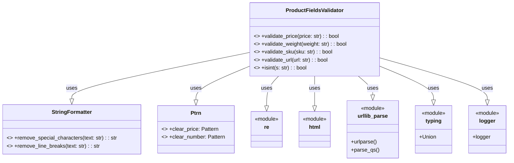

## ИНСТРУКЦИЯ:

Анализируй предоставленный код подробно и объясни его функциональность. Ответ должен включать три раздела:  

1.  **<алгоритм>**: Опиши рабочий процесс в виде пошаговой блок-схемы, включая примеры для каждого логического блока, и проиллюстрируй поток данных между функциями, классами или методами.  
2.  **<mermaid>**: Напиши код для диаграммы в формате `mermaid`, проанализируй и объясни все зависимости,
    которые импортируются при создании диаграммы.
    **ВАЖНО!** Убедитесь, что все имена переменных, используемые в диаграмме `mermaid`,
    имеют осмысленные и описательные имена. Имена переменных вроде `A`, `B`, `C`, и т.д., не допускаются!  
    
    **Дополнительно**: Если в коде есть импорт `import header`, добавьте блок `mermaid` flowchart, объясняющий `header.py`:\
    \`\`\`mermaid\
    flowchart TD\
        Start --> Header[<code>header.py</code><br> Determine Project Root]\
    
        Header --> import[Import Global Settings: <br><code>from src import gs</code>] \
    \`\`\`
3.  **<объяснение>**: Предоставьте подробные объяснения:  
    -   **Импорты**: Их назначение и взаимосвязь с другими пакетами `src.`.  
    -   **Классы**: Их роль, атрибуты, методы и взаимодействие с другими компонентами проекта.  
    -   **Функции**: Их аргументы, возвращаемые значения, назначение и примеры.  
    -   **Переменные**: Их типы и использование.  
    -   Выделите потенциальные ошибки или области для улучшения.  

Дополнительно, постройте цепочку взаимосвязей с другими частями проекта (если применимо).  

Это обеспечивает всесторонний и структурированный анализ кода.
## Формат ответа: `.md` (markdown)
**КОНЕЦ ИНСТРУКЦИИ**
```md
## <алгоритм>

**ProductFieldsValidator** - класс для валидации различных полей продукта, таких как цена, вес, артикул и URL.

**1. `validate_price(price: str) -> bool`:**
   -  **Начало:** Принимает строку `price` в качестве аргумента.
   -  **Проверка на пустоту:** Проверяет, не является ли строка `price` пустой или None. Если это так, функция возвращает `None` и завершается.
       - *Пример:* `price = ""` вернет `None`.
   -  **Очистка цены:** Удаляет все символы, не являющиеся цифрами, точками или запятыми, используя `Ptrn.clear_price.sub()`.
       - *Пример:* `price = "123,45€"` станет `"123,45"`.
   -  **Замена запятой на точку:** Заменяет запятую на точку, приводя к стандартному формату для float.
       - *Пример:* `price = "123,45"` станет `"123.45"`.
   -  **Преобразование в float:** Пытается преобразовать строку `price` в число с плавающей точкой (`float`).
       -  **Успех:** Если преобразование прошло успешно, функция возвращает `True`.
           - *Пример:* `price = "123.45"` вернет `True`.
       -  **Ошибка:** Если преобразование вызывает исключение, функция возвращает `None`.
           - *Пример:* `price = "abc"` вернет `None`.
   -  **Конец:** Функция возвращает `True` или `None`.

**2. `validate_weight(weight: str) -> bool`:**
   -  **Начало:** Принимает строку `weight` в качестве аргумента.
   -  **Проверка на пустоту:** Проверяет, не является ли строка `weight` пустой или None. Если это так, функция возвращает `None` и завершается.
       - *Пример:* `weight = ""` вернет `None`.
   -  **Очистка веса:** Удаляет все символы, не являющиеся цифрами, точками или запятыми, используя `Ptrn.clear_number.sub()`.
       - *Пример:* `weight = "10,5 кг"` станет `"10,5"`.
   -  **Замена запятой на точку:** Заменяет запятую на точку, приводя к стандартному формату для float.
       - *Пример:* `weight = "10,5"` станет `"10.5"`.
   -  **Преобразование в float:** Пытается преобразовать строку `weight` в число с плавающей точкой (`float`).
       -  **Успех:** Если преобразование прошло успешно, функция возвращает `True`.
           - *Пример:* `weight = "10.5"` вернет `True`.
       -  **Ошибка:** Если преобразование вызывает исключение, функция возвращает `None`.
           - *Пример:* `weight = "abc"` вернет `None`.
   -  **Конец:** Функция возвращает `True` или `None`.

**3. `validate_sku(sku: str) -> bool`:**
   -  **Начало:** Принимает строку `sku` в качестве аргумента.
   -  **Проверка на пустоту:** Проверяет, не является ли строка `sku` пустой или None. Если это так, функция возвращает `None` и завершается.
       - *Пример:* `sku = ""` вернет `None`.
   -  **Удаление специальных символов:** Удаляет специальные символы, используя `StringFormatter.remove_special_characters(sku)`.
       - *Пример:* `sku = "ABC-123"` станет `"ABC123"`.
   -  **Удаление переносов строк:** Удаляет переносы строк, используя `StringFormatter.remove_line_breaks(sku)`.
       - *Пример:* `sku = "ABC\n123"` станет `"ABC123"`.
   -  **Удаление лишних пробелов:** Удаляет пробелы в начале и в конце строки.
       - *Пример:* `sku = " ABC123  "` станет `"ABC123"`.
   -  **Проверка длины:** Проверяет, является ли длина строки `sku` меньше 3. Если это так, функция возвращает `None`.
       - *Пример:* `sku = "AB"` вернет `None`.
   -  **Конец:** Функция возвращает `True` если длина `sku` >= 3 или `None`.
       - *Пример:* `sku = "ABC123"` вернет `True`.

**4. `validate_url(url: str) -> bool`:**
   -  **Начало:** Принимает строку `url` в качестве аргумента.
   -  **Проверка на пустоту:** Проверяет, не является ли строка `url` пустой или None. Если это так, функция возвращает `None` и завершается.
       - *Пример:* `url = ""` вернет `None`.
   -  **Удаление лишних пробелов:** Удаляет пробелы в начале и в конце строки.
       - *Пример:* `url = "  https://example.com  "` станет `"https://example.com"`.
   -  **Добавление http://:** Проверяет, начинается ли строка `url` с `http`. Если нет, добавляет `"http://"` в начало.
       - *Пример:* `url = "example.com"` станет `"http://example.com"`.
   -  **Разбор URL:** Разбирает URL используя `urlparse`.
   -  **Проверка netloc и scheme:** Проверяет, существуют ли `netloc` (сетевое расположение) и `scheme` (протокол) в разобранном URL. Если нет, функция возвращает `None`.
       - *Пример:* `url = "http://example.com"` вернет `True`.
       - *Пример:* `url = "example"` вернет `None`.
   -  **Конец:** Функция возвращает `True` или `None`.

**5. `isint(s: str) -> bool`:**
   -  **Начало:** Принимает строку `s` в качестве аргумента.
   -  **Преобразование в int:** Пытается преобразовать строку `s` в целое число (`int`).
       -  **Успех:** Если преобразование прошло успешно, функция возвращает `True`.
           - *Пример:* `s = "123"` вернет `True`.
       -  **Ошибка:** Если преобразование вызывает исключение, функция возвращает `None`.
           - *Пример:* `s = "abc"` вернет `None`.
   -  **Конец:** Функция возвращает `True` или `None`.
   
## <mermaid>



**Описание зависимостей `mermaid`:**

1.  **`class ProductFieldsValidator`**:
    -   Это основной класс, который предоставляет статические методы для валидации различных типов полей продукта (цена, вес, артикул, URL, целое число).
2.  **`class StringFormatter`**:
    -   Вспомогательный класс, предоставляющий статические методы `remove_special_characters` и `remove_line_breaks` для очистки строк.
    -   Используется классом `ProductFieldsValidator` для валидации артикула (`sku`).
3.  **`class Ptrn`**:
     -   Вспомогательный класс, который содержит статические переменные `clear_price` и `clear_number`, которые представляют собой скомпилированные регулярные выражения.
     -   Используется для очистки данных в методах валидации цены и веса.
4.  **`class re`**:
    -   Модуль `re` из стандартной библиотеки Python, предоставляющий функциональность для работы с регулярными выражениями. Используется для очистки строк в `Ptrn`.
5.  **`class html`**:
    -   Модуль `html` из стандартной библиотеки Python, предоставляет функции для работы с HTML. (В коде не используется, но импортирован)
6.  **`class urllib_parse`**:
    -   Модуль `urllib.parse` из стандартной библиотеки Python, предоставляющий функции для разбора URL (`urlparse` и `parse_qs`).
    -   Используется для валидации URL.
7.  **`class typing`**:
    -  Модуль `typing` из стандартной библиотеки Python,  предоставляет средства для аннотации типов. Используется для аннотации типов в функциях.
8.  **`class logger`**:
    -   Модуль `logger` из пакета `src.logger`, предоставляет функциональность для логирования. (В коде не используется, но импортирован)
 
## <объяснение>

**Импорты:**

-   `import re, html`:
    -   `re`:  Используется для работы с регулярными выражениями, в частности, для очистки строк от нежелательных символов в `Ptrn`.
    -   `html`:  Используется для работы с HTML. В данном коде напрямую не используется, возможно, планировалось использование в будущем.
-   `from urllib.parse import urlparse, parse_qs`:
    -   `urlparse`: Используется для разбора URL на составные части (схема, сетевое расположение и т.д.) в `validate_url`.
    -   `parse_qs`:  Используется для разбора строки запроса URL (не используется напрямую в этом коде, но может быть частью более широкой функциональности).
-   `from typing import Union`:
    -   `Union`: Используется для указания, что переменная может быть одного из нескольких типов (не используется в данном коде).
-   `from src.logger.logger import logger`:
    -   `logger`:  Импортируется логгер из модуля `src.logger`.  Предполагается использование для записи сообщений в лог (в коде не используется, но импортирован).

**Классы:**

-   **`class ProductFieldsValidator`**:
    -   **Роль**: Класс-валидатор, предоставляющий статические методы для проверки различных типов данных (цена, вес, артикул, URL).
    -   **Атрибуты**: Нет атрибутов (использует только статические методы).
    -   **Методы**:
        -   `validate_price(price: str) -> bool`: Проверяет, является ли строка `price` корректной ценой.
        -   `validate_weight(weight: str) -> bool`: Проверяет, является ли строка `weight` корректным весом.
        -   `validate_sku(sku: str) -> bool`: Проверяет, является ли строка `sku` корректным артикулом.
        -   `validate_url(url: str) -> bool`: Проверяет, является ли строка `url` корректным URL.
        -   `isint(s: str) -> bool`: Проверяет, является ли строка `s` целым числом.
    -   **Взаимодействие**:
        -   Использует `StringFormatter` для очистки строк.
        -   Использует `Ptrn` для регулярных выражений при валидации цен и веса.
        -   Использует `urlparse` из модуля `urllib.parse` для проверки URL.

**Функции:**

-   **`validate_price(price: str) -> bool`**:
    -   **Аргументы**: `price` - строка, представляющая цену.
    -   **Возвращаемое значение**: `True`, если `price` корректная цена, `None` в противном случае (пустая строка, ошибка преобразования).
    -   **Назначение**: Проверяет корректность формата цены, приводя её к типу `float`.
    -   **Пример**: `validate_price("123,45")` вернет `True`, `validate_price("abc")` вернет `None`.
-   **`validate_weight(weight: str) -> bool`**:
    -   **Аргументы**: `weight` - строка, представляющая вес.
    -   **Возвращаемое значение**: `True`, если `weight` корректный вес, `None` в противном случае (пустая строка, ошибка преобразования).
    -   **Назначение**: Проверяет корректность формата веса, приводя её к типу `float`.
    -   **Пример**: `validate_weight("10.5")` вернет `True`, `validate_weight("abc")` вернет `None`.
-   **`validate_sku(sku: str) -> bool`**:
    -   **Аргументы**: `sku` - строка, представляющая артикул.
    -   **Возвращаемое значение**: `True`, если `sku` корректный артикул, `None` в противном случае (пустая строка или длина < 3).
    -   **Назначение**: Проверяет корректность формата артикула.
    -   **Пример**: `validate_sku("ABC-123")` вернет `True`, `validate_sku("AB")` вернет `None`.
-   **`validate_url(url: str) -> bool`**:
    -   **Аргументы**: `url` - строка, представляющая URL.
    -   **Возвращаемое значение**: `True`, если `url` корректный URL, `None` в противном случае (пустая строка, некорректный формат).
    -   **Назначение**: Проверяет корректность формата URL.
    -   **Пример**: `validate_url("https://example.com")` вернет `True`, `validate_url("example")` вернет `None`.
-   **`isint(s: str) -> bool`**:
    -   **Аргументы**: `s` - строка, которую нужно проверить.
    -   **Возвращаемое значение**: `True`, если `s` целое число, `None` в противном случае (ошибка преобразования).
    -   **Назначение**: Проверяет, можно ли преобразовать строку в целое число.
    -   **Пример**: `isint("123")` вернет `True`, `isint("abc")` вернет `None`.

**Переменные:**

-   `price`, `weight`, `sku`, `url`, `s` - это локальные переменные, используемые внутри функций для хранения и обработки входных данных.
    - Тип: `str` (строка).

**Потенциальные ошибки и области для улучшения:**

1.  **Обработка ошибок**:
    -   Функции возвращают `None` в случае ошибки, что может усложнить дальнейшую обработку.  Можно пересмотреть использование исключений для более четкой сигнализации об ошибках.
2.  **Логирование**:
    -   Импортируется логгер, но не используется. Рекомендуется добавить логирование для отслеживания ошибок и процесса валидации.
3.  **Унификация**:
    -   Функции `validate_price` и `validate_weight` имеют много общего. Можно было бы создать общую функцию для валидации чисел.
4.  **Модульность**:
    -   Класс `StringFormatter` не включен. Возможно, стоит рассмотреть его добавление для более структурированного кода.
5. **Ptrn**
    -  Класс `Ptrn` не включен.

**Взаимосвязи с другими частями проекта:**

-   Этот модуль валидации строк вероятно будет использоваться в других частях проекта, где требуется проверка корректности данных перед их обработкой или сохранением. Например, при обработке данных форм, загрузке данных из файлов и т.д.
-   Модуль `src.logger.logger` используется для логирования, что позволяет отслеживать работу приложения.

Цепочка взаимосвязей (пример):

`User Input` -> `Data Processing Module` -> `ProductFieldsValidator` -> `Data Storage`.
```