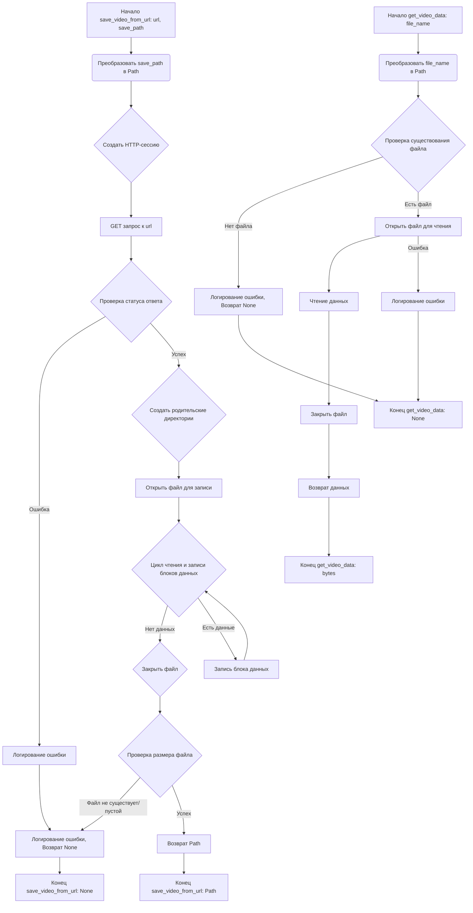

## <алгоритм>

### save_video_from_url
1.  **Начало**: Функция `save_video_from_url` принимает URL видео `url` (строка) и путь сохранения `save_path` (строка).
    *   Пример: `url` = "https://example.com/video.mp4", `save_path` = "local_video.mp4"
2.  **Преобразование пути**: `save_path` преобразуется в объект `Path` из библиотеки `pathlib`.
    *   Пример: `save_path` = `Path("local_video.mp4")`
3.  **HTTP-запрос**: Асинхронно открывается HTTP-сессия, выполняется GET-запрос к `url`.
    *   Пример: Отправляется GET запрос по адресу "https://example.com/video.mp4"
4.  **Проверка статуса ответа**: Проверяется статус HTTP-ответа на наличие ошибок. Если есть ошибки, то вызывается исключение и передается в блок `except`.
    *   Пример: HTTP-ответ 200 - успех, HTTP-ответ 404 - ошибка
5.  **Создание директории**: Создаётся родительская директория для `save_path`, если её не существует.
    *   Пример: `save_path` = `Path("dir/local_video.mp4")`, создается директория "dir"
6.  **Запись файла**: Асинхронно открывается файл для записи в бинарном режиме (`"wb"`), в цикле считываются и записываются блоки данных (размером 8192 байта) из ответа.
    *   Пример: Чтение данных из response по 8192 байта и запись в файл.
7.  **Проверка размера файла**: После записи файла проверяется его существование и размер. Если файл не существует или его размер равен 0 байт, возвращается `None` (записывается ошибка в лог).
    *   Пример: Если после записи файла `local_video.mp4` его размер оказался 0 байт, то возвращаем `None`.
8.  **Успех**: Если файл успешно скачан и сохранен, возвращается объект `Path` к сохраненному файлу.
    *   Пример: Функция возвращает `Path("local_video.mp4")`
9.  **Обработка ошибок**: Если в процессе скачивания или сохранения возникает ошибка (`aiohttp.ClientError` или другое исключение), то ошибка логируется, и возвращается `None`.
    *   Пример: Возникла ошибка сети, возвращается `None`

### get_video_data
1.  **Начало**: Функция `get_video_data` принимает путь к файлу `file_name` (строка).
    *   Пример: `file_name` = "local_video.mp4"
2.  **Преобразование пути**: `file_name` преобразуется в объект `Path`.
    *   Пример: `file_path` = `Path("local_video.mp4")`
3.  **Проверка существования файла**: Проверяется, существует ли файл по указанному пути. Если файл не существует, то логируется ошибка и возвращается `None`.
    *   Пример: Если файла `local_video.mp4` не существует, то возвращается `None`
4.  **Чтение файла**: Открывается файл для чтения в бинарном режиме (`"rb"`), и считываются все данные.
    *   Пример: Чтение всех данных из файла `local_video.mp4` в переменную.
5.  **Успех**: Возвращаются считанные бинарные данные.
    *   Пример: Функция возвращает `b'\x00\x00\x00...'`
6.  **Обработка ошибок**: Если при чтении файла возникает ошибка, то ошибка логируется и возвращается `None`.
    *   Пример: Возникла ошибка при чтении файла, возвращается `None`

## <mermaid>


### Объяснение зависимостей `mermaid`
*   `A` - `Q`:  Начало функций `save_video_from_url` и `get_video_data`, принимающих входные данные.
*   `B` - `R`: Преобразование входных путей в объекты `Path`.
*   `C`: Создание HTTP-сессии для скачивания видео.
*   `D`: GET-запрос к указанному URL.
*  `E`: Проверка статуса HTTP ответа.
*   `F`: Создание родительской директории для файла.
*   `G` - `U`: Открытие файлов (для записи и чтения)
*   `H`: Цикл для чтения и записи блоков данных.
*    `I`: Закрытие файла
*    `J`: Запись блока данных
*  `K`: Проверка размера скаченного файла
*  `L`: Логирование ошибки и выход из функции.
*  `M`: Логирование ошибки
*   `N` - `X`: Возврат результата (путь к файлу, бинарные данные).
*  `O` - `P`: Конец функции `save_video_from_url`, возвращающая `None` или `Path`.
*   `S`: Проверка существования файла.
*   `T` - `Y`: Конец функции `get_video_data`, возвращающая `None`.
*   `V`: Чтение данных из файла
* `W`: Закрытие файла
*  `Z`: Конец функции `get_video_data`, возвращающая `bytes`.
* `AA`: Логирование ошибки.
## <объяснение>

### Импорты
*   `aiohttp`: Используется для асинхронных HTTP-запросов, в основном для скачивания видео по URL.
*   `aiofiles`: Предоставляет асинхронные операции с файлами, используется для асинхронной записи скачанного видео на диск.
*   `pathlib.Path`: Позволяет работать с путями к файлам и директориям в объектно-ориентированном стиле, упрощает операции с путями.
*   `typing.Optional`: Используется для указания, что функция может возвращать значение определенного типа или `None`.
*   `asyncio`: Используется для асинхронного программирования.
*   `src.logger.logger`: Пользовательский модуль логирования для записи ошибок и другой полезной информации о работе модуля.

### Функции
*   `save_video_from_url(url: str, save_path: str) -> Optional[Path]`:
    *   **Аргументы**:
        *   `url` (str): URL видео для скачивания.
        *   `save_path` (str): Путь для сохранения скачанного видео.
    *   **Возвращает**:
        *   `Optional[Path]`: Объект `Path` к сохраненному файлу, если скачивание прошло успешно, или `None` в случае ошибки.
    *   **Назначение**: Асинхронно скачивает видео по URL и сохраняет его локально.
    *   **Пример**:
        ```python
        import asyncio
        asyncio.run(save_video_from_url("https://example.com/video.mp4", "local_video.mp4"))
        ```
*   `get_video_data(file_name: str) -> Optional[bytes]`:
    *   **Аргументы**:
        *   `file_name` (str): Путь к видеофайлу для чтения.
    *   **Возвращает**:
        *   `Optional[bytes]`: Бинарные данные файла, если файл существует и чтение прошло успешно, или `None` в случае ошибки.
    *   **Назначение**: Читает бинарные данные видеофайла.
    *   **Пример**:
        ```python
        data = get_video_data("local_video.mp4")
        if data:
            print(data[:10])
        ```
* `main()`:
    * **Аргументы**: Отсутствуют.
    * **Возвращает**: Отсутствует.
    * **Назначение**: Запускает асинхронную функцию `save_video_from_url` для тестирования функциональности.

### Переменные
*   `MODE`: Глобальная переменная, устанавливающая режим работы, имеет значение `'dev'`. Используется для определения режима работы и его влияние на функциональность (например, логирование, отладка).
*  `url`: Переменная, представляющая URL для скачивания видео.
* `save_path`: Путь для сохранения файла.
* `result`: Содержит результат выполнения функции `save_video_from_url`.
### Потенциальные ошибки и улучшения
*   **Обработка ошибок**:  Обработка ошибок достаточно полная, но можно добавить более детальное логирование исключений, например, с выводом трассировки стека.
*   **Проверка URL**: Можно добавить проверку URL на валидность (например, с помощью регулярных выражений или сторонней библиотеки).
*   **Размер файла**:  Можно добавить возможность отслеживания прогресса скачивания, отображать текущий размер скаченного файла.
*   **Оптимизация чтения**:  Можно оптимизировать чтение блоков данных при скачивании, используя `async for chunk in response.content.iter_chunked(8192)`
*   **Конфигурация**:  Можно вынести значения констант в конфигурационный файл.

### Взаимосвязь с другими частями проекта
*   **Логирование**: Используется модуль `src.logger.logger` для логирования ошибок и других событий.
*   **Модуль utils**:  Этот модуль является частью пакета `src.utils`, который, вероятно, содержит другие утилитарные функции.