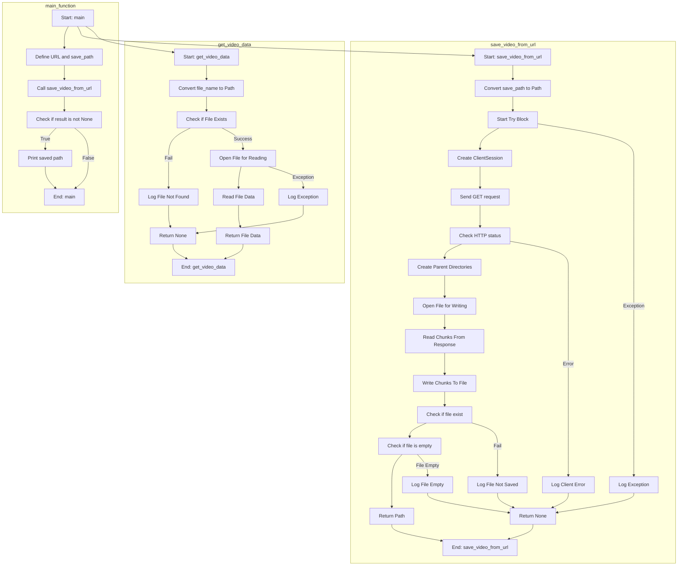

## АНАЛИЗ КОДА: `src/utils/video.py`

### 1. <алгоритм>

**`save_video_from_url(url: str, save_path: str)`:**

1.  **Начало**: Функция принимает `url` (URL видео) и `save_path` (путь сохранения).
    *   Пример: `url` = `"https://example.com/video.mp4"`, `save_path` = `"local_video.mp4"`.
2.  **Преобразование пути**: Преобразует `save_path` в объект `Path` из библиотеки `pathlib`.
    *   Пример: `"local_video.mp4"` → `Path("local_video.mp4")`.
3.  **Начало блока `try`**: Начинается блок обработки исключений.
4.  **Создание `ClientSession`**: Создается асинхронная сессия `aiohttp` для выполнения HTTP-запросов.
5.  **GET запрос**: Выполняется асинхронный GET-запрос к `url`.
6.  **Проверка статуса**: Проверяется HTTP-статус ответа. Если есть ошибка, генерируется исключение.
    *   Пример: Код ответа 200 (OK), продолжение. Код ответа 404 (Not Found) или 500 (Internal Server Error), вызывает исключение.
7.  **Создание директорий**: Создаются родительские директории для `save_path`, если они не существуют.
    *   Пример: `save_path` = `Path("videos/subfolder/local_video.mp4")`, создаются директории `"videos"` и `"videos/subfolder"`.
8.  **Открытие файла на запись**: Асинхронно открывается файл по пути `save_path` для записи в бинарном режиме (`"wb"`).
9.  **Цикл чтения**: Начинается цикл чтения данных из HTTP-ответа по частям (chunks).
    *   Пример: Читается 8192 байта данных из ответа за одну итерацию цикла.
10. **Запись в файл**: Записывается прочитанный `chunk` данных в файл.
11. **Конец цикла**: Цикл завершается, когда данные из HTTP-ответа полностью прочитаны.
12. **Проверка файла**: Проверяется, существует ли сохраненный файл, и не является ли он пустым. Если файл не существует, или имеет нулевой размер, регистрируется ошибка в `logger`, функция возвращает `None`.
13. **Возврат пути**: Если файл успешно сохранен и не пуст, возвращается `save_path`.
    *   Пример: Возвращает `Path("local_video.mp4")`.
14. **Обработка исключений**: Если во время загрузки происходит ошибка `aiohttp.ClientError`, ошибка записывается в лог, и возвращается `None`.
15. **Обработка общих исключений**: Если происходит любое другое исключение, то ошибка записывается в лог, и возвращается `None`.
16. **Конец**: Функция завершает выполнение.

**`get_video_data(file_name: str)`:**

1.  **Начало**: Функция принимает `file_name` (путь к файлу видео).
    *   Пример: `file_name` = `"local_video.mp4"`.
2.  **Преобразование пути**: Преобразует `file_name` в объект `Path`.
    *   Пример: `"local_video.mp4"` → `Path("local_video.mp4")`.
3.  **Проверка файла**: Проверяет, существует ли файл.
4.  **Возврат `None`**: Если файл не существует, регистрируется ошибка в `logger`, и функция возвращает `None`.
5.  **Открытие файла на чтение**: Открывается файл по пути `file_path` для чтения в бинарном режиме (`"rb"`).
6.  **Чтение файла**: Считывает все данные из файла.
7.  **Возврат данных**: Возвращает прочитанные данные (bytes).
8.  **Обработка исключений**: Если происходит исключение при открытии или чтении файла, ошибка записывается в лог, и возвращается `None`.
9. **Конец**: Функция завершает выполнение.

**`main()`:**

1.  **Начало**: Функция `main` определяет `url` и `save_path`.
    *   Пример: `url` = `"https://example.com/video.mp4"`, `save_path` = `"local_video.mp4"`.
2.  **Вызов `save_video_from_url`**: Вызывается асинхронная функция `save_video_from_url`.
3.  **Получение результата**: Получает результат (путь к сохраненному файлу или `None`).
4.  **Печать результата**: Если результат не `None`, выводится сообщение, что видео сохранено.
5.  **Конец**: Функция завершает выполнение.

### 2. <mermaid>


**Разбор `mermaid`:**

*   **`flowchart TD`**: Объявляет тип диаграммы как "блок-схему" (flowchart) и указывает направление сверху вниз (TD - Top Down).
*   **`subgraph save_video_from_url`**: Создает подграф, представляющий функцию `save_video_from_url`.
*   **`Start_save[...]`**: Указывает начало процесса `save_video_from_url`.
*   **`Path_conversion_save[...]`**: Описывает преобразование строки пути в объект `Path`.
*   **`Try_block_save[...]`**: Показывает начало блока обработки исключений `try`.
*    **`Create_session[...]`**: Описывает создание HTTP-сессии.
*   **`Http_get[...]`**: Описывает отправку GET-запроса.
*   **`Check_status_save[...]`**: Проверка HTTP-статуса ответа.
*   **`Create_dir_save[...]`**: Описывает создание родительских директорий.
*   **`Open_file_write_save[...]`**: Описывает открытие файла для записи.
*    **`Read_chunks_save[...]`**: Описывает чтение данных из ответа по частям.
*   **`Write_chunks_save[...]`**: Описывает запись чанков в файл.
*    **`Check_file_save[...]`**: Проверка существования файла после сохранения.
*    **`Check_size_save[...]`**: Проверка размера файла.
*   **`Return_path[...]`**: Описывает возврат пути к сохраненному файлу.
*   **`End_save[...]`**: Указывает конец процесса `save_video_from_url`.
*   **`ClientError_save[...]`**: Обработка `aiohttp.ClientError` и запись в лог.
*   **`Return_none_save[...]`**: Возврат `None` при ошибке.
*   **`Exception_block_save[...]`**: Обработка общего исключения и запись в лог.
 *  **`Log_file_not_saved[...]`**: Логирование ошибки, если файл не был сохранен.
*   **`Log_file_empty[...]`**: Логирование ошибки, если файл пустой.
*   **`subgraph get_video_data`**: Создает подграф, представляющий функцию `get_video_data`.
*    **`Start_get[...]`**: Указывает начало процесса `get_video_data`.
*   **`Path_conversion_get[...]`**: Описывает преобразование имени файла в объект `Path`.
*   **`Check_file_get[...]`**: Проверяет существование файла.
*   **`Log_file_not_found_get[...]`**: Описывает запись ошибки в лог, если файл не найден.
*   **`Return_none_get[...]`**: Описывает возврат `None`, если файл не найден.
*   **`Open_file_read_get[...]`**: Описывает открытие файла для чтения.
*    **`Read_file_get[...]`**: Описывает чтение данных из файла.
*   **`Return_data_get[...]`**: Описывает возврат данных файла.
*   **`Exception_get[...]`**: Обработка исключения при чтении файла и запись в лог.
*    **`End_get[...]`**: Указывает конец процесса `get_video_data`.
*   **`subgraph main_function`**: Создает подграф, представляющий функцию `main`.
*   **`Start_main[...]`**: Указывает начало процесса `main`.
*    **`Define_url_path[...]`**: Описывает определение URL и пути сохранения.
*   **`Call_save_video[...]`**: Описывает вызов функции `save_video_from_url`.
*   **`Check_result_main[...]`**: Проверка результата работы функции `save_video_from_url`.
*  **`Print_result[...]`**: Описывает печать результата, если файл был сохранен.
*   **`End_main[...]`**: Указывает конец процесса `main`.
*   Стрелки `-->` указывают порядок выполнения операций.
*   Условные переходы, такие как обработка ошибок, показаны стрелками с соответствующими подписями.

**Импорты:**

*   **`aiohttp`**: Используется для асинхронных HTTP-запросов (скачивание видео).
*   **`aiofiles`**: Используется для асинхронных операций с файлами (сохранение видео).
*   **`pathlib.Path`**: Используется для удобной работы с путями файлов и директорий.
*   **`typing.Optional`**: Используется для аннотации типов, указывая, что функция может вернуть `None`.
*   **`asyncio`**: Используется для поддержки асинхронного программирования.
*   **`src.logger.logger`**: Используется для логирования ошибок и других событий.

### 3. <объяснение>

**Импорты:**

*   **`import aiohttp`**: Модуль `aiohttp` используется для выполнения асинхронных HTTP-запросов. Это позволяет скачивать видео с использованием асинхронных операций, что не блокирует выполнение других задач в программе.
*   **`import aiofiles`**: Модуль `aiofiles` предоставляет асинхронные файловые операции. Он используется для записи скачанных видеоданных в файл, не блокируя основной поток выполнения.
*   **`from pathlib import Path`**: Класс `Path` из модуля `pathlib` упрощает работу с путями к файлам и директориям, предоставляя объектно-ориентированный интерфейс.
*   **`from typing import Optional`**: Тип `Optional` используется для аннотации типов, указывая, что функция может вернуть либо значение определенного типа, либо `None`.
*   **`import asyncio`**: Модуль `asyncio` предоставляет инфраструктуру для написания однопоточного кода с конкурентным выполнением с помощью корутин, что является основой для асинхронного программирования.
*   **`from src.logger.logger import logger`**: Логгер из пакета `src.logger` используется для записи ошибок, предупреждений и других событий. Это помогает в отладке и мониторинге работы программы. Он позволяет отслеживать проблемы при загрузке или сохранении видео.

**Функции:**

1.  **`save_video_from_url(url: str, save_path: str) -> Optional[Path]`**:
    *   **Аргументы**:
        *   `url (str)`: URL-адрес видео, которое нужно скачать.
        *   `save_path (str)`: Путь, по которому нужно сохранить видео.
    *   **Возвращаемое значение**:
        *   `Optional[Path]`: Возвращает объект `Path` к сохраненному файлу, если загрузка прошла успешно, в противном случае возвращает `None`.
    *   **Назначение**: Загружает видео по указанному URL и сохраняет его по указанному пути асинхронно.
    *   **Пример**:
        ```python
        asyncio.run(save_video_from_url("https://example.com/video.mp4", "local_video.mp4"))
        # Возвращает Path("local_video.mp4") в случае успеха, None в случае неудачи
        ```
    *   **Детали**:
        *   Функция использует `aiohttp.ClientSession` для асинхронного выполнения HTTP-запроса.
        *   Создаёт родительские директории, если они не существуют, с помощью `save_path.parent.mkdir(parents=True, exist_ok=True)`.
        *   Использует `aiofiles.open` для асинхронной записи видеоданных в файл.
        *   Проверяет статус ответа HTTP-запроса (`response.raise_for_status()`) и вызывает исключение при ошибке.
        *   Читает данные из ответа частями (`chunk`) по 8192 байта.
        *   Обрабатывает исключения `aiohttp.ClientError` (ошибки сети) и общие исключения, логгируя их и возвращая `None`.
        *   После сохранения файла проводит дополнительные проверки: существует ли файл и не является ли он пустым, что гарантирует корректность загрузки.

2.  **`get_video_data(file_name: str) -> Optional[bytes]`**:
    *   **Аргументы**:
        *   `file_name (str)`: Путь к видеофайлу, данные которого нужно прочитать.
    *   **Возвращаемое значение**:
        *   `Optional[bytes]`: Возвращает бинарные данные файла в виде `bytes`, если файл существует и доступен для чтения, иначе возвращает `None`.
    *   **Назначение**: Читает бинарные данные видеофайла.
    *   **Пример**:
        ```python
        data = get_video_data("local_video.mp4")
        if data:
             print(data[:10])  #выведет 10 байт
        # возвращает `bytes` если файл найден, None если файл не найден или ошибка
        ```
    *   **Детали**:
        *   Функция использует `pathlib.Path` для работы с путями файлов.
        *   Проверяет, существует ли файл с помощью `file_path.exists()`.
        *   Открывает файл для чтения в бинарном режиме (`"rb"`).
        *   Читает все данные из файла с помощью `file.read()`.
        *   Обрабатывает исключения при чтении файла, логгируя их и возвращая `None`.

3.  **`main()`**:
    *   **Аргументы**: Нет.
    *   **Возвращаемое значение**: Нет.
    *   **Назначение**: Функция тестирует функционал `save_video_from_url`.
    *   **Детали**:
        *   Задаёт URL видео и путь сохранения.
        *   Вызывает асинхронную функцию `save_video_from_url`, используя `asyncio.run`.
        *   Печатает сообщение о том, что видео сохранено, если результат не `None`.

**Переменные:**

*   `url` (str) в `main()`: URL-адрес видео.
*   `save_path` (str) в `main()`: Путь к сохраненному видео.
*   `result` в `main()`: Результат вызова функции `save_video_from_url`.
*   `file_name` (str) в `get_video_data`: Путь к видео файлу.
*   `file_path` (Path) в `get_video_data`,`save_video_from_url`: Объект `Path` для работы с путями файлов.
*    `chunk` (bytes) в `save_video_from_url`: Часть данных, прочитанных из HTTP-ответа.
*   `response` (aiohttp.ClientResponse) в `save_video_from_url`: HTTP-ответ от сервера.

**Потенциальные ошибки и улучшения:**

*   **Некорректный URL**: Некорректный URL вызовет ошибку. Следует добавить валидацию URL перед попыткой скачивания.
*   **Недостаток контроля скорости скачивания**: Не предусмотрено ограничение скорости скачивания.
*   **Отсутствие прогресс-бара**: Отсутствует прогресс-бар для отображения хода скачивания.
*   **Обработка ошибок**: Функция  `save_video_from_url`  обрабатывает только ошибки `aiohttp.ClientError` и общие исключения, но могут быть другие ошибки.
*   **Общая обработка исключений**: Использование `except Exception as e` может маскировать специфические ошибки, которые можно было бы обработать более точно.
*   **Возможность переиспользовать сессию**: В текущей реализации сессия `aiohttp.ClientSession` создается и закрывается для каждого вызова `save_video_from_url`, можно рассмотреть возможность переиспользовать сессию, если функция будет использоваться несколько раз.
*    **Отсутствие обработки таймаута**: Не предусмотрена обработка таймаута запроса, который может привести к долгому ожиданию и зависанию.

**Взаимосвязи с другими частями проекта:**

*   **`src.logger.logger`**: Модуль используется для логирования ошибок, что позволяет отслеживать проблемы, возникающие во время выполнения функций по работе с видео. `src.logger.logger` может быть настроен на запись логов в файл, в консоль, или в любое другое место.

Этот анализ предоставляет полное представление о работе кода, его функциях и потенциальных областях для улучшения.