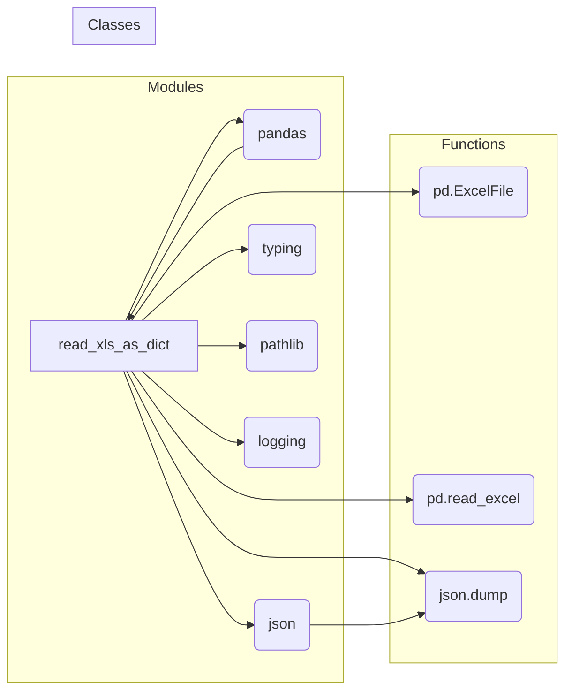

```MD
1. **<input code>**:

```python
## \file hypotez/src/utils/xls.py
# -*- coding: utf-8 -*-\
#! venv/Scripts/python.exe
#! venv/bin/python/python3.12

"""
.. module: src.utils 
	:platform: Windows, Unix
	:synopsis: Converter for Excel (`xls`) to JSON and JSON to Excel (`xls`)

"""
MODE = 'dev'

""" This module provides functions to convert Excel files to JSON format, handle multiple sheets, and save JSON data back to Excel files.

Functions:
    read_xls_as_dict(xls_file: str, json_file: str = None, sheet_name: Union[str, int] = None) -> Union[Dict, List[Dict], bool]:
        Reads an Excel file and converts it to JSON.  Optionally, converts a specific sheet and saves the result to a JSON file.  Handles errors gracefully.

    save_xls_file(data: Dict[str, List[Dict]], file_path: str) -> bool:
        Saves JSON data to an Excel file.  The data should be a dictionary where keys are sheet names and values are lists of dictionaries representing rows. Handles errors gracefully.

Examples:
    # Reading and optionally saving to JSON
    data = read_xls_as_dict('input.xlsx', 'output.json', 'Sheet1')  # Reads sheet named 'Sheet1'
    if data:
        print(data)  # Output will be {'Sheet1': [{...}]}

    # Saving from JSON data
    data_to_save = {'Sheet1': [{'column1': 'value1', 'column2': 'value2'}]}
    success = save_xls_file(data_to_save, 'output.xlsx')
    if success:
        print("Successfully saved to output.xlsx")
"""

import pandas as pd
import json
from typing import List, Dict, Union
from pathlib import Path
import logging

# Configure logging
logging.basicConfig(level=logging.INFO, format='%(asctime)s - %(levelname)s - %(message)s')


def read_xls_as_dict(
    xls_file: str,
    json_file: str = None,
    sheet_name: Union[str, int] = None
) -> Union[Dict, List[Dict], bool]:
    """
    Reads an Excel file and converts it to JSON.  Optionally, converts a specific sheet and saves the result to a JSON file.
    Handles errors gracefully.
    """
    # ... (rest of the function)
```

2. **<algorithm>**:

```mermaid
graph TD
    A[Input xls_file] --> B{Check file existence};
    B -- Exists --> C[xls = pd.ExcelFile];
    B -- Not Exists --> D[Log Error & Return False];
    C --> E{sheet_name is None?};
    E -- Yes --> F[Iterate through sheets];
    F -- True --> G[df = pd.read_excel];
    G --> H[data_dict[sheet] = df.to_dict];
    F -- Error --> I[Log Error & Return False];
    E -- No --> J[df = pd.read_excel(sheet_name)];
    J --> K[data_dict = df.to_dict];
    K --> L{json_file is not None?};
    L -- Yes --> M[json.dump to file];
    M --> N[Log Success];
    L -- No --> N;
    N --> O[Return data_dict];
    D --> O;
    I --> O;
    J -- Error --> I;
    subgraph Exception Handling
        O -- Exception --> P[Log Error & Return False];
    end
```

Example: `read_xls_as_dict("input.xlsx", "output.json", "Sheet1")`

- Input `xls_file` is checked. If it doesn't exist, an error is logged, and `False` is returned.
- If the file exists, a `pandas` `ExcelFile` object is created.
- If `sheet_name` is `None`, the code iterates through all sheets. For each sheet, it tries to read it, convert it to a dictionary, and append it to `data_dict`.  If there's an error reading a sheet, it logs an error and returns `False`.
- If `sheet_name` is provided, it reads only that sheet.
- If `json_file` is specified, the `data_dict` is saved to a JSON file.
- Finally, the `data_dict` (or `False` if there was an error) is returned.

3. **<mermaid>**:



4. **<explanation>**:

- **Импорты**:
    - `pandas`: Библиотека для работы с данными, включая Excel файлы.
    - `json`: Библиотека для работы с JSON форматом.
    - `typing`: Модуль для типов данных.
    - `pathlib`: Модуль для работы с путями к файлам.
    - `logging`: Библиотека для логирования.  Связь с `src` — `src.utils` — это модуль, вероятно, часть пакета, который содержит общие утилиты для проекта.

- **Классы**: Нет классов.  Код использует только стандартные типы данных Python.

- **Функции**:
    - `read_xls_as_dict`: Читает Excel файл. Принимает имя файла (`xls_file`), имя файла для сохранения JSON (`json_file`) и имя листа (`sheet_name`). Возвращает словарь с данными из Excel файла, либо `False` в случае ошибки. Обрабатывает исключения (`FileNotFoundError`, общие исключения) для устойчивости.  Обратите внимание на обработку ошибок - логирование ошибок с использованием `logging`.
    - `save_xls_file`: Сохраняет данные в формате JSON в Excel файл. Принимает словарь (`data`), в котором ключи - имена листов, а значения - данные в списке словарей для листов, и путь к файлу (`file_path`). Возвращает `True` в случае успеха, `False` в случае ошибки.  Внутри функция использует `pandas.ExcelWriter` для сохранения данных в формате xlsx.

- **Переменные**:
    - `MODE`: Строковая константа, скорее всего, для обозначения режима работы (например, 'dev', 'prod').
    - `xls_file`, `json_file`, `sheet_name`: Строковые переменные, хранящие имена файлов и листов.
    - `xls`: Объект `pd.ExcelFile`, представляющий Excel файл.
    - `data_dict`: Словарь, хранящий данные из Excel файла.
    - `df`: Объект `pd.DataFrame` для хранения данных.
    - `writer`: Объект `pd.ExcelWriter` для записи в файл xlsx.


- **Возможные ошибки или области для улучшений**:
    - **Типизация**: Использование аннотаций типов (`typing`) улучшает читабельность и позволяет обнаруживать ошибки на этапе компиляции.  Это сделано, но можно добавить аннотации типов к локальным переменным и улучшить переносимость кода.
    - **Обработка ошибок**: Общая обработка ошибок полезна. Ещё лучше ловить более специфичные исключения (например, `pd.errors.EmptyDataError`), если это необходимо для конкретного случая, чтобы повысить устойчивость кода.
    - **Дополнительно**: Можно добавить валидацию входных данных для `read_xls_as_dict` и `save_xls_file`, чтобы убедиться, что они соответствуют ожидаемому формату. Например, проверять, что `data` в `save_xls_file` имеет корректную структуру.
    - **Общий код**: Обработка ошибок и логирование можно вынести в отдельные функции для повторного использования, что увеличит гибкость и читабельность кода.


**Взаимосвязи с другими частями проекта**:

Этот модуль (`src.utils.xls.py`)  предоставляет утилиты для работы с Excel-файлами, что, вероятно, используется другими частями проекта, которые нуждаются в импорте и использовании данных из Excel.  Например, это может быть  модуль, обрабатывающий данные для анализа или представления в другом формате.  Взаимодействие осуществляется через вызовы функций `read_xls_as_dict` и `save_xls_file` из других частей проекта.