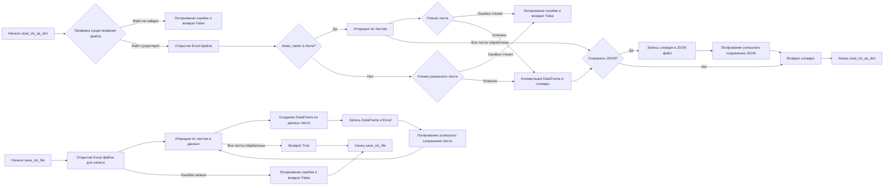

## Анализ кода `hypotez/src/utils/xls.py`

### <алгоритм>

1. **`read_xls_as_dict(xls_file, json_file=None, sheet_name=None)`:**
    - **Начало:** Принимает путь к Excel файлу (`xls_file`), опциональный путь для сохранения JSON (`json_file`), и опциональное имя или индекс листа (`sheet_name`).
    - **Проверка файла:** Проверяет, существует ли Excel файл по указанному пути. Если нет, логирует ошибку и возвращает `False`.
    - **Открытие файла:** Открывает Excel файл с помощью `pd.ExcelFile()`.
    - **Обработка листов:**
        - **Если `sheet_name` не указан:**
            - Итерирует по всем листам в Excel файле.
            - Для каждого листа читает данные в `pandas.DataFrame` с помощью `pd.read_excel()`.
                - Если возникает ошибка при чтении листа, логирует ошибку и возвращает `False`.
            - Конвертирует `DataFrame` в список словарей (`to_dict(orient='records')`) и сохраняет его в словаре `data_dict`, где ключ - имя листа.
        - **Если `sheet_name` указан:**
             - Читает данные только указанного листа в `pandas.DataFrame`.
                - Если возникает ошибка при чтении листа, логирует ошибку и возвращает `False`.
             - Конвертирует `DataFrame` в список словарей (`to_dict(orient='records')`) и сохраняет в `data_dict`.
    - **Сохранение в JSON:**
        - Если указан путь для сохранения JSON (`json_file`):
            - Открывает JSON файл для записи.
            - Записывает `data_dict` в JSON файл с отступами и корректной кодировкой.
            - Логирует успешное сохранение.
    - **Возврат:** Возвращает `data_dict` или `False` в случае ошибки.
2.  **`save_xls_file(data, file_path)`:**
    -   **Начало:** Принимает словарь `data`, где ключи - имена листов, а значения - списки словарей (строки) и путь для сохранения Excel файла (`file_path`).
    -   **Открытие Excel файла для записи:** Открывает Excel файл для записи с помощью `pd.ExcelWriter()` (использует движок `xlsxwriter`).
    -   **Итерация по листам:** Итерирует по ключам (именам листов) и значениям (данным) в словаре `data`.
    -   **Создание DataFrame:** Для каждого листа преобразует список словарей в `pandas.DataFrame`.
    -   **Запись в Excel:** Записывает `DataFrame` в Excel файл на соответствующий лист, с отключенным индексом. Логирует успешное сохранение листа.
    -   **Возврат:** Возвращает `True`, если сохранение прошло успешно, иначе `False`.

### <mermaid>



**Объяснение `mermaid`:**

- Диаграмма показывает поток управления функций `read_xls_as_dict` и `save_xls_file`.
- **`read_xls_as_dict`:**
  - Начинается с проверки существования файла.
  - Если файл существует, открывается.
  - Проверяется, указано ли имя листа.
  - Если не указано, выполняется итерация по всем листам и чтение каждого из них.
  - Если указано, то читается только этот лист.
  - После чтения данные конвертируются в словарь, который затем может быть сохранен в JSON файл.
  - В конце возвращается словарь с данными или `False` в случае ошибки.
- **`save_xls_file`:**
    - Открывает Excel файл для записи.
    - Итерируется по листам в переданных данных.
    - Создает `DataFrame` для каждого листа.
    - Записывает `DataFrame` на соответствующий лист в Excel файл.
    - В конце возвращает `True`, если все прошло успешно, или `False`, если возникла ошибка.
- **Зависимости:**
  - `pd` (pandas) - для работы с Excel файлами и `DataFrame`
  - `logging` - для логирования ошибок и информации.
  - `pathlib` - для работы с путями файлов.
  - `json` - для работы с JSON файлами.
  - `typing` - для аннотации типов.

### <объяснение>

**Импорты:**

-   `pandas as pd`: Библиотека для работы с табличными данными, используемая для чтения и записи Excel файлов. `pd.ExcelFile`, `pd.read_excel`, `pd.DataFrame`, `pd.ExcelWriter` - основные методы, которые используются в данном модуле.
-   `json`: Библиотека для работы с JSON данными, используется для сохранения данных в JSON файл, а также конвертации данных из JSON в python dict.
-   `typing`: Используется для аннотации типов, что улучшает читаемость и помогает в отладке.
    -   `List`, `Dict`, `Union`:  Указывают на типы данных, которые используются в функциях.
-   `pathlib`: Модуль для работы с путями к файлам и директориям. `Path` позволяет сделать код более кросс-платформенным.
-   `logging`: Модуль для ведения логов, позволяющий отслеживать процесс работы программы и выявлять ошибки.

**Переменные:**

-   `MODE = 'dev'`:  Переменная, которая, вероятно, используется для определения режима работы программы. В текущем коде не используется.

**Функции:**

1.  **`read_xls_as_dict(xls_file: str, json_file: str = None, sheet_name: Union[str, int] = None) -> Union[Dict, List[Dict], bool]`**:
    -   **Аргументы**:
        -   `xls_file`:  Путь к Excel файлу (тип `str`).
        -   `json_file`: Опциональный путь для сохранения JSON файла (тип `str`, по умолчанию `None`).
        -   `sheet_name`: Опциональное имя листа или индекс листа для чтения (тип `str` или `int`, по умолчанию `None`).
    -   **Возвращаемое значение**:
        -   Словарь (`Dict`), если `sheet_name` не указан, ключами являются названия листов, а значениями являются списки словарей, представляющих строки листа.
        -   Список словарей (`List[Dict]`), если `sheet_name` указан, представляющий строки листа.
        -   `False` в случае ошибки.
    -   **Назначение**: Читает Excel файл и конвертирует его в словарь или список словарей. Может сохранять результат в JSON файл.
    -   **Пример**:
        ```python
        data = read_xls_as_dict('input.xlsx', 'output.json', 'Sheet1') # Чтение листа Sheet1 и сохранение в output.json
        data_all = read_xls_as_dict('input.xlsx') # Чтение всех листов в словаре
        ```
2.  **`save_xls_file(data: Dict[str, List[Dict]], file_path: str) -> bool`**:
    -   **Аргументы**:
        -   `data`: Словарь, где ключи – имена листов, значения – списки словарей (строки таблицы).
        -   `file_path`: Путь для сохранения Excel файла (тип `str`).
    -   **Возвращаемое значение**:
        -   `True`, если сохранение прошло успешно.
        -   `False` в случае ошибки.
    -   **Назначение**: Сохраняет данные из словаря в Excel файл.
    -   **Пример**:
        ```python
        data_to_save = {'Sheet1': [{'col1': 'val1', 'col2': 'val2'}]}
        success = save_xls_file(data_to_save, 'output.xlsx')
        if success:
            print("Saved successfully")
        ```

**Потенциальные ошибки и области для улучшения:**

-   **Обработка ошибок**: В блоках `try-except` ошибки обрабатываются, логируются, и функция возвращает `False`, что позволяет отслеживать проблемы.
-   **Отсутствие проверок типов:** При вызове функций не проверяется тип аргументов `xls_file`, `json_file`, `sheet_name` в функции `read_xls_as_dict` и `data` и `file_path` в функции `save_xls_file`, можно добавить проверку типов.
-   **Зависимость от `xlsxwriter`**: Функция `save_xls_file` использует `xlsxwriter` в качестве движка для записи в Excel. Это может быть проблемой, если у пользователя не установлен данный пакет.
-   **Отсутствие обработки пустых листов**: Если лист в Excel файле пустой, это не вызовет ошибку, но, возможно, стоит обрабатывать такие случаи отдельно.
-   **Не используется переменная MODE:** Переменная MODE задана, но не используется.

**Взаимосвязи с другими частями проекта:**

- Данный модуль является утилитой и может быть использован в любом месте проекта, где требуется конвертация между Excel и JSON, что делает его независимым и универсальным.

Этот анализ предоставляет подробное объяснение кода, его функциональности, а также выявляет возможные области для улучшения.