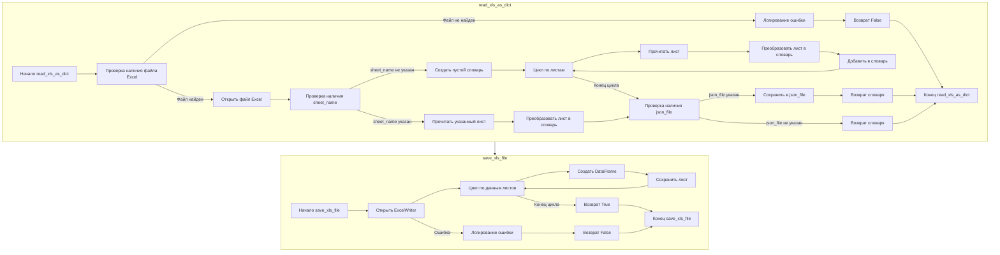

# Анализ кода `hypotez/src/utils/xls.py`

## 1. <алгоритм>

### Функция `read_xls_as_dict`

1.  **Начало**: Функция `read_xls_as_dict` принимает путь к файлу Excel (`xls_file`), необязательный путь к файлу JSON (`json_file`) и необязательное имя листа (`sheet_name`) в качестве входных данных.
    *   Пример: `read_xls_as_dict('input.xlsx', 'output.json', 'Sheet1')`

2.  **Проверка наличия файла**: Проверяется, существует ли файл Excel по указанному пути. Если файл не найден, функция регистрирует ошибку и возвращает `False`.
    *   Пример: Если `input.xlsx` не существует, вернется `False` и ошибка в лог.

3.  **Чтение Excel файла**: Файл Excel открывается с помощью `pd.ExcelFile`.
    *   Пример:  `xls = pd.ExcelFile('input.xlsx')`

4.  **Обработка листов**:
    *   **Если `sheet_name` не указан**:
        *   Создается пустой словарь `data_dict`.
        *   Перебираются все листы в файле Excel.
            *   Для каждого листа:
                *   Читается лист в DataFrame с помощью `pd.read_excel`.
                *   DataFrame преобразуется в список словарей с помощью `df.to_dict(orient='records')`.
                *   Полученный список добавляется в `data_dict` с ключом имени листа.
                *   Если в процессе возникает ошибка, она логируется, и функция возвращает `False`.
    *   **Если `sheet_name` указан**:
        *   Читается указанный лист в DataFrame.
        *   DataFrame преобразуется в список словарей.
        *   Если возникает ошибка, она логируется и функция возвращает `False`.
    *   Пример: Если `sheet_name='Sheet1'`,  только лист `Sheet1` будет прочитан и преобразован.

5.  **Сохранение в JSON (если необходимо)**: Если указан `json_file`:
    *   `data_dict` сохраняется в JSON файл.
        *   Пример: `data_dict` сохраняется в `output.json`.
    *   Функция логирует успешное сохранение.

6.  **Возврат результата**: Функция возвращает `data_dict` (словарь, содержащий данные Excel) или `False` в случае ошибки.

### Функция `save_xls_file`

1.  **Начало**: Функция `save_xls_file` принимает словарь `data`, где ключи являются именами листов, а значения - списками словарей (строки), и путь к файлу Excel (`file_path`) в качестве входных данных.
    *   Пример: `save_xls_file({'Sheet1': [{'col1': 'val1'}]}, 'output.xlsx')`

2.  **Открытие ExcelWriter**: Создается `pd.ExcelWriter` для записи данных в файл Excel с использованием движка `xlsxwriter`.

3.  **Запись листов**:
    *   Перебираются все листы в словаре `data`.
    *   Для каждого листа:
        *   Создается DataFrame из списка словарей.
        *   DataFrame записывается в Excel файл на соответствующий лист.
        *   Устанавливается параметр `index=False`, чтобы не сохранять индексы строк.
        *   Функция логирует успешное сохранение листа.

4.  **Возврат результата**: Функция возвращает `True` если данные успешно сохранены в файл, или `False`, если возникла ошибка.

## 2. <mermaid>

### Описание зависимостей в `mermaid`:

*   `read_xls_as_dict`: Функция отвечает за чтение данных из файла Excel и преобразование их в формат словаря или списка словарей. Принимает на вход путь к файлу Excel, необязательный путь для JSON файла и необязательное имя листа. Начинается с проверки наличия файла и заканчивается возвратом словаря или `False` в случае ошибки.
*  `save_xls_file`: Функция отвечает за запись данных из словаря в Excel файл. Принимает на вход словарь, где ключи - названия листов, а значения - списки словарей с данными для записи, а также путь к файлу Excel.
*   `Start_read`, `End_read`: Начало и конец выполнения функции `read_xls_as_dict`.
*   `Start_save`, `End_save`: Начало и конец выполнения функции `save_xls_file`.
*   `CheckFileExists`: Проверка, существует ли файл Excel по указанному пути.
*   `LogErrorFile`: Логирование ошибки, если файл не найден.
*   `ReturnFalse1`: Возврат значения `False` при ошибке в `read_xls_as_dict`.
*   `OpenExcel`: Открытие файла Excel с помощью `pd.ExcelFile`.
*    `CheckSheetName`: Проверка, указано ли имя листа.
*    `CreateEmptyDict`: Создание пустого словаря для хранения данных, если `sheet_name` не указан.
*    `LoopSheets`: Цикл по всем листам в файле Excel, если `sheet_name` не указан.
*    `ReadSheet`: Чтение листа Excel в DataFrame.
*   `ConvertToDict`: Преобразование DataFrame в список словарей.
*   `AddToDict`: Добавление списка словарей в словарь данных.
* `ReadSpecifiedSheet`: Чтение листа Excel в DataFrame по указанному имени листа.
*  `ConvertToDictSpecified`:  Преобразование DataFrame в список словарей, если имя листа указано.
*    `CheckJsonFile`: Проверка, нужно ли сохранить данные в JSON файл.
*   `SaveJsonFile`: Сохранение данных в JSON файл.
*   `ReturnDict1`, `ReturnDict2`: Возврат словаря с данными из Excel.
*  `OpenExcelWriter`: Создание объекта `pd.ExcelWriter` для записи данных в Excel.
*   `LoopData`: Цикл по всем листам в словаре с данными для записи.
*  `CreateDataFrame`: Создание DataFrame из списка словарей.
*  `SaveSheet`: Сохранение DataFrame на соответствующий лист в Excel файл.
* `ReturnTrue`: Возврат значения `True` при успешной записи данных в Excel файл.
*   `LogErrorSave`: Логирование ошибки, если произошла ошибка при записи в Excel.
*    `ReturnFalse2`: Возврат значения `False` при ошибке в `save_xls_file`.
*  Связь `read_xls_as_dict --> save_xls_file` указывает, что данные, прочитанные функцией `read_xls_as_dict`, могут быть переданы в функцию `save_xls_file` для сохранения в Excel файл.

## 3. <объяснение>

### Импорты

*   **`pandas as pd`**: Используется для работы с данными в табличном виде (DataFrame) и для чтения/записи файлов Excel.
*   **`json`**: Используется для работы с JSON-форматом, включая сохранение и загрузку данных.
*   **`typing`**: Используется для аннотации типов, что повышает читаемость и облегчает отладку кода.
    *   `List`, `Dict`, `Union`: Конкретные типы для аннотации: списки, словари и возможность использовать несколько типов.
*   **`pathlib.Path`**: Используется для работы с путями к файлам и каталогам. Обеспечивает более удобный и переносимый способ работы с файловой системой по сравнению со строками.
*   **`logging`**: Используется для логирования событий и ошибок. Позволяет отслеживать выполнение кода и выявлять проблемы.

### Переменные

*   **`MODE = 'dev'`**:  Определяет режим работы модуля. В данном контексте значение `dev` может указывать на режим разработки. В текущем коде не используется.

### Функции

#### `read_xls_as_dict(xls_file: str, json_file: str = None, sheet_name: Union[str, int] = None) -> Union[Dict, List[Dict], bool]`

*   **Аргументы**:
    *   `xls_file (str)`: Путь к файлу Excel для чтения.
    *   `json_file (str, optional)`: Путь к файлу JSON, куда будут сохранены данные. По умолчанию `None`, то есть сохранение в JSON не требуется.
    *   `sheet_name (str | int, optional)`: Имя листа для чтения, может быть как строкой, так и индексом. Если не указан, то читаются все листы. По умолчанию `None`.
*   **Возвращаемое значение**:
    *   `Union[Dict, List[Dict], bool]`: Возвращает либо словарь, содержащий данные Excel, либо список словарей (если sheet_name указан), либо `False` в случае ошибки.
*   **Назначение**:
    *   Читает файл Excel, преобразует его в JSON формат и возвращает данные в виде словаря. Может читать как все листы, так и конкретный лист. Позволяет сохранить данные в JSON файл, если `json_file` указан.

#### `save_xls_file(data: Dict[str, List[Dict]], file_path: str) -> bool`

*   **Аргументы**:
    *   `data (Dict[str, List[Dict]])`: Словарь, где ключи - имена листов, а значения - списки словарей с данными для записи в Excel.
    *   `file_path (str)`: Путь к файлу Excel для записи.
*   **Возвращаемое значение**:
    *   `bool`: Возвращает `True` в случае успешного сохранения и `False` в случае ошибки.
*   **Назначение**:
    *   Сохраняет данные из JSON-подобного словаря в файл Excel, где каждый ключ словаря становится листом, а значения - данными на этом листе.

### Потенциальные ошибки и улучшения

*   **Обработка ошибок**: В коде присутствует обработка общих исключений (`Exception`), но можно сделать более точную обработку исключений, например, `ValueError` при неправильном формате данных, `KeyError` при отсутствующих ключах.
*   **Логирование**: Используется стандартное логирование, можно добавить более подробные сообщения и, возможно, настроить разные уровни логирования.
*   **Использование `xlsxwriter`**: В функции `save_xls_file`  используется `xlsxwriter`, который является хорошим вариантом, но можно добавить поддержку других движков, таких как `openpyxl`, для большей гибкости.
*   **Отсутствие проверок типов**: В функциях `read_xls_as_dict` и `save_xls_file` не проверяются явно типы входящих данных, это может вызвать проблемы в runtime. Можно добавить проверки типов или использовать Pydantic для валидации входных данных.
*   **Масштабируемость**:  При чтении больших файлов Excel в память может возникнуть проблема. Можно реализовать чтение файла по частям, если это необходимо.
*   **Отсутствие тестов**: Код не содержит тестов, что может привести к проблемам при рефакторинге.

### Взаимосвязи с другими частями проекта

*   **Использование в других модулях**: Данный модуль `xls.py` может использоваться в других частях проекта `hypotez` для преобразования данных между Excel и JSON. Например, для загрузки настроек из Excel или для экспорта данных.
*   **Зависимости**: Зависит от библиотек `pandas`, `json`, `pathlib`, и `typing`.
*   **Конфигурация**: Модуль использует базовую конфигурацию `logging`.