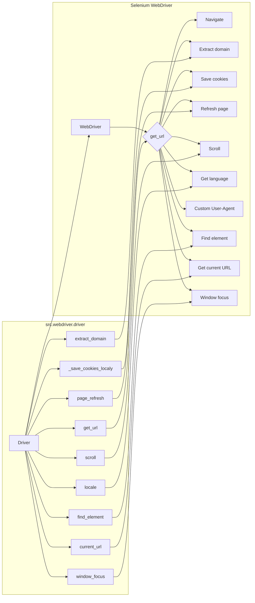

```MD
# Анализ кода модуля `webdriver`

## 1. <input code>

```python
# -*- coding: utf-8 -*-\n\n""" Examples for using `Driver` and `Chrome` classes """\n\nfrom src.webdriver.driver import Driver, Chrome\nfrom selenium.webdriver.common.by import By\n\ndef main():\n    """ Main function to demonstrate usage examples for Driver and Chrome """\n\n    # Example 1: Create a Chrome driver instance and navigate to a URL\n    chrome_driver = Driver(Chrome)\n    if chrome_driver.get_url("https://www.example.com"):\n        print("Successfully navigated to the URL")\n\n    # Example 2: Extract the domain from a URL\n    domain = chrome_driver.extract_domain("https://www.example.com/path/to/page")\n    print(f"Extracted domain: {domain}")\n\n    # Example 3: Save cookies to a local file\n    success = chrome_driver._save_cookies_localy()\n    if success:\n        print("Cookies were saved successfully")\n\n    # Example 4: Refresh the current page\n    if chrome_driver.page_refresh():\n        print("Page was refreshed successfully")\n\n    # Example 5: Scroll the page down\n    if chrome_driver.scroll(scrolls=3, direction=\'forward\', frame_size=1000, delay=1):\n        print("Successfully scrolled the page down")\n\n    # Example 6: Get the language of the current page\n    page_language = chrome_driver.locale\n    print(f"Page language: {page_language}")\n\n    # Example 7: Set a custom user agent for the Chrome driver\n    user_agent = {\n        \'user-agent\': \'Mozilla/5.0 (Windows NT 10.0; Win64; x64) AppleWebKit/537.36 (KHTML, like Gecko) Chrome/100.0.4896.127 Safari/537.36\'\n    }\n    custom_chrome_driver = Driver(Chrome, user_agent=user_agent)\n    if custom_chrome_driver.get_url("https://www.example.com"):\n        print("Successfully navigated to the URL with custom user agent")\n\n    # Example 8: Find an element by its CSS selector\n    element = chrome_driver.find_element(By.CSS_SELECTOR, \'h1\')\n    if element:\n        print(f"Found element with text: {element.text}")\n\n    # Example 9: Get the current URL\n    current_url = chrome_driver.current_url\n    print(f"Current URL: {current_url}")\n\n    # Example 10: Focus the window to remove focus from the element\n    chrome_driver.window_focus()\n    print("Focused the window")\n\nif __name__ == "__main__":\n    main()
```

## 2. <algorithm>

**Блок-схема**

(Невозможно отобразить блок-схему здесь.  Блок-схема будет сложной и потребует визуального представления. Вместо этого, мы описываем алгоритм словами.)

Алгоритм состоит из последовательного выполнения примеров использования класса `Driver` (наследующего от класса, реализующего работу с WebDriver, например, `Chrome`).  В каждом примере происходит создание экземпляра класса `Driver`, вызов методов для взаимодействия с веб-страницей, получение и вывод результата (в формате текста или экземпляра класса `WebElement`).  Принимаемые аргументы и возвращаемые значения каждого метода отражаются в коде.

Примеры в функции `main()` демонстрируют, как использовать методы класса `Driver`: навигация по URL, извлечение домена, сохранение кукисов, обновление страницы, прокрутка, получение языка, настройка User-Agent, поиск элемента по CSS селектору, получение текущего URL, фокусировка окна.


## 3. <mermaid>



**Объяснение диаграммы:**

Диаграмма представляет взаимозависимости компонентов.  Существует `Selenium WebDriver` (обозначенный как `A`) -  базовое  решение для работы с браузером. Класс `Driver` (обозначенный как `M`) использует функционал `WebDriver` для взаимодействия с веб-страницей.  Связи между классами показывают, как `Driver` использует методы `WebDriver` для выполнения различных задач (навигация, поиск, прокрутка).

## 4. <explanation>

**Импорты:**

- `from src.webdriver.driver import Driver, Chrome`: Импортирует классы `Driver` и `Chrome` из модуля `driver` в подпапке `webdriver` текущего проекта.  Это указывает на структуру проекта, где модули `Driver` и `Chrome` предоставляют функционал для работы с WebDriver.
- `from selenium.webdriver.common.by import By`: Импортирует класс `By` из Selenium, который используется для определения стратегии поиска элементов на веб-странице (например, по CSS селектору, ID и т.д.).

**Классы:**

- `Driver`:  Этот класс является базовым классом для работы с WebDriver. Он, вероятно, предоставляет общий интерфейс для взаимодействия с браузером, и другие драйверы (например, `Chrome`) наследуются от него. В примерах кода используется конкретный драйвер `Chrome`.  Класс расширяет функциональность, предоставляя методы для прокрутки, работы с кукисами и другими действиями.
- `Chrome`:  Этот класс (или класс-оболочка), скорее всего, наследуется от базового класса `Driver` и предоставляет конкретную реализацию для управления браузером Chrome с помощью Selenium.

**Функции:**

- `main()`:  Функция-оболочка, которая содержит примеры использования класса `Driver`. Она создает экземпляры `Driver` (например, `chrome_driver`), выполняет действия (вызовы методов `Driver`, например, `get_url`, `extract_domain`, `page_refresh` и др.) и выводит результаты в консоль.
- Методы класса `Driver` (например, `get_url`, `extract_domain`, `_save_cookies_locally`):  Эти методы отвечают за различные действия, связанные с управлением веб-страницей, как  навигация по URL, получение домена, сохранение кукисов и т.д.  Подробности о каждом методе (аргументы, типы возвращаемых значений) можно найти в соответствующем коде, или в документации к `Driver` и `Chrome`.

**Переменные:**

- `chrome_driver`, `custom_chrome_driver`: Экземпляры класса `Driver` (конкретно для Chrome).
- `domain`, `page_language`, `current_url`: Переменные, хранящие результаты выполнения методов класса `Driver` (строки).
- `user_agent`: Словарь, определяющий пользовательский User-Agent для ChromeDriver.

**Возможные ошибки или области для улучшений:**

- **Отсутствует обработка исключений:** Хотя в примерах кода есть проверки с `if chrome_driver.get_url(...)`,  отсутствует более полная обработка исключений, которые могут возникнуть при выполнении операций с WebDriver (например, `NoSuchElementException`, `TimeoutException`). Это может привести к непредсказуемому поведению программы при сбоях.
- **Недостающие детали в коде:** Отсутствует подробное описание того, как `Driver` взаимодействует с драйверами (например, `Chrome`) и где и как происходит их инициализация (например, `options`).
- **Общее:** Не хватает описания внутренней реализации класса `Driver` и как он взаимодействует с другими частями проекта.


**Цепочка взаимосвязей с другими частями проекта:**

Из кода видно, что модуль `webdriver` использует библиотеку Selenium для работы с WebDriver.  Также, присутствуют импорты из `src`, что подразумевает, что этот код связан с другими частями проекта, включая модули для логирования (`src.logger`) и управления настройками (`gs`).  Подробности о взаимосвязях могут быть найдены в коде этих модулей.

**Общее впечатление:**

Код представляет собой простой пример использования класса `Driver`, но для полноценного анализа требуется ознакомиться с полным кодом класса `Driver`, включая все его методы.  Для улучшения кода необходимо добавить более полную обработку исключений.