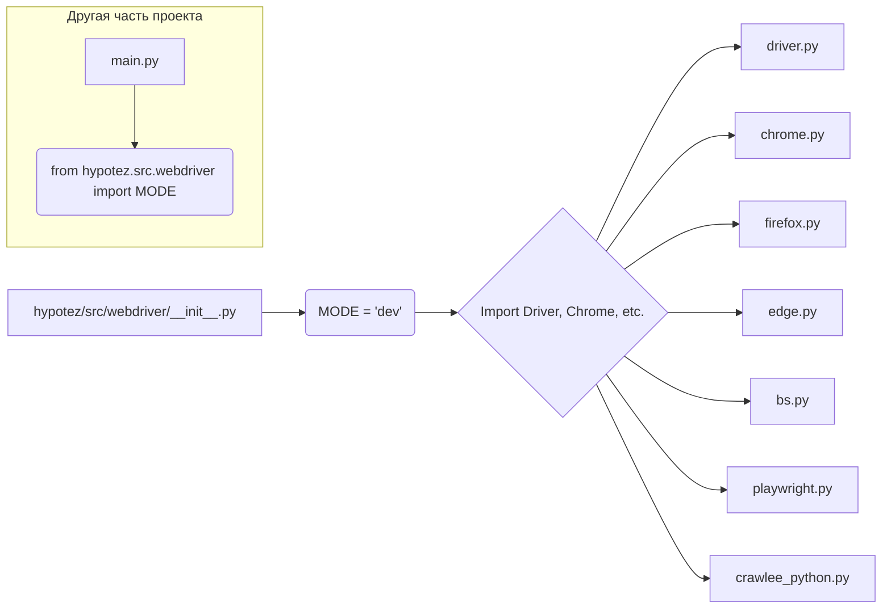

# <input code>

```python
## \file hypotez/src/webdriver/__init__.py
# -*- coding: utf-8 -*-
#! venv/Scripts/python.exe
#! venv/bin/python/python3.12

"""
.. module: src.webdriver 
	:platform: Windows, Unix
	:synopsis:

"""
MODE = 'dev'
```

# <algorithm>

Этот код представляет собой файл `__init__.py` для пакета `webdriver` в проекте `hypotez`.  Он, в основном, является импортом и не содержит собственно логики выполнения.  Алгоритм работы сводится к инициализации переменной MODE со значением 'dev'. Далее он импортирует классы и функции из модулей внутри папки `webdriver`.  Однако, импорты закомментированы, что означает, что эти элементы не используются в текущем файле, но могут быть доступны через импорт в других частях проекта.

**Пример**
Несмотря на закомментированные импорты, если в других частях проекта (например, в файле `main.py`) импортировать из `hypotez/src/webdriver/__init__.py`, то будет доступен объект `MODE`.

```
from hypotez.src.webdriver import MODE
print(MODE)  # Вывод: dev
```

**Пошаговая блок-схема:**

1. Определяется переменная `MODE` со значением 'dev'.
2. Закомментированы импорты классов и функций из различных драйверов. (Этот шаг в текущей реализации не влияет на работу)


# <mermaid>



**Объяснение диаграммы:**

* `A`:  Файл `__init__.py` в папке `webdriver`.
* `B`: Инициализация переменной `MODE`.
* `C`:  Обозначает, что в будущем могут быть импорты других файлов.
* `D`, `E`, `F`, `G`, `H`, `I`, `J`:  Модули (классы и функции), потенциально находящиеся в `hypotez/src/webdriver`.
* `K`: Другая часть проекта, например `main.py`.
* `L`: Импорт переменной `MODE`.


# <explanation>

* **Импорты**: Файл `__init__.py` предназначен для инициализации пакета `webdriver`. Закомментированные импорты означают, что  модули `driver`, `chrome`, `firefox`, `edge`, `bs`, `playwright`, `crawlee_python` (расположенные в подпапках `hypotez/src/webdriver`) доступны для использования в других частях проекта, но не используются непосредственно в этом файле. Обычно в `__init__.py` импортируются необходимые классы или функции для использования в текущем пакете.  Их отсутствие здесь означает, что текущий `__init__.py` не использует функциональность этих модулей.

* **Классы**:  Не определены, но импорты предполагают, что будут классы, например, для управления веб-драйверами (Chrome, Firefox, etc.).

* **Функции**:  Не определены, закомментированные импорты указывают на потенциальные функции, связанные с веб-драйверами.

* **Переменные**:  `MODE = 'dev'` -  переменная, вероятно, используемая для настройки различных режимов работы (разработка, тестирование, производство) внутри проекта.

* **Возможные ошибки или области для улучшений**:
    * **Нет функций/классов**: Пока нет кода для работы.  Если нужно, этот `__init__.py` должен содержать импорт необходимых объектов для использования в проекте.
    * **Не используемые импорты**: Закомментированные импорты, которые не используются, могут сбивать с толку.  Либо использовать, либо удалить.
    * **Документация**:  Комментарии в `__init__.py` могут быть дополнены более подробным описанием используемых импортами.

* **Цепочка взаимосвязей**:  Файл `__init__.py` в папке `webdriver` предоставляет точку входа в этот пакет.  Другие части проекта (например, `main.py`) могут использовать импорт функций и классов, определенных в подпапках `webdriver`, для управления веб-драйверами.  Цепочка:
    `hypotez/src/webdriver/` → `hypotez/src/webdriver/__init__.py` → `hypotez/src/webdriver/*.py` (модули драйверов) → `main.py` (и т.д.)