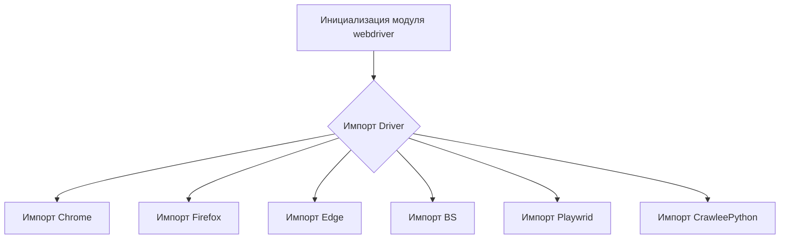
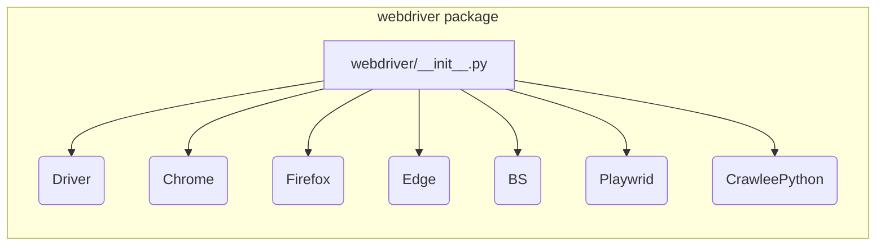

```MD
# Анализ кода hypotez/src/webdriver/__init__.py

1. **<input code>**

```python
## \file hypotez/src/webdriver/__init__.py
# -*- coding: utf-8 -*-
#! venv/Scripts/python.exe
#! venv/bin/python/python3.12

"""
.. module: src.webdriver 
	:platform: Windows, Unix
	:synopsis:

"""
MODE = 'dev'


from .driver import Driver
from .chrome import Chrome
from .firefox import Firefox
from .edge import Edge
from .bs import BS
from .playwright import Playwrid
from .crawlee_python import CrawleePython
```

2. **<algorithm>**

Этот код представляет собой инициализационный модуль для пакета `webdriver`.  Он не содержит алгоритма в традиционном смысле.  Основная функция - это импортирование подмодулей, определяющих различные драйверы веб-браузеров (Chrome, Firefox, Edge) и другие связанные компоненты (Playwright, BS, CrawleePython).  Это делает классы и функции из этих подмодулей доступными для использования в других частях проекта.  Никаких вычислений или операций с данными не происходит.

**Блок-схема:**



В данном случае, данные - это импортируемые модули, и их перемещение происходит в рамках Python'овской системы импортов.

3. **<mermaid>**



Диаграмма отображает взаимосвязи внутри пакета `webdriver`.  Модуль `webdriver/__init__.py` импортирует другие модули из того же пакета (в подпапках `driver`, `chrome`, и т.д.).  Зависимости определяются исключительно импортными операторами Python.

4. **<explanation>**

* **Импорты:**  
    * `from .driver import Driver`: Импортирует класс `Driver` из модуля `driver.py` внутри текущей папки (`webdriver`).  `.` указывает на то, что это подмодуль из того же пакета.
    * Аналогично импортируются классы для других браузеров, а также BS, Playwright и CrawleePython.  Эти импорты делают классы из соответствующих модулей доступными в этом модуле.  Они предполагают, что в директориях `src/webdriver/driver.py`, `src/webdriver/chrome.py`, и т.д., уже определены классы с соответствующими именами.


* **Классы:** (подробнее о них можно узнать, проанализировав соответствующие `.py` файлы)
    * `Driver`, `Chrome`, `Firefox`, `Edge`, `BS`, `Playwrid`, `CrawleePython`:  Эти классы, вероятно, представляют разные реализации веб-драйверов и связанные с ними функциональности.  Без просмотра определений классов, невозможно точно указать их атрибуты и методы.


* **Функции:**  Нет функций в этом файле.  Всё сводится к импорту классов.


* **Переменные:**
    * `MODE = 'dev'`:  Глобальная переменная, вероятно, задаёт режим работы (разработка, тестирование, производство), которая используется в других частях проекта.  Значение может быть использовано для конфигурации различных аспектов приложения.


* **Возможные ошибки/улучшения:**
    * Отсутствует проверка существования импортируемых модулей.  Если какие-то из `src/webdriver/*` модулей отсутствуют, код выдаст ошибку во время выполнения.  Добавление проверки на наличие файлов и соответствующих `__init__.py` файлов в папках улучшило бы отказоустойчивость.

* **Связь с другими частями проекта:**  Этот модуль является частью проекта `hypotez` и служит своего рода "индексом" для доступных веб-драйверов.  Другие части проекта будут использовать эти драйверы для взаимодействия с веб-сайтами.  Предполагается, что в других модулях (`hypotez/src/` или подпапках) есть код, который использует эти веб-драйверы.