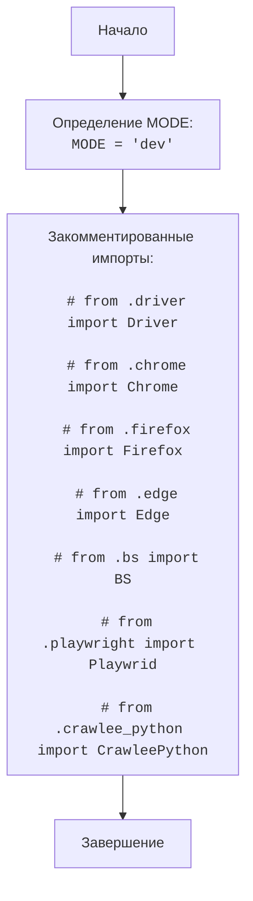

## АНАЛИЗ КОДА: `hypotez/src/webdriver/__init__.py`

### 1. <алгоритм>

1.  **Начало:** Инициализация модуля `webdriver`.
2.  **Объявление MODE:**  Переменная `MODE` устанавливается в значение `'dev'`. Это может указывать на режим разработки, что может влиять на поведение других частей проекта.

    *   Пример: `MODE = 'dev'`

3.  **Закомментированные импорты:** Далее в коде идут закомментированные строки импорта из разных подмодулей `webdriver` такие как `Driver`, `Chrome`, `Firefox`, `Edge`, `BS`, `Playwright`, `CrawleePython`.
    *   Пример:
    ```python
    # from .driver import Driver
    # from .chrome import Chrome
    # from .firefox import Firefox
    # from .edge import Edge
    # from .bs import BS
    # from .playwright import Playwrid
    # from .crawlee_python import CrawleePython
    ```
    Эти импорты закомментированы, что означает, что они в данный момент не используются, но вероятно предназначены для использования в будущем или при других конфигурациях.

4. **Завершение:** Модуль `webdriver` инициализирован с настройкой `MODE`.

### 2. <mermaid>



**Объяснение диаграммы:**

*   `Start`: Начало выполнения модуля.
*   `DefineMode`: Переменная `MODE` устанавливается в значение `'dev'`.
*   `CommentedImports`: Закомментированные импорты, которые не активны в текущей версии кода.
*   `End`: Завершение выполнения модуля.

### 3. <объяснение>

**Импорты:**

*   В данном коде нет активных импортов. Вместо этого присутствует список закомментированных импортов.
*   `from .driver import Driver`:  Импорт класса `Driver` из модуля `driver`, вероятно, базовый класс для управления браузерами.
*   `from .chrome import Chrome`: Импорт класса `Chrome` для управления браузером Chrome.
*   `from .firefox import Firefox`: Импорт класса `Firefox` для управления браузером Firefox.
*    `from .edge import Edge`: Импорт класса `Edge` для управления браузером Edge.
*   `from .bs import BS`:  Импорт класса `BS`, возможно, для работы с BeautifulSoup (парсинг HTML).
*   `from .playwright import Playwrid`: Импорт класса `Playwrid`, скорее всего, для работы с библиотекой Playwright (автоматизация браузера).
*  `from .crawlee_python import CrawleePython`: Импорт класса `CrawleePython`, вероятно для работы с библиотекой Crawlee (веб-скрапинг).
*  Все эти импорты, судя по их названиям, предназначены для управления различными веб-браузерами и инструментами веб-скрапинга в рамках проекта `hypotez`. Они закомментированы, что означает, что этот модуль, вероятно, находится в состоянии разработки, или они будут активированы при определенных условиях, или для разных конфигураций проекта.
**Классы:**

*   В текущем файле не определено ни одного класса. Закомментированные импорты указывают на то, что классы (например, `Driver`, `Chrome`, `Firefox`, и др.) должны быть определены в соответствующих модулях, таких как `.driver.py`, `.chrome.py` и т.д. Они вероятно предназначены для управления браузерами и парсинга веб-страниц.

**Функции:**

*   В этом файле нет функций.

**Переменные:**

*   `MODE = 'dev'`: Глобальная переменная `MODE` определяет текущий режим работы приложения. В данном случае установлено значение `'dev'`, что, вероятно, обозначает режим разработки.
    *   Тип: `str`.
    *   Использование: Значение `MODE` может использоваться другими модулями для выбора различных настроек или поведения (например, уровень логирования, использование мок-объектов и т.д.).

**Потенциальные ошибки и области для улучшения:**

*   **Закомментированные импорты**:  Наличие большого количества закомментированных импортов может указывать на то, что этот файл ещё находится в стадии разработки. Необходимо выяснить, почему импорты закомментированы, и либо активировать их, либо удалить, если они больше не нужны.
*   **Отсутствие функциональности**: Файл `__init__.py`  пока что не выполняет значительной работы, кроме установки переменной `MODE`. Возможно, он будет содержать логику инициализации пакета `webdriver` в будущем.

**Взаимосвязи с другими частями проекта:**

*   Этот модуль, вероятно, является частью пакета `src.webdriver`.
*   Переменная `MODE` может влиять на работу других модулей проекта.
*   Когда импорты будут раскомментированы, этот модуль будет тесно связан с модулями `.driver`, `.chrome`, `.firefox`, `.edge`, `.bs`, `.playwright` и `.crawlee_python`.
*   Предполагается, что данный модуль станет точкой входа для управления различными веб-браузерами и инструментами парсинга HTML в проекте.

В целом, данный файл представляет собой начальную точку для пакета `webdriver` и нуждается в дальнейшем развитии для реализации задуманной функциональности.