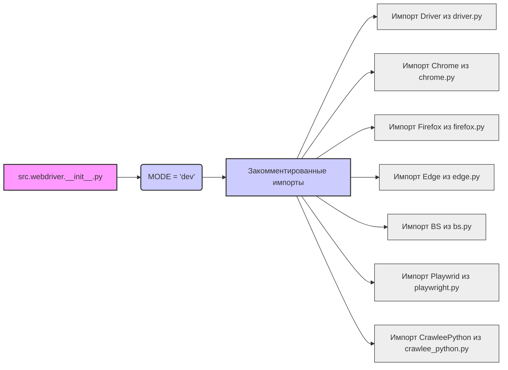

## Анализ кода `hypotez/src/webdriver/__init__.py`

### 1. <алгоритм>

1. **Инициализация:**
   - Устанавливается переменная `MODE` в значение `'dev'`. Это, вероятно, указывает на режим разработки, который может влиять на поведение вебдрайвера.
   - **Пример**: `MODE = 'dev'`.

2. **Импорт модулей (закомментировано):**
   - Код содержит закомментированные импорты различных классов, связанных с веб-драйверами, таких как `Driver`, `Chrome`, `Firefox`, `Edge`, `BS`, `Playwrid` и `CrawleePython`. Эти импорты в текущей версии кода не выполняются, но они показывают потенциальное использование различных браузерных драйверов.
   - **Пример**: `# from .driver import Driver` -  импорт класса `Driver` из модуля `driver` в текущем пакете.

### 2. <mermaid>



**Зависимости и пояснения:**

-   **`src.webdriver.__init__.py`**: Это корневой файл пакета `webdriver`. Он отвечает за инициализацию пакета и импорт необходимых компонентов.
-   **`MODE = 'dev'`**: Эта переменная определяет режим работы, в данном случае, режим разработки. Она может влиять на различные параметры и настройки вебдрайверов.
-   **Закомментированные импорты**: Эти импорты представляют потенциальные зависимости пакета `webdriver`. Они показывают, что пакет может использовать классы для управления различными браузерами (`Chrome`, `Firefox`, `Edge`) и другими инструментами, такими как `BS` (вероятно, Beautiful Soup), `Playwrid` (вероятно, Playwright) и `CrawleePython` (вероятно, интеграция с Crawlee).
    -   `Driver`: Представляет общий интерфейс для работы с вебдрайверами.
    -   `Chrome`, `Firefox`, `Edge`: Конкретные реализации драйверов для соответствующих браузеров.
    -   `BS`: Вероятно, для работы с HTML и парсинга.
    -   `Playwrid`: Вероятно, для использования возможностей Playwright.
    -   `CrawleePython`: Вероятно, для интеграции с библиотекой Crawlee для веб-скрапинга.

### 3. <объяснение>

**Импорты:**

-   В текущем состоянии кода все импорты закомментированы, что означает, что на данный момент в файле `__init__.py` не импортируется ни одного модуля. Закомментированные импорты указывают на то, что пакет `webdriver` предназначен для работы с различными веб-браузерами и инструментами для парсинга веб-страниц.
-   Эти импорты связывают пакет `webdriver` с другими пакетами внутри `src`: `driver`, `chrome`, `firefox`, `edge`, `bs`, `playwright` и `crawlee_python`. Все эти пакеты, вероятно, содержат классы и функции для конкретных браузеров и инструментов.

**Переменные:**

-   `MODE`: Строковая переменная, устанавливается в значение `'dev'`. Предполагается, что она управляет режимом работы.  В зависимости от значения этой переменной, поведение программы может меняться.

**Классы:**

-   В текущем коде нет определения классов, но закомментированные импорты (`Driver`, `Chrome`, `Firefox`, `Edge`, `BS`, `Playwrid`, `CrawleePython`) говорят о потенциальном использовании классов для:
    -   `Driver`: Абстрактный класс для взаимодействия с веб-браузерами.
    -   `Chrome`, `Firefox`, `Edge`: Классы, расширяющие `Driver` и реализующие конкретные методы для управления соответствующими браузерами.
    -   `BS`: Класс для парсинга HTML.
    -   `Playwrid`: Класс для использования возможностей Playwright.
    -   `CrawleePython`: Класс для интеграции с библиотекой Crawlee.

**Функции:**

-   В текущем коде нет определения функций.

**Потенциальные ошибки и области для улучшения:**

-   **Отсутствие активных импортов**: В текущем состоянии файл не делает ничего, кроме установки переменной `MODE`. Это ограничивает его функциональность.
-   **Неопределенное использование `MODE`**:  Непонятно, где и как используется переменная `MODE`.  Рекомендуется добавить  логику, которая будет интерпретировать её значение.
-   **Закомментированные импорты**: В будущем эти импорты следует раскомментировать и использовать классы, чтобы реализовать функционал веб-драйвера.
-   **Нет документации**:  Не хватает docstring в начале кода, чтобы описать назначение пакета.

**Взаимосвязи с другими частями проекта:**

-   Пакет `webdriver`  будет зависеть от:
    - `src.driver`, `src.chrome`, `src.firefox`, `src.edge`, `src.bs`, `src.playwright`, `src.crawlee_python`
    - Он предоставляет абстракции для управления веб-браузерами и другими инструментами, которые, вероятно, будут использоваться другими частями проекта, например, для тестирования веб-интерфейса, скрапинга данных и автоматизации действий в браузере.
-  `MODE` может быть использован в других частях проекта, чтобы включить или выключить определённые возможности.

**Цепочка взаимосвязей:**

```
src.webdriver (пакет) 
  |--> src.driver (модуль)
  |--> src.chrome (модуль)
  |--> src.firefox (модуль)
  |--> src.edge (модуль)
  |--> src.bs (модуль)
  |--> src.playwright (модуль)
  |--> src.crawlee_python (модуль)
```

**Заключение:**

Файл `hypotez/src/webdriver/__init__.py` на данный момент находится в начальной стадии разработки.  Он  определяет режим работы и имеет закомментированные импорты, которые говорят о потенциальном функционале. Необходимо раскомментировать необходимые импорты, добавить классы и функции, чтобы  реализовать  функционал пакета `webdriver` и его взаимодействие с другими модулями проекта.