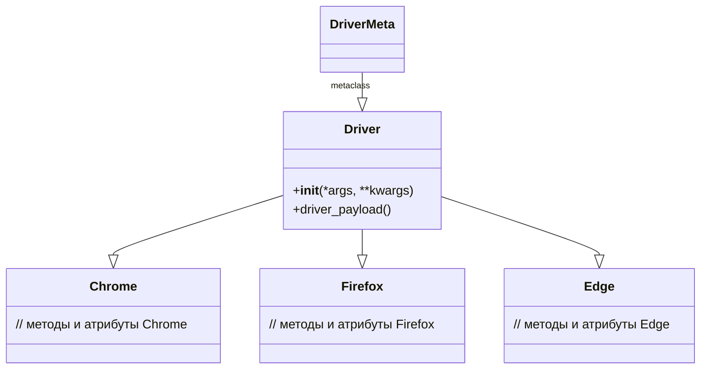

```MD
# Анализ кода Driver

```
## <input code>

```python
# ... (предполагается, что здесь определены классы Chrome, Firefox, Edge, Driver)

class DriverMeta(type):
    def __call__(cls, webdriver_cls, *args, **kwargs):
        assert isinstance(webdriver_cls, type)
        assert issubclass(webdriver_cls, Chrome | Firefox | Edge)

        class Driver(cls, webdriver_cls):
            def __init__(self, *args, **kwargs):
                print(f"Initializing WebDriver: {webdriver_cls.__name__} with args {args}, kwargs {kwargs}")
                super().__init__(*args, **kwargs)
                self.driver_payload()

            def driver_payload(self):
                super().driver_payload()  # Assuming a driver_payload method exists in the base Driver class


        return Driver(*args, **kwargs)

# ... (предполагается, что здесь определены классы Chrome, Firefox, Edge, Driver)

```

## <algorithm>

```mermaid
graph TD
    A[Создать экземпляр Driver] --> B{Проверка типа webdriver_cls};
    B -- Тип - класс --> C[Создать динамический класс Driver];
    B -- Не тип класса --> D[Ошибка: Некорректный тип];
    C --> E[Проверка наследования от Chrome/Firefox/Edge];
    E -- Наследует --> F[Создать экземпляр Driver класса];
    E -- Не наследует --> G[Ошибка: Некорректный тип драйвера];
    F --> H[Инициализация WebDriver];
    H --> I[Вызов super().__init__ для базовых классов];
    I --> J[Вызов self.driver_payload()];
    J --> K[Возврат экземпляра Driver];
```

**Пример:**

Если `webdriver_cls` - `Chrome`, то создается новый класс `Driver` который наследует от `Driver` и `Chrome`.  Затем создается экземпляр этого класса с передачей аргументов. Внутри конструктора `__init__` выводится сообщение об инициализации, вызывается конструктор родительского класса `super().__init__` и вызывается метод `driver_payload`.

## <mermaid>



**Объяснение диаграммы:**

Эта диаграмма показывает иерархию классов. `DriverMeta` является метаклассом, который используется для динамического создания класса `Driver`.  `Driver` наследует от базового класса `Driver` и от конкретной реализация браузера (Chrome, Firefox или Edge).

## <explanation>

**Импорты:**

В данном коде отсутствуют импорты. Предполагается, что классы `Chrome`, `Firefox`, `Edge` и `Driver` определены в других частях проекта (`src`).

**Классы:**

*   `DriverMeta`: Метакласс, который отвечает за динамическое создание класса `Driver`. Этот метакласс принимает класс Selenium WebDriver (`webdriver_cls`) и создает новый класс `Driver`, который наследует от базового `Driver` и от переданного класса WebDriver.
*   `Driver`: Базовый класс для управления драйверами.  Этот класс должен иметь метод `driver_payload`, используемый для дополнительной инициализации.
*   `Chrome`, `Firefox`, `Edge`: Предполагаемые классы, представляющие Selenium WebDriver для конкретных браузеров.  Они должны быть подклассами `webdriver`.

**Функции:**

*   `__call__`: Метод метакласса `DriverMeta`. Он вызывается при создании экземпляра класса `Driver` с использованием `DriverMeta` как метакласса. В методе происходит создание нового класса `Driver` с наследованием от `webdriver_cls`.  Принимает `webdriver_cls` (класс браузера), `*args` и `**kwargs` (аргументы для инициализации). Возвращает экземпляр созданного класса `Driver`.

**Переменные:**

*   `webdriver_cls`: Переменная, содержащая класс WebDriver (например, `Chrome`, `Firefox`).

**Возможные ошибки и улучшения:**

*   **Отсутствие импортов:** Не указано, откуда берутся классы `Chrome`, `Firefox`, `Edge` и `Driver`. Требуется импорт.
*   **Проверка `driver_payload`:** Должна быть проверка, что метод `driver_payload` существует в `Driver` и в подклассе.
*   **Обработка исключений:**  Необходимо добавить обработку исключений для ситуации, если `webdriver_cls` не является `Chrome`, `Firefox`, `Edge` или если он не является классом.
*   **Дополнения к `driver_payload`:**  Необходимо указать, что делает `driver_payload` в базовом классе `Driver`, чтобы знать, как он взаимодействует с WebDriver.
*   **Типизация:**  Для повышения читабельности и безопасности можно использовать типизацию (например, через `typing`).

**Взаимосвязи с другими частями проекта:**

Этот код предполагает наличие базового класса `Driver` и классов Selenium WebDriver (`Chrome`, `Firefox`, `Edge`).  Эти классы, скорее всего, находятся в пакетах, связанных с тестированием (например, `src.testing`) или управлением веб-драйверами (`src.webdriver`).