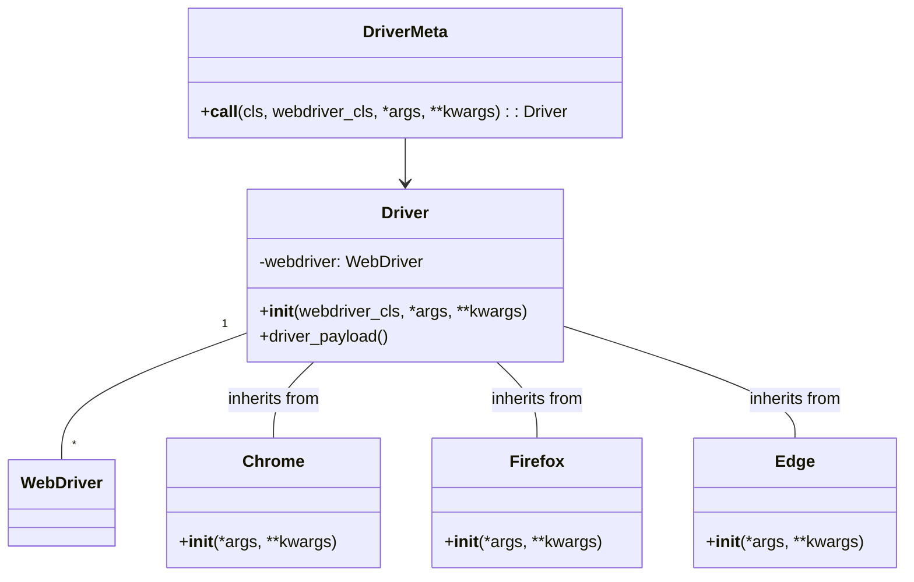

# <input code>

```python
This code defines a metaclass `DriverMeta` for dynamically creating a `Driver` class that inherits from both the base `Driver` class and a specified Selenium WebDriver class (`Chrome`, `Firefox`, or `Edge`). The metaclass is responsible for instantiating the correct combination of these classes. Here's a breakdown of what each part of this code does:

### `DriverMeta` Metaclass

A metaclass in Python is a class of a class that defines how a class behaves. Here, `DriverMeta` is used to control the creation of a new `Driver` class.

#### `__call__` Method

The `__call__` method in a metaclass is invoked when you instantiate an instance of the class. In this case, it's used to create a new `Driver` class that inherits from both the `Driver` base class and one of the Selenium WebDriver classes (`Chrome`, `Firefox`, or `Edge`).

- `cls`: The class being instantiated, which is `Driver` in this case.
- `webdriver_cls`: The Selenium WebDriver class to inherit from (`Chrome`, `Firefox`, or `Edge`).
- `*args` and `**kwargs`: Arguments and keyword arguments to pass to the `Driver` class constructor.

#### Assertions

- `assert isinstance(webdriver_cls, type)`: Ensures that `webdriver_cls` is indeed a class.
- `assert issubclass(webdriver_cls, Chrome | Firefox | Edge)`: Ensures that `webdriver_cls` is a subclass of one of the allowed WebDriver classes (`Chrome`, `Firefox`, or `Edge`).

#### Dynamic Class Creation

Inside the `__call__` method, a new class named `Driver` is defined dynamically. This new class inherits from both `cls` (the base `Driver` class) and `webdriver_cls` (the specified WebDriver class).

##### `Driver` Class Constructor

- `__init__`: The constructor for the dynamically created `Driver` class.
  - Logs the initialization of the WebDriver with its name and arguments.
  - Calls the constructors of the parent classes using `super()`.
  - Calls a method `driver_payload`.

##### `driver_payload` Method

This method is defined inside the dynamically created `Driver` class and calls the `driver_payload` method from the parent `Driver` class. This ensures any additional initialization required by the `Driver` class is executed.

#### Returning the Dynamic Class

The newly created `Driver` class is instantiated and returned with the provided arguments.

### Example Usage

When you create an instance of the `Driver` class with `DriverMeta` as its metaclass and pass in a WebDriver class, it will dynamically create a new class that inherits from both the base `Driver` class and the specified WebDriver class.

For example:
```python
# Creating a Driver instance with Chrome as the WebDriver class
chrome_driver = Driver(Chrome, *args, **kwargs)

# Creating a Driver instance with Firefox as the WebDriver class
firefox_driver = Driver(Firefox, *args, **kwargs)
```

This allows you to instantiate a `Driver` class that has all the methods and properties of both the base `Driver` class and the specified Selenium WebDriver class (`Chrome`, `Firefox`, or `Edge`), enabling flexible and dynamic WebDriver instantiation with additional custom functionality.
```

# <algorithm>

```mermaid
graph TD
    A[DriverMeta(__call__)] --> B{Is webdriver_cls a valid class?};
    B -- Yes --> C[Create dynamic Driver class];
    B -- No --> D[Assertion Error];
    C --> E[Driver.__init__(...)];
    E --> F[super().__init__(...)];
    E --> G[driver_payload()];
    G --> H[Return Driver instance];
    D --> H;
```

**Explanation:**

1.  `DriverMeta(__call__)` is called with `webdriver_cls`, `*args`, and `**kwargs`.

2.  `webdriver_cls` is checked for validity (class type and inheritance from `Chrome`, `Firefox`, or `Edge`).

3.  If valid, a new `Driver` class is created, inheriting from both `Driver` and `webdriver_cls`.

4.  The new `Driver` class' constructor (`__init__`) is called with provided arguments.

5.  `super().__init__()` calls the constructors of both parent classes (base `Driver` and the specific WebDriver class).

6.  `driver_payload()` method is called, possibly for additional setup.

7.  An instance of the dynamically created `Driver` class is returned.

**Data flow:**

- `webdriver_cls`, `*args`, and `**kwargs` are passed to `DriverMeta(__call__)`.
- `webdriver_cls` is validated.
- `Driver` class structure is created based on input.
- Arguments are passed to the new `Driver` constructor.
- `Driver`'s `__init__` method calls the `__init__` methods of the parent classes and `driver_payload` methods.
- The dynamically generated `Driver` instance is returned.


# <mermaid>



**Dependencies:**

- The code depends on the existence of `Chrome`, `Firefox`, and `Edge` classes (likely from a Selenium WebDriver library), which are used as base classes for instantiating the `Driver` class.
- The code depends on `Driver` class itself (a base `Driver` class).


# <explanation>

**Imports:**

There are no explicit imports in the provided code snippet.  It assumes that `Chrome`, `Firefox`, and `Edge` classes are defined elsewhere (likely in a Selenium WebDriver library). The base `Driver` class is also implied but not shown.

**Classes:**

- **`DriverMeta`:** A metaclass responsible for dynamically creating `Driver` classes.  It defines the `__call__` method that controls the creation process.
- **`Driver`:** A base class, dynamically extended using metaclasses. It likely contains methods and attributes for driver-related operations, and initialization. The code shows only the minimal structure needed.
- **`Chrome`, `Firefox`, `Edge`:**  These are classes representing different WebDriver implementations. They likely provide methods for interacting with the respective browser.


**Functions:**

- **`DriverMeta.__call__`:** Takes the base `Driver` class, a WebDriver class (`webdriver_cls`), and arguments for initialization (`*args`, `**kwargs`). It creates a new class inheriting from both and initializes it, then returns the new class instance.
- **`Driver.__init__`:** This is the constructor of the dynamically created `Driver` class. It initializes the `webdriver` attribute (likely of the WebDriver type) and calls the constructor of the parent classes (base `Driver` and WebDriver), storing any relevant parameters.
- **`driver_payload`:** This method is likely to perform additional driver-specific or project-specific initialization or setup steps.

**Variables:**

- `webdriver_cls`: Holds the type of the WebDriver class to use (e.g., `Chrome`, `Firefox`).
- `*args` and `**kwargs`: Used to pass arguments to the `__init__` methods of `Driver` and the WebDriver class (e.g., browser options).

**Possible Errors/Improvements:**

- **Error Handling:** The code lacks error handling.  If `webdriver_cls` is not a valid WebDriver class, or if there are issues during initialization, exceptions could be raised without a proper way to catch them.
- **Type Hinting:** Adding type hints would significantly improve readability and maintainability.
- **Context Management:** The code should likely use a `with` statement or a similar mechanism to ensure the WebDriver is properly closed and resources are released when it's no longer needed.
- **Logging:** The logging is rudimentary; more detailed information about driver initialization should be logged for better debugging and monitoring.

**Relationships to Other Parts of the Project:**

The `Driver` class and `DriverMeta` form a key part of the project's infrastructure for handling web driver instantiation. They depend on the `Chrome`, `Firefox`, and `Edge` classes from the Selenium library and potentially other project-specific `Driver` methods and attributes for further operation. The `driver_payload` method, in particular, is a critical hook for custom driver-related actions.