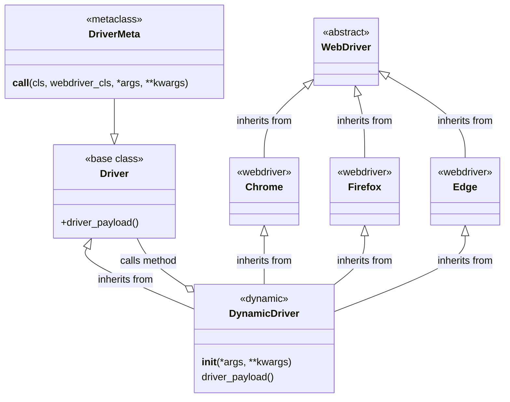

# Анализ кода `DriverMeta`

## <алгоритм>

**Блок-схема:**

1.  **Начало**: Вызов `Driver(webdriver_cls, *args, **kwargs)` для создания экземпляра класса `Driver`.

    *   **Пример**: `chrome_driver = Driver(Chrome, executable_path='/path/to/chromedriver', options=options)`

2.  **Вызов `__call__` в `DriverMeta`**: Метод `__call__` метакласса `DriverMeta` вызывается с аргументами `cls` (базовый класс `Driver`), `webdriver_cls` (класс `Chrome`, `Firefox` или `Edge`) и произвольными `*args`, `**kwargs`.

    *   **Пример**: `cls` - это класс `Driver`, `webdriver_cls` - класс `Chrome`, `*args` - `(executable_path='/path/to/chromedriver')`, `**kwargs` - `{'options': options}`

3.  **Проверка типов**: Метод проверяет, что `webdriver_cls` является классом и подклассом одного из разрешенных WebDriver классов (`Chrome`, `Firefox`, `Edge`).

    *   **Пример**: Проверка, что `webdriver_cls` (например, `Chrome`) является классом и подклассом `Chrome`.

4.  **Динамическое создание класса**: Внутри метода `__call__` динамически создается новый класс `Driver`, который наследует от базового класса `Driver` (`cls`) и переданного класса WebDriver (`webdriver_cls`).

    *   **Пример**: Создается новый класс `Driver`, который наследует от базового `Driver` и `Chrome`.

5.  **Определение метода `__init__`**: В динамически созданном классе `Driver` определяется конструктор `__init__`.

    *   **Пример**: Конструктор записывает в лог, что был создан драйвер и вызывает конструкторы родительских классов.

6.  **Вызов `super().__init__`**: В `__init__` вызывается конструктор родительских классов (`Driver` и `webdriver_cls`).

    *   **Пример**: Сначала вызывается конструктор базового `Driver`, затем `Chrome`, передавая все `*args`, `**kwargs`.

7.  **Вызов `driver_payload`**: В `__init__` вызывается метод `driver_payload` текущего класса.

    *   **Пример**: Вызывается метод `driver_payload`, определенный в базовом классе `Driver`.

8.  **Возврат экземпляра**: Созданный динамический класс `Driver` инстанцируется с переданными `*args` и `**kwargs`, а его экземпляр возвращается.

    *   **Пример**: Возвращается экземпляр `chrome_driver`, созданный с `executable_path='/path/to/chromedriver'` и `options`.

9.  **Конец**: Экземпляр класса `Driver` создан и готов к использованию.

## <mermaid>



**Зависимости в `mermaid`:**

1.  `DriverMeta` (метакласс) наследуется от `type`, но явно это не отображено на диаграмме, чтобы не усложнять ее. Метакласс управляет созданием экземпляров класса `Driver`.
2.  `Driver` – базовый класс, от которого наследует динамически созданный класс `DynamicDriver`.  `Driver`  определяет метод `driver_payload`, который будет вызываться из `DynamicDriver`.
3.  `WebDriver` - абстрактный класс.
4.  `Chrome`, `Firefox`, `Edge` — конкретные реализации веб-драйверов, которые наследуют от  `WebDriver` и используются для создания динамического класса `DynamicDriver`.
5.  `DynamicDriver` — динамически созданный класс `Driver`, который наследует от базового класса `Driver` и одного из классов веб-драйверов (`Chrome`, `Firefox`, или `Edge`). Класс переопределяет метод `__init__`, вызывает конструктор родительских классов и вызывает `driver_payload` из базового класса `Driver`.
6.  `DynamicDriver` вызывает метод `driver_payload` из базового класса `Driver` для выполнения дополнительной инициализации.

## <объяснение>

### Импорты

В предоставленном коде нет явных импортов. Однако, подразумевается, что:

*   `Chrome`, `Firefox`, `Edge` - это классы веб-драйверов из библиотеки Selenium (`selenium.webdriver`).
*   `Driver` - базовый класс, предположительно находящийся в том же пакете `src`.

### Классы

1.  **`DriverMeta`**:
    *   **Роль**: Метакласс, управляющий созданием класса `Driver`.
    *   **Атрибуты**: Отсутствуют.
    *   **Методы**:
        *   `__call__(cls, webdriver_cls, *args, **kwargs)`: Вызывается при создании экземпляра класса `Driver`. Динамически создает класс, который наследует от базового класса `Driver` и от одного из `webdriver_cls` (`Chrome`, `Firefox`, или `Edge`). Проверяет, что `webdriver_cls` - класс и подкласс одного из разрешенных вебдрайверов.
    *   **Взаимодействие**: Метакласс `DriverMeta` используется для настройки поведения класса `Driver`.

2.  **`Driver`**:
    *   **Роль**: Базовый класс, от которого наследуют динамически создаваемые классы драйверов.
    *   **Атрибуты**: Зависят от конкретной реализации, не описаны в коде.
    *   **Методы**:
        *   `driver_payload()`: Метод для дополнительной инициализации, вызываемый при создании экземпляра класса `Driver`.
    *   **Взаимодействие**: Предоставляет базовую функциональность для работы с драйверами и используется для создания динамических классов через `DriverMeta`.

3.  **`WebDriver`**:
    *   **Роль**: Абстрактный класс, от которого наследуют конкретные веб-драйверы.
    *   **Атрибуты**: Зависят от конкретной реализации.
    *   **Методы**: Зависят от конкретной реализации.
    *   **Взаимодействие**: Определяет интерфейс для конкретных веб-драйверов.

4.  **`Chrome`, `Firefox`, `Edge`**:
    *   **Роль**: Классы, представляющие конкретные веб-драйверы.
    *   **Атрибуты**: Зависят от конкретной реализации.
    *   **Методы**: Зависят от конкретной реализации.
    *   **Взаимодействие**: Используются для создания экземпляров браузера и управления им.

5. **`DynamicDriver`**
  - **Роль**: Динамически созданный класс, который наследуется от базового класса `Driver` и одного из классов веб-драйверов.
  - **Атрибуты**: Зависят от конкретной реализации.
  - **Методы**:
    - `__init__(*args, **kwargs)`: Конструктор класса, который вызывает конструктор базового класса и метод `driver_payload`.
    - `driver_payload()`: Метод для дополнительной инициализации, вызываемый при создании экземпляра класса `Driver`, определенный в базовом классе `Driver`.
  - **Взаимодействие**: Получает все методы и атрибуты от базового класса `Driver` и класса веб-драйвера, а также обеспечивает дополнительную инициализацию.

### Функции

1.  **`__call__` в `DriverMeta`**:
    *   **Аргументы**:
        *   `cls`: Базовый класс `Driver`.
        *   `webdriver_cls`: Класс WebDriver (`Chrome`, `Firefox`, `Edge`).
        *   `*args`, `**kwargs`: Произвольные позиционные и именованные аргументы.
    *   **Возвращаемое значение**: Экземпляр динамически созданного класса `Driver`.
    *   **Назначение**: Динамически создает класс `Driver`, наследующий от базового класса `Driver` и указанного класса веб-драйвера.
    *   **Пример**:
        ```python
        DriverMeta.__call__(Driver, Chrome, executable_path='/path/to/chromedriver')
        ```

2. **`__init__` в `DynamicDriver`**:
    *   **Аргументы**:
        *   `*args`, `**kwargs`: Произвольные позиционные и именованные аргументы.
    *   **Возвращаемое значение**: Нет.
    *   **Назначение**: Инициализирует экземпляр динамически созданного класса `Driver`, вызывает конструкторы родительских классов и метод `driver_payload`.
    *   **Пример**:
        ```python
          dynamic_driver = DynamicDriver(executable_path='/path/to/chromedriver', options=options)
        ```

3.  **`driver_payload` в `Driver`**:
    *   **Аргументы**: Нет.
    *   **Возвращаемое значение**: Нет.
    *   **Назначение**: Выполняет дополнительную инициализацию драйвера.
    *   **Пример**:
        ```python
        Driver().driver_payload()
        ```

### Переменные

*   `cls`: Переменная, представляющая класс `Driver` при вызове метода `__call__` метакласса `DriverMeta`.
*   `webdriver_cls`: Переменная, представляющая класс веб-драйвера (`Chrome`, `Firefox`, `Edge`).
*   `*args`, `**kwargs`: Переменные, содержащие позиционные и именованные аргументы, передаваемые конструктору класса `Driver`.

### Потенциальные ошибки и улучшения

1.  **Отсутствие явных импортов**: Код подразумевает наличие необходимых классов, но не импортирует их явно. Это может вызвать ошибки `NameError`. Необходимо явно импортировать `Chrome`, `Firefox`, `Edge` из `selenium.webdriver` и `Driver` из соответствующего модуля.
2.  **Обработка исключений**: Код не содержит обработки исключений. Следует добавить блоки `try-except` для обработки возможных ошибок при создании драйвера.
3.  **Расширяемость**: В текущем виде код поддерживает только `Chrome`, `Firefox`, и `Edge`. Для поддержки других веб-драйверов потребуется изменить `assert` и логику внутри `__call__`. Можно переписать проверку типов, к примеру, с использованием аннотаций типов, чтобы она была более гибкой.
4.  **Логирование**: Код использует простое логирование, можно добавить возможность настраивать уровень логирования и формат сообщений.

### Взаимосвязь с другими частями проекта

1.  **Базовый класс `Driver`**: `DriverMeta` зависит от наличия базового класса `Driver` в том же пакете. Класс `Driver` предположительно содержит общую логику для управления веб-драйверами.
2.  **Библиотека Selenium**: Код зависит от библиотеки Selenium для управления веб-браузерами.
3.  **Использование**: Данный код используется для создания экземпляров драйверов, которые затем используются для тестирования и взаимодействия с веб-сайтами.
4.  **Конфигурация**: Код может быть расширен для интеграции с конфигурационными файлами, для настройки различных параметров драйвера.

**Пример цепочки взаимосвязей:**

1.  Пользовательский код инициирует создание экземпляра `Driver` с указанием конкретного веб-драйвера (`Chrome`, `Firefox` или `Edge`).
2.  `DriverMeta` перехватывает вызов и динамически создает класс, наследующий от базового класса `Driver` и указанного веб-драйвера.
3.  Созданный экземпляр класса инициализируется вызовом конструктора, который включает в себя вызов конструкторов родительских классов и метода `driver_payload`.
4.  В результате создаётся экземпляр драйвера с необходимой функциональностью.
5.  Далее данный экземпляр используется для управления браузером.

Таким образом, `DriverMeta` является центральным элементом для динамического создания экземпляров драйверов, обеспечивая гибкость и расширяемость.