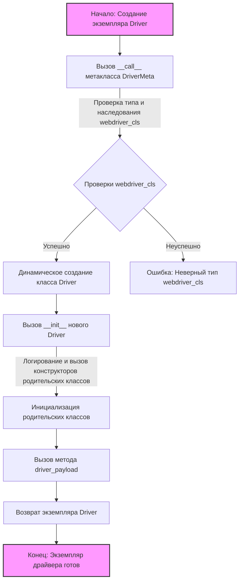

## АНАЛИЗ КОДА:

### <алгоритм>

1. **Начало**: Инициализация экземпляра класса `Driver` с использованием метакласса `DriverMeta`.
   *   Пример: `driver_instance = Driver(Chrome, *args, **kwargs)`.

2. **Вызов `__call__` в `DriverMeta`**: Метод `__call__` метакласса `DriverMeta` вызывается, когда создаётся экземпляр `Driver`.
   *   Пример: `cls` - это класс `Driver`, `webdriver_cls` - это класс `Chrome`, `args` - произвольные позиционные аргументы, `kwargs` - произвольные именованные аргументы.

3. **Проверки**: Выполняются проверки:
    *   Проверка типа `webdriver_cls`: Убеждаемся, что `webdriver_cls` является классом.
        *   Пример: `assert isinstance(webdriver_cls, type)`
    *   Проверка наследования `webdriver_cls`: Убеждаемся, что `webdriver_cls` является подклассом `Chrome`, `Firefox`, или `Edge`.
        *   Пример: `assert issubclass(webdriver_cls, Chrome | Firefox | Edge)`

4. **Динамическое создание класса `Driver`**: Внутри `__call__` создаётся новый класс `Driver` (переопределяя исходный класс `Driver`). Этот новый класс наследуется от исходного класса `Driver` и `webdriver_cls`.

5. **Конструктор `__init__` динамического `Driver`**: Вызывается конструктор созданного динамического класса `Driver`.
    *   Пример: `__init__(self, *args, **kwargs)`
    *   Логирование: Записывается информация о создании WebDriver.
    *   Вызов конструкторов родительских классов: Инициализируются базовый класс `Driver` и класс `webdriver_cls` с помощью `super().__init__()`.
    *   Вызов `driver_payload`: Вызывается метод `driver_payload` для выполнения дополнительной инициализации.
        *   Пример: `super().driver_payload()`.

6. **Метод `driver_payload`**: Выполняется метод `driver_payload` родительского класса `Driver`.

7. **Возврат экземпляра**: Созданный экземпляр динамического класса `Driver` возвращается.

8. **Конец**: Экземпляр драйвера, например, `chrome_driver`, готов к использованию.

### <mermaid>

**Объяснение `mermaid` диаграммы:**

*   **Start**: Начальная точка процесса, когда создаётся экземпляр класса `Driver`.
*   **CallMeta**: Вызов метода `__call__` метакласса `DriverMeta`, который управляет созданием класса `Driver`.
*   **TypeCheck**: Проверка, что `webdriver_cls` является классом и подклассом одного из допустимых WebDriver классов (Chrome, Firefox, Edge).
*   **Error**: В случае неуспешной проверки выбрасывается ошибка.
*   **DynamicDriverCreation**: Динамическое создание нового класса `Driver`, наследующегося от базового класса `Driver` и `webdriver_cls`.
*   **InitDriver**: Вызов метода `__init__` вновь созданного динамического класса `Driver`.
*   **InitParents**: Инициализация родительских классов, т.е. конструкторы базового класса `Driver` и `webdriver_cls`.
*   **CallDriverPayload**: Вызов метода `driver_payload` для дополнительной инициализации.
*   **ReturnInstance**: Возврат созданного экземпляра класса `Driver`.
*   **End**: Конечная точка процесса, когда экземпляр драйвера готов к использованию.

### <объяснение>

**Метакласс `DriverMeta`**

*   **Назначение:** Метакласс `DriverMeta` отвечает за динамическое создание классов `Driver`, которые наследуются от базового класса `Driver` и одного из классов Selenium WebDriver (`Chrome`, `Firefox` или `Edge`).
*   **Метод `__call__`:**
    *   **Аргументы:**
        *   `cls`: Класс, для которого создается экземпляр (в данном случае - класс `Driver`).
        *   `webdriver_cls`: Класс WebDriver, от которого будет наследоваться создаваемый класс (например, `Chrome`).
        *   `*args` и `**kwargs`: Позиционные и именованные аргументы, которые будут переданы в конструктор создаваемого класса.
    *   **Функциональность:**
        1.  Проверяет, что `webdriver_cls` является классом и подклассом одного из допустимых WebDriver классов.
        2.  Создаёт новый класс `Driver` динамически, который наследуется от базового `Driver` и переданного `webdriver_cls`.
        3.  Определяет метод `__init__` для нового класса `Driver`, который вызывает конструкторы родительских классов, логирует инициализацию и вызывает метод `driver_payload`.
        4.  Определяет метод `driver_payload`, который вызывает метод `driver_payload` базового класса `Driver`.
        5.  Возвращает экземпляр динамически созданного класса `Driver`.

**Динамически создаваемый класс `Driver`**

*   **Наследование:** Наследуется от базового класса `Driver` и от переданного класса WebDriver (`Chrome`, `Firefox` или `Edge`).
*   **Метод `__init__`:**
    *   **Аргументы:** `*args` и `**kwargs` - аргументы, которые передаются при создании экземпляра.
    *   **Функциональность:**
        1.  Логирует инициализацию WebDriver с его именем и аргументами.
        2.  Вызывает конструкторы родительских классов с помощью `super()`.
        3.  Вызывает метод `driver_payload`.
*   **Метод `driver_payload`:**
    *   **Функциональность:** Вызывает метод `driver_payload` базового класса `Driver` для выполнения дополнительной инициализации.

**Импорты**:
    * В коде не используются явные импорты, но подразумевается, что классы `Driver`, `Chrome`, `Firefox`, и `Edge` определены в других частях проекта. Предполагается наличие иерархии классов:
        - Базовый класс `Driver`: Определяет общую функциональность для всех драйверов.
        - Классы WebDriver (`Chrome`, `Firefox`, `Edge`):  Обеспечивают взаимодействие с соответствующими браузерами.
        - Метакласс `DriverMeta`: Динамически связывает базовый `Driver` с конкретным драйвером.

**Переменные:**

*   `cls`: Ссылка на класс, для которого создается экземпляр.
*   `webdriver_cls`: Класс драйвера WebDriver, от которого будет наследоваться создаваемый класс.
*   `args`: Позиционные аргументы, передаваемые в конструктор создаваемого класса.
*   `kwargs`: Именованные аргументы, передаваемые в конструктор создаваемого класса.

**Потенциальные ошибки и улучшения:**

1. **Обработка исключений:** В методе `__call__` отсутствуют блоки try/except для обработки исключений, которые могут возникнуть в процессе создания класса.
2. **Гибкость проверок:** Проверки `webdriver_cls` можно сделать более гибкими, например, используя абстрактный базовый класс WebDriver.
3. **Логирование:** Можно добавить более детальное логирование.
4. **Docstrings:** Добавить docstrings к методам и классам для лучшего понимания кода.

**Цепочка взаимосвязей:**
    1.  Базовый класс `Driver` (предположительно, из другого файла `driver.py`) определяет общую логику для драйверов.
    2.  Классы `Chrome`, `Firefox`, `Edge` (предположительно, из пакета `selenium.webdriver`) предоставляют конкретную реализацию управления браузерами.
    3.  `DriverMeta` (из этого файла) создает динамический класс `Driver`, наследующийся от базового класса `Driver` и одного из драйверов (`Chrome`, `Firefox`, `Edge`).
    4.  Экземпляр `Driver` (например, `chrome_driver`) используется для управления браузером через selenium, при этом  он также обладает кастомной логикой базового класса `Driver`.

Этот код реализует гибкий механизм для создания экземпляров драйверов, позволяя использовать общую логику `Driver` в сочетании с конкретными драйверами Selenium WebDriver.