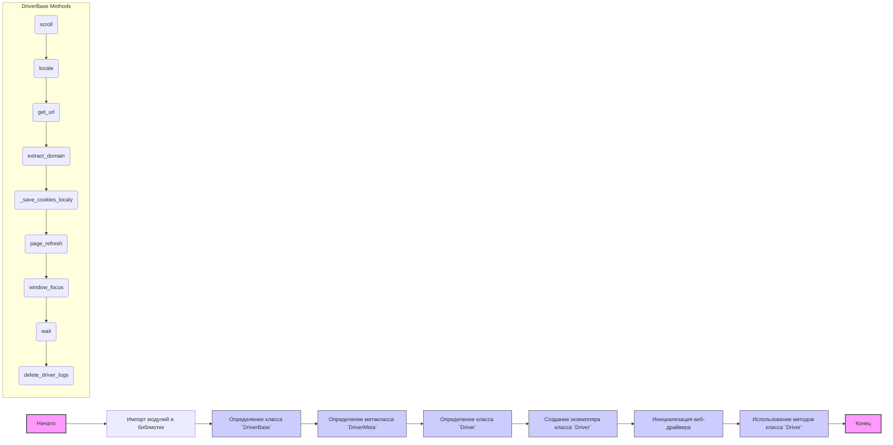

## Анализ кода `driver.py`

### 1. **<алгоритм>**

**Блок-схема работы кода `driver.py`**


**Примеры для каждого блока:**

1.  **Импорт модулей и библиотек:**
    *   `import sys`: Импорт модуля `sys` для доступа к параметрам и функциям, специфичным для интерпретатора Python.
    *   `import time`: Импорт модуля `time` для работы со временем, например, для задержек.
    *   `from selenium import webdriver`: Импорт модулей для управления веб-драйвером.
    *   `from src import gs`: Импорт глобальных настроек из `src.gs`.
2.  **Определение класса `DriverBase`:**
    *   `class DriverBase:`: Создание базового класса для всех драйверов.
    *   Методы, такие как `scroll()`, `locale()`, `get_url()`, `_save_cookies_localy()`, реализуются здесь.
3.  **Определение метакласса `DriverMeta`:**
    *   `class DriverMeta(type):`: Создание метакласса для динамического создания классов драйверов.
    *   Метод `__call__()` для создания нового класса драйвера.
4.  **Определение класса `Driver`:**
    *   `class Driver(metaclass=DriverMeta):`: Создание класса `Driver` с использованием метакласса `DriverMeta`.
    *   Класс является динамически созданным и наследует от `DriverBase` и указанного веб-драйвера.
5.  **Создание экземпляра класса `Driver`:**
    *   `d = Driver(Chrome)`: Создание экземпляра `d` класса `Driver` для браузера Chrome.
6.  **Инициализация веб-драйвера:**
    *   `driver_payload()`: Инициализирует JavaScript-методы и `ExecuteLocator`.
7.  **Использование методов класса `Driver`:**
    *   `d.get_url("https://example.com")`: Загрузка веб-страницы.
    *   `d.scroll(scrolls=3, frame_size=500, direction='forward', delay=0.5)`: Прокрутка страницы.

### 2. **<mermaid>**

```mermaid
flowchart TD
    Start[Start] --> ImportModules[Импорт модулей и библиотек]
    ImportModules --> DriverBaseClass[Class: DriverBase <br> Base class for WebDriver]
    DriverBaseClass --> DriverMetaClass[Class: DriverMeta <br> Metaclass for dynamic driver creation]
    DriverMetaClass --> DriverClass[Class: Driver <br> Dynamic WebDriver class]
    DriverClass --> DriverInstance[Driver(WebDriverClass) <br> Create driver instance]
    DriverInstance --> DriverMethods[Use Driver methods <br> like get_url(), scroll(), locale()]
    DriverMethods --> End[End]
    
    subgraph DriverBase Class
        direction TB
         InitDriverPayload[driver_payload() <br> Init JS and locator] --> ScrollMethod[scroll(scrolls, frame_size, direction, delay) <br> Scroll the page]
        ScrollMethod --> LocaleMethod[locale() <br> Get page language]
        LocaleMethod --> GetUrlMethod[get_url(url) <br> Navigate to URL]
        GetUrlMethod --> ExtractDomainMethod[extract_domain(url) <br> Get domain from URL]
        ExtractDomainMethod --> SaveCookiesMethod[_save_cookies_localy(to_file) <br> Save cookies to file]
        SaveCookiesMethod --> RefreshPageMethod[page_refresh() <br> Refresh current page]
        RefreshPageMethod --> WindowFocusMethod[window_focus() <br> Restore window focus]
        WindowFocusMethod --> WaitMethod[wait(interval) <br> Pause execution]
        WaitMethod --> DeleteLogsMethod[delete_driver_logs() <br> Delete temporary files and logs]
        
    end
     
    
    style Start fill:#f9f,stroke:#333,stroke-width:2px
    style End fill:#f9f,stroke:#333,stroke-width:2px
    style DriverBaseClass fill:#ccf,stroke:#333,stroke-width:1px
    style DriverMetaClass fill:#ccf,stroke:#333,stroke-width:1px
    style DriverClass fill:#ccf,stroke:#333,stroke-width:1px
    style DriverInstance fill:#ccf,stroke:#333,stroke-width:1px
```

**Зависимости импорта:**
*   `import sys`: Модуль для работы с системными параметрами.
*   `import pickle`: Модуль для сериализации и десериализации объектов Python (используется для сохранения и загрузки кук).
*   `import time`: Модуль для работы со временем (например, для задержек между действиями).
*   `import copy`: Модуль для создания копий объектов.
*   `from pathlib import Path`: Класс для работы с путями к файлам и директориям.
*   `from typing import Type, Union`: Типизация для функций и классов.
*    `import urllib.parse`: Модуль для разбора URL.
*   `from selenium.webdriver.common.action_chains import ActionChains`: Модуль для выполнения сложных действий с элементами на странице (например, клик с удержанием, перетаскивание).
*   `from selenium.webdriver.common.keys import Keys`: Модуль для эмуляции нажатий клавиш на клавиатуре.
*   `from selenium.webdriver.common.by import By`: Модуль для определения локаторов элементов на веб-странице.
*   `from selenium.webdriver.support import expected_conditions as EC`: Модуль для определения условий ожидания при работе с веб-элементами.
*   `from selenium.webdriver.support.ui import WebDriverWait`: Модуль для явного ожидания загрузки элемента на странице.
*  `from selenium.webdriver.remote.webelement import WebElement`: Модуль для взаимодействия с веб-элементами.
*   `from selenium.common.exceptions import InvalidArgumentException, ElementClickInterceptedException, ElementNotInteractableException, ElementNotVisibleException`: Модуль с исключениями, которые могут возникнуть при работе с Selenium.
*   `from src import gs`: Импорт глобальных настроек проекта.
*   `from src.webdriver.executor import ExecuteLocator`: Класс для выполнения поиска элементов на странице.
*   `from src.webdriver.javascript.js import JavaScript`: Класс для выполнения JavaScript-кода на странице.
*   `from src.utils.printer import pprint`: Функция для красивого вывода данных.
*   `from src.logger.logger import logger`: Модуль для логирования событий.
*   `from src.logger.exceptions import WebDriverException`: Пользовательские исключения для WebDriver.

### 3. **<объяснение>**

#### **Импорты:**
-   `sys`: Предоставляет доступ к некоторым переменным и функциям, взаимодействующим с интерпретатором Python.
-   `pickle`: Используется для сохранения и загрузки cookie в файл. Это позволяет сохранять сессии браузера между запусками.
-   `time`: Используется для добавления задержек в выполнение кода, например, для ожидания загрузки веб-страницы.
-   `copy`: Используется для создания копий объектов, что полезно для предотвращения нежелательных изменений.
-   `pathlib.Path`: Используется для более удобной работы с путями файлов.
-   `typing.Type, typing.Union`: Используется для типизации, что делает код более читаемым и менее подверженным ошибкам.
-   `urllib.parse`:  Используется для обработки URL, например, для извлечения домена.
-   `selenium.webdriver.common.action_chains.ActionChains`: Позволяет выполнять последовательность действий над элементами (например, drag-and-drop).
-   `selenium.webdriver.common.keys.Keys`: Используется для отправки специальных клавиш (например, Enter, Esc).
-   `selenium.webdriver.common.by.By`: Используется для определения локаторов элементов на веб-странице.
-   `selenium.webdriver.support.expected_conditions as EC`: Используется для определения условий, при которых WebDriver должен ждать.
-   `selenium.webdriver.support.ui.WebDriverWait`: Используется для явного ожидания элементов на странице.
-    `selenium.webdriver.remote.webelement.WebElement`: Тип представляющий веб-элемент в Selenium.
-   `selenium.common.exceptions`: Набор исключений, связанных с selenium, которые могут быть перехвачены в коде для обработки ошибок.
-   `src.gs`: Содержит глобальные настройки проекта, включая пути к ресурсам, настройки браузера и прочее.
-   `src.webdriver.executor.ExecuteLocator`: Модуль, отвечающий за выполнение поиска элементов на веб-странице.
-   `src.webdriver.javascript.js.JavaScript`: Модуль для выполнения JavaScript-кода на странице.
-   `src.utils.printer.pprint`: Модуль для форматированного вывода данных в консоль.
-   `src.logger.logger.logger`: Модуль для логирования событий в файл.
-   `src.logger.exceptions.WebDriverException`: Пользовательское исключение для WebDriver.

#### **Классы:**
*   **`DriverBase`**:
    -   **Роль**: Базовый класс для всех веб-драйверов, предоставляющий общие методы и атрибуты.
    -   **Атрибуты**:
        -   `previous_url`: URL предыдущей страницы.
        -   `referrer`: Реферер.
        -   `page_lang`: Язык текущей страницы.
    -   **Методы**:
        -   `driver_payload()`: Инициализация JavaScript и `ExecuteLocator`.
        -   `scroll()`: Прокрутка страницы.
        -   `locale()`: Получение языка страницы.
        -   `get_url()`: Переход по URL.
        -   `extract_domain()`: Извлечение домена из URL.
        -   `_save_cookies_localy()`: Сохранение кук в файл.
        -   `page_refresh()`: Обновление страницы.
        -   `window_focus()`: Восстановление фокуса на окне браузера.
        -   `wait()`: Пауза в выполнении.
        -   `delete_driver_logs()`: Удаление логов и временных файлов драйвера.
*   **`DriverMeta`**:
    -   **Роль**: Метакласс, который создает динамические классы `Driver`.
    -   **Метод `__call__`**: Создает класс `Driver`, который наследуется от `DriverBase` и указанного класса веб-драйвера.
*   **`Driver`**:
    -   **Роль**: Динамически создаваемый класс WebDriver.
    -   Создается с помощью метакласса `DriverMeta` и наследует от `DriverBase` и указанного веб-драйвера.
    -   Это позволяет использовать общие методы и свойства базового класса с конкретным драйвером.
    
#### **Функции:**
*   Большинство методов определены внутри классов `DriverBase` и `DriverMeta`.
    -   **Примеры:**
    -   `get_url(url: str)`: принимает URL и загружает его в браузере.
    -   `scroll(scrolls: int, frame_size: int, direction: str, delay: float)`: прокручивает страницу на указанное количество `scrolls` раз, с размером фрейма `frame_size`, в `direction` направлении и с `delay` задержкой.
    -   `locale()`: возвращает язык текущей страницы.

#### **Переменные:**
*   `previous_url`, `referrer`, `page_lang`: переменные, используемые для хранения данных о предыдущей странице и языке.
*   `webdriver_cls`: переменная, используемая для хранения класса веб-драйвера (например, `Chrome`, `Firefox`).

**Цепочка взаимосвязей:**
1.  **`src.gs`**: Глобальные настройки используются для конфигурации драйвера, например, для определения пути к исполняемому файлу браузера.
2.  **`ExecuteLocator`, `JavaScript`**: Используются для выполнения действий на странице. `ExecuteLocator` ищет элементы, а `JavaScript` позволяет выполнять JS код.
3.  **`src.logger`**: Используется для логирования событий, что помогает при отладке кода.
4.  **`Driver`, `DriverBase`, `DriverMeta`**: Классы, создающие архитектуру для управления веб-драйверами. `Driver` динамически создается с помощью `DriverMeta`, наследуя функционал `DriverBase`.

**Потенциальные ошибки и области для улучшения:**
*   Обработка исключений: в коде уже присутствуют `try-except`, но можно добавить более подробную обработку исключений.
*   Управление ресурсами: можно добавить механизмы для более явного освобождения ресурсов (например, закрытие драйвера).
*   Обновление кук: можно добавить автоматическое обновление кук, если это необходимо для проекта.
*   Возможно, следует сделать `driver_payload()` более гибким, передавая нужные параметры в функцию, а не инициализировать их напрямую в классе `DriverBase`.

Этот анализ предоставляет полную картину работы кода, включая его архитектуру, зависимости, а также возможные улучшения.