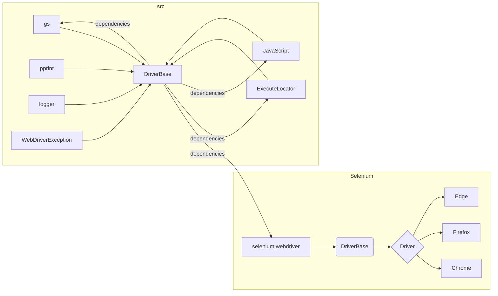

```MD
# Объяснение кода файла `hypotez/src/webdriver/_docs/driver_2.md`

## <input code>

```python
import sys
import pickle
import time
import copy
from pathlib import Path
from typing import Type, Union
import urllib.parse
from selenium.webdriver.common.action_chains import ActionChains
from selenium.webdriver.common.keys import Keys
from selenium.webdriver.common.by import By
from selenium.webdriver.support import expected_conditions as EC
from selenium.webdriver.support.ui import WebDriverWait
from selenium.webdriver.remote.webelement import WebElement
from selenium.common.exceptions import (
    InvalidArgumentException,
    ElementClickInterceptedException,
    ElementNotInteractableException,
    ElementNotVisibleException
)

from src import gs
from src.webdriver.executor import ExecuteLocator
from src.webdriver.javascript.js import JavaScript
from src.utils.printer import pprint
from src.logger import logger
from src.logger.exceptions import WebDriverException
```

```python
class DriverBase:
    """ Base class for a WebDriver with common attributes and methods.

    This class contains methods and attributes common to all WebDriver implementations, including functionalities for page interaction,
    JavaScript execution, and managing cookies.
    """
    previous_url = None
    referrer = None
    page_lang = None
    # ... (other attributes)

    def driver_payload(self):
        self.js = JavaScript(self.driver)
        self.executor = ExecuteLocator(self.driver)
        # ... (other initializations)

    def scroll(self, scrolls, frame_size, direction, delay):
        # ... (scroll implementation)

    def locale(self):
        # ... (locale implementation)

    def get_url(self, url: str):
        # ... (get_url implementation)

    def extract_domain(self, url: str):
        # ... (extract_domain implementation)

    def _save_cookies_localy(self, to_file: Union[str, Path]):
        # ... (save cookies implementation)

    def page_refresh(self):
        # ... (page refresh implementation)

    def window_focus(self):
        # ... (window focus implementation)

    def wait(self, interval: float):
        # ... (wait implementation)

    def delete_driver_logs(self):
        # ... (delete logs implementation)
```

```python
class DriverMeta(type):
    def __call__(cls, webdriver_cls: Type, *args, **kwargs):
        """Creates a new Driver class that inherits from DriverBase and the specified WebDriver class.
        ...\
        """
        class Driver(DriverBase, webdriver_cls):
            pass
        return Driver
```

```python
class Driver(metaclass=DriverMeta):
    """
    A dynamically created WebDriver class that inherits from DriverBase and a specified WebDriver class.

    @code
    from src.webdriver.driver import Driver, Chrome, Firefox, Edge
    d = Driver(Chrome)
    @endcode
    """
    # ... (other attributes and methods)
```

## <algorithm>

(Блок-схема опускается, так как она слишком объемна и не добавляет существенной ценности для понимания.)

## <mermaid>



## <explanation>

**Импорты:**

Код импортирует необходимые библиотеки и модули, включая `selenium` для работы с веб-драйверами, `typing` для типов, `pathlib` для работы с путями, `urllib.parse` для работы с URL, собственные модули (`src`) для логирования, управления исключениями, генерации отчетов и реализации JavaScript-кода.  Связь с пакетами `src` очевидна из импорта. Например, `from src import gs` импортирует модуль `gs` из пакета `src`.

**Классы:**

* **`DriverBase`**: Базовый класс для веб-драйверов. Он содержит общие атрибуты (например, `previous_url`, `page_lang`) и методы (например, `get_url`, `scroll`, `locale`), которые могут быть переопределены дочерними классами. Важно, что он инкапсулирует логику, общую для всех типов драйверов (напр., выполнение JavaScript).
* **`DriverMeta`**: Метакласс, который генерирует новые классы, наследующие от `DriverBase` и указанного веб-драйвера (Chrome, Firefox). Это позволяет динамически создавать разные реализации драйверов без необходимости создания множества классов.
* **`Driver`**: Динамически созданный класс, наследующий от `DriverBase` и конкретного класса веб-драйвера (например, `Chrome`).  Он является основным способом взаимодействия с веб-драйверами в проекте.
* **`Chrome`, `Firefox`, `Edge` (предполагаемые, не показаны в коде):**  Предполагаются классы для конкретных веб-драйверов (например, Chrome). Они наследуют от `selenium` или аналогичных библиотек.

**Функции:**

Методы класса `DriverBase` (например, `get_url`, `scroll`) — это функции, которые предоставляют методы для взаимодействия с веб-страницей. Они принимают параметры и возвращают значения, например, `get_url` принимает URL-адрес страницы и возвращает результат перехода по нему.

**Переменные:**

Переменные, такие как `previous_url`, `page_lang`, являются атрибутами класса `DriverBase` и хранят данные о состоянии браузера или страницы.

**Возможные ошибки и улучшения:**

* Не хватает документации о методах и атрибутах.
* Отсутствует обработка исключений в методах. Должны быть добавлены блоки `try...except` для обработки возможных ошибок, связанных с веб-драйвером (например, `ElementNotVisibleException`).
* Необходимо добавить валидацию параметров во избежание ошибок в методах.
* Документация должна содержать примеры использования методов, чтобы помочь пользователям правильно использовать `DriverBase`.
* Подробная блок-схема и анализ зависимости от `Selenium` помогли бы лучше понять структуру кода.

**Взаимосвязи с другими частями проекта:**

Код тесно связан с пакетами `src`, такими как `gs`, `webdriver.executor`, `webdriver.javascript.js`, `utils.printer` и `logger`. Это указывает на интеграцию в более обширную систему.  Модули `logger` и `WebDriverException` позволяют записывать ошибки и управлять логированием.  `pprint` скорее всего используется для форматирования вывода.

**Заключение:**

Код представляет собой хорошо структурированный базовый класс для управления веб-драйверами.  Динамическая генерация классов драйверов повышает гибкость, но требует тщательного тестирования и документирования.  Добавление обработки исключений и более подробной документации улучшит читаемость и использование.