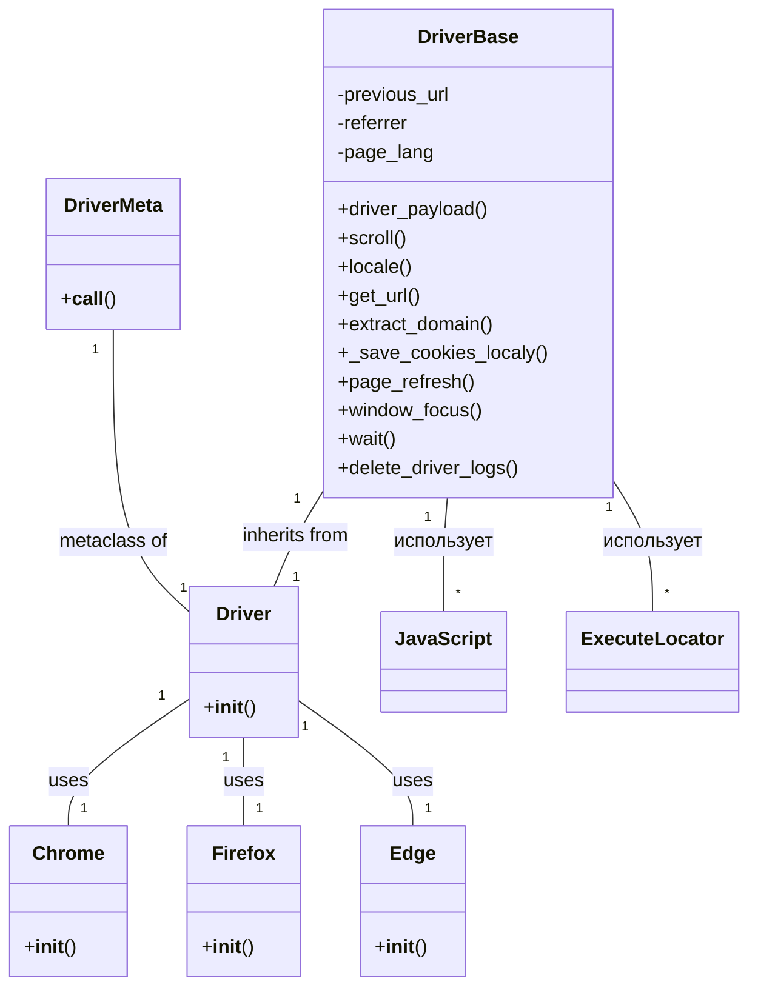

```MD
# <input code>

```python
import sys
import pickle
import time
import copy
from pathlib import Path
from typing import Type, Union
import urllib.parse
from selenium.webdriver.common.action_chains import ActionChains
from selenium.webdriver.common.keys import Keys
from selenium.webdriver.common.by import By
from selenium.webdriver.support import expected_conditions as EC
from selenium.webdriver.support.ui import WebDriverWait
from selenium.webdriver.remote.webelement import WebElement
from selenium.common.exceptions import (
    InvalidArgumentException,
    ElementClickInterceptedException,
    ElementNotInteractableException,
    ElementNotVisibleException
)

from src import gs
from src.webdriver.executor import ExecuteLocator
from src.webdriver.javascript.js import JavaScript
from src.utils import pprint
from src.logger import logger
from src.logger.exceptions import WebDriverException
```

```python
class DriverBase:
    """ Base class for a WebDriver with common attributes and methods.

    This class contains methods and attributes common to all WebDriver implementations, including functionalities for page interaction,
    JavaScript execution, and managing cookies.
    """
    previous_url = None
    referrer = None
    page_lang = None
    ready_state = None
    # ... (other attributes and methods)


    def driver_payload(self):
        self.js = JavaScript(self.driver)
        self.executor = ExecuteLocator(self.driver)

    def scroll(self, scrolls, frame_size, direction, delay):
        # ... (scroll implementation)

    def locale(self):
        # ... (locale implementation)

    def get_url(self, url: str):
        # ... (get_url implementation)

    def extract_domain(self, url: str):
        # ... (extract_domain implementation)


    def _save_cookies_localy(self, to_file: Union[str, Path]):
        # ... (save cookies implementation)

    def page_refresh(self):
        # ... (page_refresh implementation)

    def window_focus(self):
        # ... (window_focus implementation)

    def wait(self, interval: float):
        # ... (wait implementation)

    def delete_driver_logs(self):
        # ... (delete driver logs implementation)
```

```python
class DriverMeta(type):
    def __call__(cls, webdriver_cls: Type, *args, **kwargs):
        """Creates a new Driver class that inherits from DriverBase and the specified WebDriver class.
        ...\n
        """
        class DriverClass(cls, webdriver_cls):
            pass
        return DriverClass(*args, **kwargs)


class Driver(metaclass=DriverMeta):
    """
    A dynamically created WebDriver class that inherits from DriverBase and a specified WebDriver class.

    @code
    from src.webdriver import Driver, Chrome, Firefox, Edge
    d = Driver(Chrome)
    @endcode
    """
    pass
```

# <algorithm>

**Общая блок-схема:**

```mermaid
graph TD
    A[Пользовательский запрос] --> B{Выбор браузера (Chrome, Firefox, etc.)};
    B --> C[Создание экземпляра Driver];
    C --> D[Инициализация DriverBase (установка драйвера, js, executor)];
    D --> E[Выполнение запроса (get_url, scroll, etc.)];
    E --> F[Обработка результата];
    F --> G[Возврат результата пользователю];
```

* **Пример (get_url):** Пользовательский запрос `d.get_url("https://example.com")` вызывает метод `get_url` в `DriverBase`. Алгоритм переходит на указанный URL и проверяет успешность перехода. Результат (успех или ошибка) возвращается пользователю.

* **Пример (scroll):** Пользовательский запрос `d.scroll(...)` вызывает метод `scroll` в `DriverBase`. Алгоритм прокручивает страницу.  Данные (направление, кол-во прокруток, delay) передаются в метод `scroll`

# <mermaid>



# <explanation>

**1. Импорты:**

- `sys`, `pickle`, `time`, `copy`, `pathlib`, `typing`, `urllib.parse`, `ActionChains`, `Keys`, `By`, `EC`, `WebDriverWait`, `WebElement`, `InvalidArgumentException`, `ElementClickInterceptedException`, `ElementNotInteractableException`, `ElementNotVisibleException`: Стандартные библиотеки Python и библиотека Selenium для работы с веб-драйверами и веб-элементами.
- `src.gs`, `src.webdriver.executor`, `src.webdriver.javascript.js`, `src.utils`, `src.logger`, `src.logger.exceptions`:  Модули из собственного проекта.  `src.gs` вероятно содержит глобальные настройки, `src.webdriver.executor` – для управления веб-драйвером, `src.webdriver.javascript.js` для выполнения JavaScript кода, `src.utils` – служебные утилиты (pprint),  `src.logger` — для логирования, `src.logger.exceptions` — для собственных исключений, связанных с веб-драйвером.

**2. Классы:**

- **`DriverBase`:** Базовый класс для всех типов веб-драйверов. Содержит общие атрибуты (например, `previous_url`, `page_lang`) и методы (например, `get_url`, `scroll`, `locale`).  Этот класс предоставляет общие методы взаимодействия со страницей, такие как навигация, прокрутка и обработка JavaScript кода.
- **`DriverMeta`:** Метакласс, который используется для динамического создания классов веб-драйверов (Chrome, Firefox, Edge). `__call__` метод позволяет настраивать созданный класс, наследовав его от `DriverBase` и переданного `webdriver_cls`.
- **`Driver`:** Класс, созданный с помощью `DriverMeta`. Он динамически наследуется от `DriverBase` и `webdriver_cls`.  Он является точкой входа для создания экземпляров веб-драйверов.
- **`Chrome`, `Firefox`, `Edge` (предполагаемые классы):** Специализированные классы для работы с конкретными веб-драйверами (Chrome, Firefox, Edge). Они наследуют функциональность `Driver`. В примерах показано, как их использовать для создания объекта `Driver`

**3. Функции:**

- `driver_payload()`: Инициализирует объекты `JavaScript` и `ExecuteLocator`, необходимые для работы с JavaScript-кодом на странице и использованием локатора для поиска элементов.
- `get_url()`, `scroll()`, `locale()`, `extract_domain()`, `_save_cookies_locally()`, `page_refresh()`, `window_focus()`, `wait()`, `delete_driver_logs()`: Методы для выполнения различных действий с браузером (переход по URL, прокрутка страницы, определение языка, сохранение куки и т.д.).

**4. Переменные:**

- Атрибуты класса `DriverBase`: `previous_url`, `referrer`, `page_lang`, `ready_state`: Хранят данные о предыдущей странице, реферере, языке страницы и состоянии загрузки.


**Возможные ошибки/улучшения:**

- Нет явного указания, какие именно методы `webdriver_cls` используются в классе `Driver`.  Важно понимать, что конкретная реализация методов в `DriverBase` должна быть связана с методами `webdriver_cls`.  В коде не указано, как методы `DriverBase` вызываются и как они связаны с методами конкретного вебдрайвера.
- Отсутствует проверка на корректность переданных аргументов (например, URL или время ожидания в `wait`).
- Отсутствие обработки исключений в методах. Важно добавить обработку исключений `Selenium` для устойчивости к ошибкам.
- Нет документации для каждого метода и атрибута, что затрудняет понимание и использование кода.
- Необходимо улучшить логирование для отслеживания поведения и ошибок.

**Взаимосвязь с другими частями проекта:**

Код использует собственные модули из пакета `src`, что указывает на интеграцию с другими частями проекта (например, для логирования, обработки исключений и настройки работы с веб-драйверами).  Необходимо дополнительное изучение кода в папках `src.webdriver`, `src.utils`, `src.logger` для понимания полной картины.