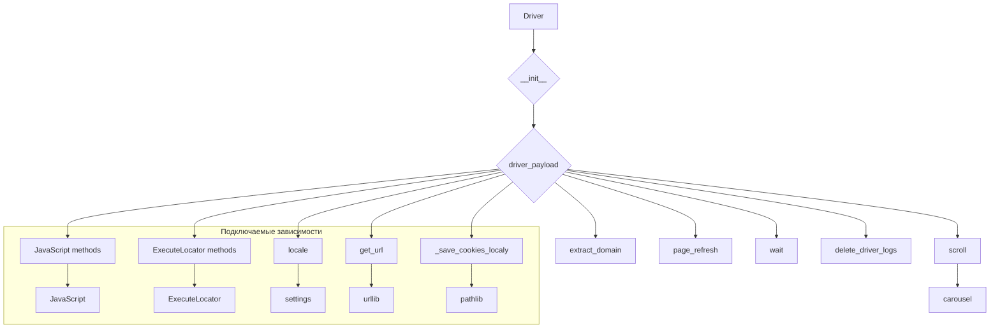

# Анализ кода драйвера веб-драйвера

## <input code>

```
src.webdriver.driver
├── Imports
│   ├── sys
│   ├── pickle
│   ├── time
│   ├── copy
│   ├── pathlib.Path
│   ├── typing (Type)
│   ├── urllib.parse
│   ├── selenium.webdriver.common.action_chains.ActionChains
│   ├── selenium.webdriver.common.keys.Keys
│   ├── selenium.webdriver.common.by.By
│   ├── selenium.webdriver.support.expected_conditions as EC
│   ├── selenium.webdriver.support.ui.WebDriverWait
│   ├── selenium.webdriver.remote.webelement.WebElement
│   ├── selenium.common.exceptions
│   │   ├── InvalidArgumentException
│   │   ├── ElementClickInterceptedException
│   │   ├── ElementNotInteractableException
│   │   ├── ElementNotVisibleException
│   ├── src.settings.gs
│   ├── src.webdriver.executor.ExecuteLocator
│   ├── src.webdriver.javascript.js.JavaScript
│   ├── src.utils.pprint
│   ├── src.logger.logger
│   ├── src.exceptions.WebDriverException
├── DriverBase
│   ├── Attributes
│   │   ├── previous_url: str
│   │   ├── referrer: str
│   │   ├── page_lang: str
│   │   ├── ready_state
│   │   ├── get_page_lang
│   │   ├── unhide_DOM_element
│   │   ├── get_referrer
│   │   ├── window_focus
│   │   ├── execute_locator
│   │   ├── click
│   │   ├── get_webelement_as_screenshot
│   │   ├── get_attribute_by_locator
│   │   ├── send_message
│   │   ├── send_key_to_webelement
│   ├── Methods
│   │   ├── driver_payload(self)
│   │   │   ├── JavaScript methods
│   │   │   ├── ExecuteLocator methods
│   │   ├── scroll(self, scrolls: int, frame_size: int, direction: str, delay: float) -> None | bool
│   │   │   ├── carousel(direction: str, scrolls: int, frame_size: int, delay: float) -> bool
│   │   ├── locale(self) -> None | str
│   │   ├── get_url(self, url: str) -> bool
│   │   ├── extract_domain(self, url: str) -> str
│   │   ├── _save_cookies_localy(self, to_file: str | Path) -> bool
│   │   ├── page_refresh(self) -> bool
│   │   ├── window_focus(self)
│   │   ├── wait(self, interval: float)
│   │   ├── delete_driver_logs(self) -> bool
├── DriverMeta
│   ├── Methods
│   │   ├── __call__(cls, webdriver_cls, *args, **kwargs)
│   │   │   ├── Driver class
│   │   │   │   ├── __init__(self, *args, **kwargs)
│   │   │   │   ├── driver_payload()
└── Driver(metaclass=DriverMeta)
    ├── Usage Example
    │   ├── from src.webdriver.driver import Driver, Chrome, Firefox, Edge
    │   ├── d = Driver(Chrome)
```

## <algorithm>

(Блок-схема показывается в формате Mermaid в следующем разделе)

## <mermaid>



**Описание подключенных зависимостей:**

* `JavaScript`, `ExecuteLocator` - собственные модули проекта, реализующие соответствующие функциональности.
* `settings` - модуль настроек проекта, скорее всего, содержит конфигурационные параметры.
* `urllib` - модуль для работы с URL, необходимый для обработки URL.
* `pathlib` - для работы с файлами и путями.

## <explanation>

**Импорты:**

- Импортируются стандартные модули Python (`sys`, `pickle`, `time`, `copy`, `pathlib`, `typing`, `urllib.parse`).
- Импортируются необходимые классы и модули из `selenium` для работы с веб-драйвером.
- Импортируются классы из собственных модулей: `src.settings.gs`, `src.webdriver.executor.ExecuteLocator`, `src.webdriver.javascript.js`, `src.utils.pprint`, `src.logger.logger`, `src.exceptions.WebDriverException`.  Эти импорты показывают, что проект имеет модули, которые реализуют функциональность, связанную с настройками, исполнением локализации, логированием и обработкой исключений.

**Классы:**

- `DriverBase`: Базовый класс, определяющий атрибуты и методы, общие для всех драйверов.  `previous_url`, `referrer`, `page_lang` - это данные, связанные с текущей страницей. Методы `scroll`, `carousel`, `locale`, `get_url` - реализуют основные функциональные возможности работы с веб-страницей.
- `DriverMeta`:  Метакласс, используемый для динамического создания различных типов драйверов (Chrome, Firefox, Edge).
- `Driver`: Класс, реализующий интерфейс для взаимодействия с веб-драйвером.  Он использует `DriverMeta` для создания конкретных типов драйверов.

**Функции:**

- Методы `driver_payload`, `scroll`, `carousel`, `locale`, `get_url`, `extract_domain`, `_save_cookies_localy`, `page_refresh`, `window_focus`, `wait`, `delete_driver_logs` -  эти функции определяют функциональность работы с веб-драйвером, обработку различных действий на веб-страницах и работу с локальными файлами (cookies).

**Переменные:**

- `previous_url`, `referrer`, `page_lang`, `ready_state` - это данные, содержащие информацию о текущей веб-странице и состоянии работы драйвера.


**Возможные ошибки и улучшения:**

- Отсутствие явного описания обработки исключений.  Можно улучшить обработку исключений, используя `try...except` блоки для обработки возможных ошибок.
- Неясно, как реализован `DriverMeta`. Необходимо уточнить механизм работы `__call__` и создание конкретных типов драйверов.
- Не хватает документации для каждого метода и атрибута.  Необходимо добавить подробные пояснения к методам и атрибутам, чтобы помочь в понимании их назначения и использования.
- Отсутствие информации о параметрах `scrolls`, `frame_size`, `direction` и `delay` для метода `scroll` и `carousel`.

**Взаимосвязи с другими частями проекта:**

- Классы `JavaScript`, `ExecuteLocator` связаны напрямую с основным классом `DriverBase`. Это указывает, что они предоставляют функциональность, необходимую для работы с веб-страницей.  Связь с `settings` также важна.
- Все импорты из `src.*` подчёркивают модульность проекта и его структурирование.


**Общий вывод:**

Код, описывающий базовый класс веб-драйвера, написан на Python. Он использует selenium для работы с веб-драйверами.  Проект имеет структурированную архитектуру, где классы и методы отвечают за определенные аспекты взаимодействия с веб-страницей.  Однако для полного понимания и использования кода необходимы дополнительные пояснения, документация и обработка исключений.