## АНАЛИЗ КОДА: `src.webdriver.driver`

### 1. <алгоритм>
   
   **Блок-схема работы `src.webdriver.driver`:**

   ```mermaid
   graph LR
       A[Начало: Инициализация драйвера] --> B{Driver(webdriver_cls)};
       B -- Вызов __call__ из DriverMeta --> C[Создание экземпляра класса драйвера (webdriver_cls)];
       C --> D{Вызов __init__ драйвера};
       D --> E[Инициализация атрибутов DriverBase];
       E --> F{Вызов driver_payload()};
       F --> G[Инициализация методов JavaScript и ExecuteLocator];
       G --> H[Драйвер готов к использованию];
       H --> I{Вызов методов DriverBase: get_url, scroll, click...};
        I --> J{Выполнение действий через драйвер};
        J --> K[Конец];
   
       subgraph DriverMeta
          C 
       end
       subgraph DriverBase
          D
          E
          F
          G
          I
       end
       subgraph Driver
          B
          H
       end
   ```

**Примеры:**
   *   **Инициализация драйвера**: `d = Driver(Chrome)` - создает экземпляр драйвера Chrome.
   *  **Вызов `__call__`**: Метод `__call__` класса `DriverMeta`  создает экземпляр конкретного драйвера (Chrome, Firefox, Edge).
   *   **Инициализация `DriverBase`**: Конструктор `__init__` класса `DriverBase` инициализирует общие атрибуты и методы для всех драйверов.
   *   **Использование методов `DriverBase`**: Например, `d.get_url("https://example.com")`, `d.scroll(10, 100, "down", 0.1)`, `d.click("locator")`.
   *   **Вызов `driver_payload()`**: Инициализирует методы `JavaScript` и `ExecuteLocator`, обеспечивая возможность выполнять JS и поиск элементов.

```mermaid
    flowchart TD
        A[<code>driver.py</code><br>Driver] --> B(DriverMeta);
        B --> C[<code>webdriver_cls</code><br>Chrome, Firefox, Edge];
        C --> D(DriverBase);
        D --> E[<code>src.webdriver.executor.ExecuteLocator</code>];
        D --> F[<code>src.webdriver.javascript.js.JavaScript</code>];
        D --> G[<code>src.settings.gs</code><br>Global Settings];
        G --> H[<code>src.logger.logger</code><br>Logging];
        D --> I[<code>src.exceptions.WebDriverException</code><br>Custom Exceptions];
        D --> J[<code>selenium</code><br>WebDriver API];
        J --> K[<code>selenium.webdriver.common.action_chains.ActionChains</code>];
        J --> L[<code>selenium.webdriver.common.keys.Keys</code>];
        J --> M[<code>selenium.webdriver.common.by.By</code>];
        J --> N[<code>selenium.webdriver.support.expected_conditions as EC</code>];
        J --> O[<code>selenium.webdriver.support.ui.WebDriverWait</code>];
        J --> P[<code>selenium.webdriver.remote.webelement.WebElement</code>];
        J --> Q[<code>selenium.common.exceptions</code><br>WebDriver Exceptions];
        Q --> R[<code>selenium.common.exceptions.InvalidArgumentException</code>];
        Q --> S[<code>selenium.common.exceptions.ElementClickInterceptedException</code>];
        Q --> T[<code>selenium.common.exceptions.ElementNotInteractableException</code>];
        Q --> U[<code>selenium.common.exceptions.ElementNotVisibleException</code>];
        A --> V[<code>sys</code><br>System Functions];
        A --> W[<code>pickle</code><br>Object Serialization];
        A --> X[<code>time</code><br>Time Functions];
        A --> Y[<code>copy</code><br>Copy Functions];
        A --> Z[<code>pathlib.Path</code><br>Path Manipulation];
        A --> AA[<code>typing.Type</code><br>Type Hints];
        A --> AB[<code>urllib.parse</code><br>URL Parsing];
        A --> AC[<code>src.utils.pprint</code><br>Pretty Printing];

    
    style A fill:#f9f,stroke:#333,stroke-width:2px
    style B fill:#ccf,stroke:#333,stroke-width:2px
    style C fill:#afa,stroke:#333,stroke-width:2px
    style D fill:#ccf,stroke:#333,stroke-width:2px
```

### 2. <mermaid>



### 3. <объяснение>

**Импорты:**

*   `sys`: Для доступа к системным функциям.
*   `pickle`: Для сериализации и десериализации объектов (например, для сохранения куки).
*   `time`: Для работы с временными задержками и таймерами.
*   `copy`: Для создания копий объектов.
*   `pathlib.Path`: Для работы с файловыми путями.
*   `typing.Type`: Для аннотации типов.
*   `urllib.parse`: Для работы с URL.
*   `selenium.webdriver.common.action_chains.ActionChains`: Для имитации сложных взаимодействий с элементами (например, drag-and-drop).
*   `selenium.webdriver.common.keys.Keys`: Для отправки специальных клавиш (например, Enter, Esc).
*   `selenium.webdriver.common.by.By`: Для определения способов поиска элементов.
*   `selenium.webdriver.support.expected_conditions as EC`: Набор предопределенных условий для ожидания элементов.
*   `selenium.webdriver.support.ui.WebDriverWait`: Для ожидания выполнения условий в течение определенного времени.
*   `selenium.webdriver.remote.webelement.WebElement`: Для представления веб-элементов.
*  `selenium.common.exceptions.*`: Для обработки исключений, возникающих при работе с Selenium.
*   `src.settings.gs`: Глобальные настройки проекта.
*   `src.webdriver.executor.ExecuteLocator`: Класс для поиска элементов через локаторы.
*   `src.webdriver.javascript.js.JavaScript`: Класс для выполнения JavaScript.
*   `src.utils.pprint`: Для "красивого" вывода данных.
*   `src.logger.logger`: Для логирования событий.
*   `src.exceptions.WebDriverException`: Пользовательское исключение для обработки ошибок веб-драйвера.
   
**Классы:**
   
*   **`DriverBase`**:
    *   **Роль:** Базовый класс для всех драйверов, содержащий общие методы и атрибуты.
    *   **Атрибуты:**
        *   `previous_url`: Предыдущий URL.
        *   `referrer`: Реферер текущей страницы.
        *   `page_lang`: Язык текущей страницы.
        *   `ready_state`: Готовность страницы.
       *     Методы для работы с DOM, отправки сообщений, действий над веб-элементами.
       
   *   **Методы**:
        *   `driver_payload(self)`: Загружает в драйвер методы JavaScript и `ExecuteLocator`.
        *  `scroll(self, scrolls: int, frame_size: int, direction: str, delay: float)`: Скроллит страницу в указанном направлении.
        *   `locale(self)`: Возвращает локаль страницы.
        *   `get_url(self, url: str)`: Загружает указанный URL.
        *   `extract_domain(self, url: str)`: Извлекает домен из URL.
        *    `_save_cookies_localy(self, to_file: str | Path)`: Сохраняет куки в файл.
        *   `page_refresh(self)`: Обновляет страницу.
        *   `window_focus(self)`: Переключает фокус на окно.
        *   `wait(self, interval: float)`: Ожидает в течение заданного времени.
        *   `delete_driver_logs(self)`: Удаляет логи драйвера.
*   **`DriverMeta`**:
    *   **Роль:** Метакласс, управляющий созданием экземпляров драйверов.
    *   **Методы:**
        *   `__call__(cls, webdriver_cls, *args, **kwargs)`: Метод, вызываемый при создании объекта класса `Driver`. Создаёт экземпляр драйвера, инициализирует его и возвращает объект.
*   **`Driver`**:
    *   **Роль:** Класс-обертка для драйвера, использует `DriverMeta` для создания экземпляров.
    *   **Наследование:** Использует `metaclass=DriverMeta`.

**Функции:**

*   Большая часть логики находится внутри методов классов `DriverBase` и `DriverMeta`.

**Переменные:**
   *   `webdriver_cls`: Класс конкретного драйвера (`Chrome`, `Firefox`, `Edge`).
   *   `url`, `scrolls`, `frame_size`, `direction`, `delay`, `locator`: Переменные, используемые в качестве аргументов методов класса `DriverBase`.
   *   `interval`: Переменная для указания интервала задержки в методе `wait`.
    * `to_file`: Переменная для указания пути к файлу для сохранения cookies.
   
**Взаимосвязи с другими частями проекта:**

*   **`src.settings.gs`**: Используется для получения глобальных настроек, необходимых для работы драйвера.
*   **`src.webdriver.executor.ExecuteLocator`**: Отвечает за поиск веб-элементов на странице, что является ключевой частью взаимодействия с веб-страницей.
*   **`src.webdriver.javascript.js.JavaScript`**: Позволяет выполнять JS на странице, расширяя функциональность драйвера.
*   **`src.logger.logger`**: Используется для логирования событий, что важно для отладки и контроля работы драйвера.
*   **`src.exceptions.WebDriverException`**: Пользовательское исключение, позволяющее более гибко обрабатывать ошибки веб-драйвера.

**Потенциальные ошибки и области для улучшения:**

*   Необходимо добавить обработку ошибок в методы класса `DriverBase`.
*   Необходимо добавить возможность управления временем ожидания, перед выполнением операций с элементами.
*   Возможность более гибкого управления  параметрами скроллинга.

Этот анализ предоставляет подробное представление о структуре и функциональности кода `src.webdriver.driver`.