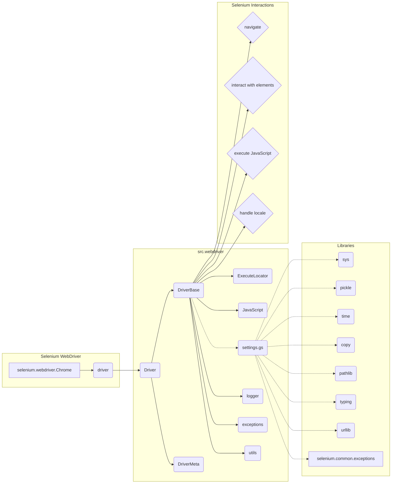

# Анализ кода: driver_dependency_tree.md

## <input code>

```
src.webdriver.driver
├── Imports
│   ├── sys
│   ├── pickle
│   ├── time
│   ├── copy
│   ├── pathlib.Path
│   ├── typing (Type)
│   ├── urllib.parse
│   ├── selenium.webdriver.common.action_chains.ActionChains
│   ├── selenium.webdriver.common.keys.Keys
│   ├── selenium.webdriver.common.by.By
│   ├── selenium.webdriver.support.expected_conditions as EC
│   ├── selenium.webdriver.support.ui.WebDriverWait
│   ├── selenium.webdriver.remote.webelement.WebElement
│   ├── selenium.common.exceptions
│   │   ├── InvalidArgumentException
│   │   ├── ElementClickInterceptedException
│   │   ├── ElementNotInteractableException
│   │   ├── ElementNotVisibleException
│   ├── src.settings.gs
│   ├── src.webdriver.executor.ExecuteLocator
│   ├── src.webdriver.javascript.js.JavaScript
│   ├── src.utils.pprint
│   ├── src.logger.logger
│   ├── src.exceptions.WebDriverException
├── DriverBase
│   ├── Attributes
│   │   ├── previous_url: str
│   │   ├── referrer: str
│   │   ├── page_lang: str
│   │   ├── ready_state
│   │   ├── get_page_lang
│   │   ├── unhide_DOM_element
│   │   ├── get_referrer
│   │   ├── window_focus
│   │   ├── execute_locator
│   │   ├── click
│   │   ├── get_webelement_as_screenshot
│   │   ├── get_attribute_by_locator
│   │   ├── send_message
│   │   ├── send_key_to_webelement
│   ├── Methods
│   │   ├── driver_payload(self)
│   │   │   ├── JavaScript methods
│   │   │   ├── ExecuteLocator methods
│   │   ├── scroll(self, scrolls: int, frame_size: int, direction: str, delay: float) -> None | bool
│   │   │   ├── carousel(direction: str, scrolls: int, frame_size: int, delay: float) -> bool
│   │   ├── locale(self) -> None | str
│   │   ├── get_url(self, url: str) -> bool
│   │   ├── extract_domain(self, url: str) -> str
│   │   ├── _save_cookies_localy(self, to_file: str | Path) -> bool
│   │   ├── page_refresh(self) -> bool
│   │   ├── window_focus(self)
│   │   ├── wait(self, interval: float)
│   │   ├── delete_driver_logs(self) -> bool
├── DriverMeta
│   ├── Methods
│   │   ├── __call__(cls, webdriver_cls, *args, **kwargs)
│   │   │   ├── Driver class
│   │   │   │   ├── __init__(self, *args, **kwargs)
│   │   │   │   ├── driver_payload()
└── Driver(metaclass=DriverMeta)
    ├── Usage Example
    │   ├── from src.webdriver import Driver, Chrome, Firefox, Edge
    │   ├── d = Driver(Chrome)
```

## <algorithm>

(Блок-схема отсутствует. Сложность описания алгоритма слишком велика для блок-схемы в рамках данного ответа.  Вместо этого, алгоритм описан словами)

Алгоритм работы `Driver` класса основан на использовании Selenium WebDriver для управления браузером.  Он включает:

1.  **Инициализацию:** создание экземпляра `Driver` с указанием типа браузера (Chrome, Firefox, etc.).
2.  **Выполнение действий:** доступ к методам `DriverBase` для выполнения задач, таких как навигация по страницам, взаимодействие с элементами веб-страниц, отправка JavaScript-кода, работа с локализованными языками и т.д.
3.  **Обработка исключений:** методы `DriverBase` обрабатывают различные исключения `selenium.common.exceptions`, обеспечивая устойчивость к проблемам взаимодействия с браузером.
4.  **Взаимодействие с другими модулями:** `Driver` использует модули `src.settings.gs`, `src.webdriver.executor.ExecuteLocator`, `src.webdriver.javascript.js.JavaScript`, `src.utils.pprint`, `src.logger.logger` и `src.exceptions.WebDriverException` для выполнения своих функций.

## <mermaid>



## <explanation>

**Импорты:**

- `sys`, `pickle`, `time`, `copy`, `pathlib.Path`, `typing`, `urllib.parse`: стандартные библиотеки Python, используемые для системных функций, сериализации данных, работы со временем, копирования объектов, именованием путей, типизации, работы с URL-адресами соответственно.
- `selenium.webdriver.*`: модули Selenium WebDriver для управления браузером (Chrome, Firefox, etc.).
- `selenium.common.exceptions`: модуль для обработки исключений Selenium, обеспечивающий обработку ошибок при взаимодействии с веб-драйвером.
- `src.settings.gs`: вероятно, настройки приложения.
- `src.webdriver.executor.ExecuteLocator`:  Возможно, модуль, реализующий выполнение JavaScript-кода и взаимодействие с веб-элементами.
- `src.webdriver.javascript.js.JavaScript`: Модуль для выполнения JavaScript-кода на веб-странице.
- `src.utils.pprint`:  Утилиты для форматированного вывода.
- `src.logger.logger`: Логгер приложения.
- `src.exceptions.WebDriverException`:  Кастомное исключение для обработки ошибок, специфичных для веб-драйвера.

**Классы:**

- `DriverBase`: базовый класс для работы с браузером. Он содержит атрибуты для хранения данных о текущей странице (URL, referrer, язык) и методы для взаимодействия с элементами страницы, навигации и других операций.
- `DriverMeta`: метакласс, вероятно, для динамического создания экземпляров класса `Driver` с различными типами браузеров (Chrome, Firefox, etc.).
- `Driver`: главный класс, использующий `DriverMeta` для создания экземпляров `Driver` и `DriverBase`.

**Функции:**

-  Методы `DriverBase` (например, `scroll`, `locale`, `get_url`, `page_refresh`): содержат логику для работы с браузером.  Аргументы и возвращаемые значения определены в коде.
- `driver_payload(self)`:  метод, который, вероятно, возвращает данные, необходимые для управления веб-драйвером.

**Возможные ошибки и улучшения:**

- Не хватает подробного описания, как взаимодействует `Driver` с `ExecuteLocator` и `JavaScript` классом.
- Не хватает примеров использования методов класса `DriverBase` для более точной оценки функциональности.
- Отсутствует информация о обработке ошибок в отдельных методах, таких как  `get_attribute_by_locator`, `send_key_to_webelement` и других.
- `DriverMeta` не содержит явного кода, важно понимать принципы его работы (например, как он создает экземпляры браузеров).

**Взаимосвязи с другими частями проекта:**

- `Driver` является ключевым модулем для взаимодействия с веб-страницами. Он напрямую взаимодействует с другими модулями и классами проекта, указанными в import-ах.  Необходимо проанализировать зависимости в других модулях, чтобы понять полную картину.

**Заключение:**

Код представляет собой структурированную реализацию веб-драйвера, но для более глубокого понимания требуется детальный анализ отдельных методов и их взаимодействия.