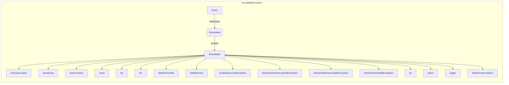

## Анализ кода `src.webdriver.driver`

### <алгоритм>

1. **Импорт библиотек:**
   - Импортируются необходимые библиотеки: `sys`, `pickle`, `time`, `copy`, `pathlib.Path`, `typing.Type`, `urllib.parse`, `selenium` (для работы с веб-драйверами), `src.settings.gs`, `src.webdriver.executor.ExecuteLocator`, `src.webdriver.javascript.js.JavaScript`, `src.utils.pprint`, `src.logger.logger`, `src.exceptions.WebDriverException`.
   *   *Пример*: `import time` - для временных задержек, `from selenium.webdriver.common.by import By` - для поиска элементов по селекторам.
2.  **Класс `DriverBase`**:
    -   Представляет собой базовый класс для всех драйверов.
    -   **Атрибуты**:
        -   `previous_url`: хранит предыдущий URL.
        -   `referrer`: хранит referrer.
        -  `page_lang`: хранит язык страницы.
        -   `ready_state`: Состояние готовности страницы.
        -   `execute_locator`: экземпляр `src.webdriver.executor.ExecuteLocator` для выполнения поиска элементов.
    -   **Методы**:
        -   `driver_payload(self)`: Метод, который вероятно, используется для возвращения словаря с настройками для драйвера, и использует методы из `JavaScript` и `ExecuteLocator`.
        -   `scroll(self, scrolls: int, frame_size: int, direction: str, delay: float) -> None | bool`: Метод для прокрутки страницы, в котором вызывается метод `carousel`
        -   `carousel(direction: str, scrolls: int, frame_size: int, delay: float) -> bool`: Метод для прокрутки карусели.
        -   `locale(self) -> None | str`: Метод для определения локали страницы.
        -   `get_url(self, url: str) -> bool`: Метод для открытия URL в браузере.
        -   `extract_domain(self, url: str) -> str`: Метод для извлечения домена из URL.
        -   `_save_cookies_localy(self, to_file: str | Path) -> bool`: Метод для сохранения куки в файл.
        -   `page_refresh(self) -> bool`: Метод для обновления текущей страницы.
        -  `window_focus(self)`: Метод для фокуса на текущем окне браузера.
        -   `wait(self, interval: float)`: Метод для задержки выполнения.
        -   `delete_driver_logs(self) -> bool`: Метод для удаления логов драйвера.
         -    `get_page_lang(self)`: Метод для получения языка страницы.
         -    `unhide_DOM_element(self, locator: tuple, wait_time: int)`: Метод для отображения скрытого DOM-элемента.
         -    `get_referrer(self)`: Метод для получения referrer.
         -   `click(self, locator: tuple, wait_time: int)`: Метод для клика по элементу, найденному по локатору.
         -   `get_webelement_as_screenshot(self, locator: tuple)`: Метод для получения скриншота элемента.
         -   `get_attribute_by_locator(self, locator: tuple, attribute: str)`: Метод для получения атрибута элемента.
         -   `send_message(self, locator: tuple, text: str, clear: bool = True, wait_time: int = 1)`: Метод для отправки текста в элемент.
         -   `send_key_to_webelement(self, locator: tuple, key: str, wait_time: int = 1)`: Метод для отправки клавиши в элемент.
        *   *Пример*: `driver = DriverBase(); driver.get_url("https://www.example.com")` - откроет страницу в браузере.
3.  **Класс `DriverMeta`**:
    -   Является метаклассом для `Driver`, управляет созданием экземпляров драйверов.
    -   **Методы**:
        -   `__call__(cls, webdriver_cls, *args, **kwargs)`:  Метод, который вызывается при создании экземпляра `Driver`. Он создает экземпляр конкретного драйвера (например, `Chrome`, `Firefox`, `Edge`), инициализирует его и возвращает.
        *   *Пример*: `d = Driver(Chrome)` вызывает метод `__call__` в `DriverMeta`, который в свою очередь инициализирует `Chrome` драйвер.
4.  **Класс `Driver`**:
    -   Основной класс для работы с веб-драйверами, использует метакласс `DriverMeta`.
    -   Не содержит собственных методов или атрибутов, но наследует поведение метакласса `DriverMeta`.
    -   **Пример использования**:
        -   `from src.webdriver.driver import Driver, Chrome, Firefox, Edge`: Импорт класса Driver и конкретных драйверов.
        -   `d = Driver(Chrome)`: Создание экземпляра `Chrome` драйвера через класс `Driver`.
5. **Цепочка взаимосвязей**:
   - `Driver` использует `DriverMeta` для создания экземпляров драйверов.
   -  `DriverBase` предоставляет базовую функциональность для всех драйверов.
   - `DriverBase` использует `ExecuteLocator` для поиска элементов на странице.
   - `DriverBase` использует `JavaScript` для выполнения JavaScript на странице.
   - Все классы драйверов (Chrome, Firefox, Edge) наследуются от `DriverBase`.

### <mermaid>

**Зависимости `mermaid`:**

-   **`Driver`**: Основной класс для работы с веб-драйверами.
-   **`DriverMeta`**: Метакласс для `Driver`, управляет созданием экземпляров драйверов.
-  **`DriverBase`**: Базовый класс, предоставляющий общую функциональность для всех драйверов.
-    **`ExecuteLocator`**:  Используется для поиска элементов на веб-странице.
-   **`JavaScript`**: Используется для выполнения JavaScript на веб-странице.
-   **`ActionChains`**: Используется для выполнения сложных действий пользователя (например, drag-and-drop).
-   **`Keys`**: Используется для отправки специальных клавиш.
-   **`By`**: Используется для выбора элементов по различным локаторам (ID, class, xpath, css).
-    **`EC`**:  Используется для установки ожиданий в WebDriverWait.
-    **`WebDriverWait`**:  Используется для ожидания загрузки элемента.
-    **`WebElement`**:  Используется для взаимодействия с элементами на странице.
-   **`InvalidArgumentException`**:  Исключение, которое выбрасывается при некорректных аргументах.
-  **`ElementClickInterceptedException`**:  Исключение, которое выбрасывается, когда клику мешает другой элемент.
-    **`ElementNotInteractableException`**: Исключение, которое выбрасывается, когда с элементом нельзя взаимодействовать.
-   **`ElementNotVisibleException`**: Исключение, которое выбрасывается, когда элемент не виден.
-    **`gs`**: Используется для получения глобальных настроек.
-    **`pprint`**: Используется для удобного вывода данных.
-    **`logger`**: Используется для логирования.
-  **`WebDriverException`**: Используется для обработки исключений WebDriver.

### <объяснение>

**Импорты:**

-   `sys`: Для доступа к параметрам среды выполнения и функциям.
-   `pickle`: Для сериализации и десериализации объектов Python, используется для работы с куки.
-   `time`: Для работы со временем, используется для задержек.
-   `copy`: Для создания копий объектов.
-   `pathlib.Path`: Для работы с путями к файлам и директориям.
-   `typing.Type`: Для аннотации типов.
-   `urllib.parse`: Для работы с URL.
-   `selenium.webdriver.common.action_chains.ActionChains`: Для выполнения сложных действий пользователя.
-   `selenium.webdriver.common.keys.Keys`: Для отправки специальных клавиш.
-   `selenium.webdriver.common.by.By`: Для поиска элементов по локаторам.
-  `selenium.webdriver.support.expected_conditions as EC`: Для определения условий ожидания.
-   `selenium.webdriver.support.ui.WebDriverWait`: Для ожидания загрузки элементов.
-   `selenium.webdriver.remote.webelement.WebElement`: Для представления элементов на странице.
-   `selenium.common.exceptions`: Набор исключений, связанных с работой Selenium.
  -   `InvalidArgumentException`: Исключение, выбрасываемое при некорректных аргументах.
   -   `ElementClickInterceptedException`: Исключение, выбрасываемое при попытке клика на элемент, перекрытый другим.
   -   `ElementNotInteractableException`: Исключение, выбрасываемое при попытке взаимодействия с неинтерактивным элементом.
   -   `ElementNotVisibleException`: Исключение, выбрасываемое при попытке взаимодействия с невидимым элементом.
-   `src.settings.gs`: Глобальные настройки проекта.
-   `src.webdriver.executor.ExecuteLocator`: Для поиска элементов на странице.
-   `src.webdriver.javascript.js.JavaScript`: Для выполнения JavaScript кода на странице.
-   `src.utils.pprint`: Для красивого вывода данных.
-   `src.logger.logger`: Для логирования событий.
-  `src.exceptions.WebDriverException`: Пользовательское исключение для WebDriver.

**Классы:**

-   **`DriverBase`**:
    -   **Роль**: Базовый класс для всех драйверов.
    -   **Атрибуты**:
        -   `previous_url`: Сохраняет предыдущий URL для отслеживания навигации.
        -   `referrer`: Сохраняет referrer для отслеживания источника запроса.
        -   `page_lang`: Сохраняет язык текущей страницы.
        -   `ready_state`: Текущее состояние загрузки страницы.
        -   `execute_locator`: Объект `ExecuteLocator`, используемый для поиска элементов.
    -   **Методы**:
        -   `driver_payload`: Возвращает словарь с данными драйвера.
        -   `scroll`: Прокручивает страницу на заданное количество прокруток.
        -   `carousel`: Прокручивает карусель на странице.
        -    `locale`: Получает или устанавливает локаль страницы.
        -   `get_url`: Загружает страницу по заданному URL.
        -   `extract_domain`: Извлекает домен из URL.
        -   `_save_cookies_localy`: Сохраняет куки в файл.
        -   `page_refresh`: Обновляет текущую страницу.
         -  `window_focus`: Устанавливает фокус на окно.
        -   `wait`: Пауза выполнения на заданный интервал.
        -   `delete_driver_logs`: Удаляет логи драйвера.
         -    `get_page_lang`: Получает язык страницы.
         -    `unhide_DOM_element`: Делает скрытый элемент DOM видимым.
         -    `get_referrer`: Получает referrer.
         -   `click`: Кликает по элементу.
         -   `get_webelement_as_screenshot`: Получает скриншот элемента.
         -    `get_attribute_by_locator`: Получает атрибут элемента.
         -    `send_message`: Отправляет сообщение в элемент.
         -    `send_key_to_webelement`: Отправляет клавишу в элемент.
-  **`DriverMeta`**:
    -   **Роль**: Метакласс для управления созданием экземпляров драйверов.
    -   **Методы**:
        -   `__call__`: Создает и инициализирует экземпляр конкретного драйвера.
-   **`Driver`**:
    -   **Роль**: Класс для работы с веб-драйверами.
    -   Использует метакласс `DriverMeta` для создания экземпляров драйверов (Chrome, Firefox, Edge).

**Функции:**

-   В данном фрагменте кода функции явно не указаны, но используются методы классов.

**Переменные:**

-   `previous_url`: Тип `str`, хранит URL предыдущей страницы.
-   `referrer`: Тип `str`, хранит referrer.
-   `page_lang`: Тип `str`, хранит язык текущей страницы.
-   `ready_state`: Тип не указан, хранит состояние загрузки страницы.
- `args`, `kwargs`:  Используются для передачи аргументов в методы.
- `webdriver_cls`:  Класс драйвера (Chrome, Firefox, Edge)
-  `locator`: Тип `tuple`, для хранения локатора элемента.
-  `wait_time`: Тип `int`, для указания времени ожидания.
- `attribute`: Тип `str`, для указания названия атрибута элемента.
- `text`: Тип `str`, для указания текста для отправки в элемент.
- `clear`: Тип `bool`, для указания необходимости очистки поля перед отправкой текста.
- `key`: Тип `str`, для указания отправляемой клавиши.

**Потенциальные ошибки и области для улучшения:**

-   Не хватает документации для каждого метода.
-   Не все переменные имеют аннотацию типов.
-   Можно добавить проверку типов для входящих аргументов.
-   В коде отсутствует явная обработка исключений `try...except`
-   Логирование можно сделать более гибким.

**Цепочка взаимосвязей с другими частями проекта:**

-   Использует `src.settings.gs` для получения настроек.
-   Использует `src.webdriver.executor.ExecuteLocator` для поиска элементов.
-   Использует `src.webdriver.javascript.js.JavaScript` для выполнения JavaScript кода.
-   Использует `src.utils.pprint` для вывода данных.
-   Использует `src.logger.logger` для логирования.
-   Использует `src.exceptions.WebDriverException` для пользовательских исключений.