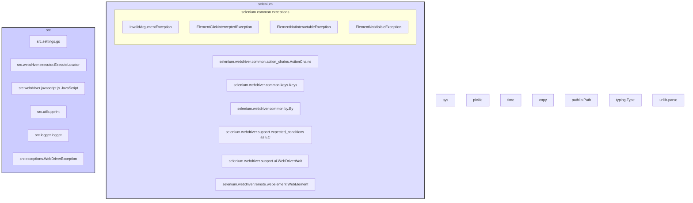

## ИНСТРУКЦИЯ:

Анализируй предоставленный код подробно и объясни его функциональность. Ответ должен включать три раздела:  

1. **<алгоритм>**: Опиши рабочий процесс в виде пошаговой блок-схемы, включая примеры для каждого логического блока, и проиллюстрируй поток данных между функциями, классами или методами.  
2. **<mermaid>**: Напиши код для диаграммы в формате `mermaid`, проанализируй и объясни все зависимости, 
    которые импортируются при создании диаграммы. 
    **ВАЖНО!** Убедитесь, что все имена переменных, используемые в диаграмме `mermaid`, 
    имеют осмысленные и описательные имена. Имена переменных вроде `A`, `B`, `C`, и т.д., не допускаются!  
    
    **Дополнительно**: Если в коде есть импорт `import header`, добавьте блок `mermaid` flowchart, объясняющий `header.py`:\
    ```mermaid
    flowchart TD
        Start --> Header[<code>header.py</code><br> Determine Project Root]
    
        Header --> import[Import Global Settings: <br><code>from src import gs</code>] 
    ```

3. **<объяснение>**: Предоставьте подробные объяснения:  
   - **Импорты**: Их назначение и взаимосвязь с другими пакетами `src.`.  
   - **Классы**: Их роль, атрибуты, методы и взаимодействие с другими компонентами проекта.  
   - **Функции**: Их аргументы, возвращаемые значения, назначение и примеры.  
   - **Переменные**: Их типы и использование.  
   - Выделите потенциальные ошибки или области для улучшения.  

Дополнительно, постройте цепочку взаимосвязей с другими частями проекта (если применимо).  

Это обеспечивает всесторонний и структурированный анализ кода.
## Формат ответа: `.md` (markdown)
**КОНЕЦ ИНСТРУКЦИИ**
```markdown
## <алгоритм>

```mermaid
graph LR
    A[Start] --> B(Driver Initialization);
    B --> C{DriverMeta.__call__};
    C -->|First call| D(Create Driver Class Instance);
    D --> E(Driver.__init__);
    E --> F(DriverBase.__init__);
    F --> G(Initialize attributes);
    G --> H{Call driver_payload()};
    H --> I(JavaScript.driver_payload() and ExecuteLocator.driver_payload());
    I --> J(Return driver instance);
    J --> K(Usage example using Driver instance)
    K --> L(Call Driver methods e.g., get_url, click, etc)
    L --> M[End];
     
    subgraph Driver Creation
    C
    D
    E
    F
    G
    H
    I
    J
    end
    
    style B fill:#f9f,stroke:#333,stroke-width:2px
    style K fill:#ccf,stroke:#333,stroke-width:2px
```

1.  **Начало:** Процесс начинается с создания экземпляра класса `Driver`. Например, `d = Driver(Chrome)`.
2.  **Инициализация Драйвера:** Вызывается `DriverMeta.__call__`, который отвечает за создание и инициализацию нужного драйвера (например, `Chrome`).
3.  **Создание Экземпляра Драйвера:** Внутри `DriverMeta.__call__` создается экземпляр класса драйвера (например, `Chrome`), который был передан в качестве параметра.
4.  **Конструктор Драйвера:** Вызывается конструктор `__init__` класса драйвера. В процессе инициализации:
    *   Вызывается конструктор `__init__` базового класса `DriverBase`.
    *   Инициализируются атрибуты драйвера, такие как `previous_url`, `referrer`, `page_lang` и т.д.
    *   Вызывается метод `driver_payload` для инициализации JavaScript и ExecuteLocator.
5.  **Вызов `driver_payload()`:** Метод `driver_payload` вызывает методы `driver_payload` классов JavaScript и ExecuteLocator для настройки нужных параметров.
6.  **Использование Драйвера:**  После инициализации, созданный экземпляр драйвера (`d`) можно использовать для выполнения различных действий, таких как переход по URL (`get_url`), клик по элементам (`click`), и т.д.
7.  **Завершение:**  Процесс завершается после выполнения необходимых действий.

## <mermaid>



**Объяснение `mermaid`:**

Диаграмма показывает зависимости, импортируемые в файле `src/webdriver/driver.py`  (неявно из структуры markdown).
-   **`selenium`**: Все блоки, сгруппированные в `selenium`, относятся к библиотеке Selenium, используемой для автоматизации веб-браузеров. `ActionChains` позволяет выполнять сложные последовательности действий, `Keys` содержит коды клавиш клавиатуры, `By` используется для выбора элементов, `EC` (Expected Conditions) и `WebDriverWait` используются для ожидания определенных условий на веб-странице, `WebElement` представляет элемент на странице, а `selenium.common.exceptions` - это исключения, которые могут возникнуть при взаимодействии с Selenium.
-   **`src`**:  Блоки, сгруппированные в `src`, представляют собой пользовательские модули из проекта, в том числе `src.settings.gs` -глобальные настройки, `src.webdriver.executor.ExecuteLocator` - класс для выполнения поиска элементов, `src.webdriver.javascript.js.JavaScript` - класс для выполнения JavaScript кода, `src.utils.pprint` - для "красивого" вывода, `src.logger.logger` - для логирования и `src.exceptions.WebDriverException` - для обработки пользовательских исключений.
-   **`sys`**: Модуль `sys` предоставляет доступ к некоторым переменным и функциям, связанным с интерпретатором Python.
-   **`pickle`**: Модуль `pickle` используется для сериализации и десериализации объектов Python.
-   **`time`**: Модуль `time` предоставляет функции для работы со временем.
-   **`copy`**: Модуль `copy` используется для создания копий объектов.
-   **`pathlib.Path`**: Класс `Path` из модуля `pathlib` используется для работы с путями к файлам и каталогам.
-   **`typing.Type`**:  Используется для аннотаций типов в Python.
-   **`urllib.parse`**: Модуль `urllib.parse` используется для разбора URL-адресов.

## <объяснение>

**Импорты:**

*   `sys`: Используется для доступа к системным переменным и функциям, например, для изменения пути поиска модулей (не явно в этом markdown).
*   `pickle`: Используется для сохранения и загрузки состояния драйвера (например, куки) в файл.
*   `time`: Используется для реализации задержек (например, ожидание загрузки страницы).
*   `copy`: Используется для создания копий объектов.
*   `pathlib.Path`: Используется для работы с путями файлов.
*  `typing.Type`:  Используется для аннотаций типов, что улучшает читаемость и поддержку кода.
*   `urllib.parse`: Используется для разбора и работы с URL-адресами, например, для извлечения домена.
*   `selenium.webdriver.common.action_chains.ActionChains`: Позволяет выполнять сложные последовательности действий пользователя (например, drag-and-drop).
*   `selenium.webdriver.common.keys.Keys`: Позволяет отправлять нажатия клавиш (например, Enter, Tab) веб-элементам.
*   `selenium.webdriver.common.by.By`: Используется для определения способов поиска веб-элементов (например, по ID, CSS-селектору).
*   `selenium.webdriver.support.expected_conditions as EC`: Используется для задания ожидаемых условий при взаимодействии с элементами.
*   `selenium.webdriver.support.ui.WebDriverWait`: Используется для ожидания выполнения определенных условий.
*   `selenium.webdriver.remote.webelement.WebElement`:  Представляет веб-элемент на странице.
*   `selenium.common.exceptions`: Набор исключений, возникающих при использовании Selenium:
    *   `InvalidArgumentException`: Исключение, возникающее при использовании неверных аргументов.
    *   `ElementClickInterceptedException`: Исключение, возникающее, когда клик по элементу перехвачен другим элементом.
    *   `ElementNotInteractableException`: Исключение, возникающее, когда элемент не может быть использован для действий.
    *  `ElementNotVisibleException`: Исключение, возникающее, когда элемент не виден на странице.
*   `src.settings.gs`: Модуль глобальных настроек проекта, которые используются для конфигурации WebDriver.
*   `src.webdriver.executor.ExecuteLocator`: Класс, отвечающий за поиск веб-элементов.
*   `src.webdriver.javascript.js.JavaScript`: Класс для выполнения JavaScript-кода на веб-странице.
*   `src.utils.pprint`:  Функция для "красивого" форматированного вывода данных.
*  `src.logger.logger`: Модуль для логирования событий и ошибок.
* `src.exceptions.WebDriverException`: Пользовательское исключение для ошибок, связанных с WebDriver.

**Классы:**

*   **`DriverBase`**: Базовый класс для всех драйверов, содержащий общую логику:
    *   **Атрибуты**:
        *   `previous_url`:  Хранит URL предыдущей страницы.
        *   `referrer`:  Хранит HTTP Referrer текущей страницы.
        *   `page_lang`: Язык текущей страницы.
        *   `ready_state`: Состояние готовности DOM.
        *   методы `get_page_lang`, `unhide_DOM_element`, `get_referrer`, `window_focus`, `execute_locator`, `click`, `get_webelement_as_screenshot`, `get_attribute_by_locator`, `send_message`, `send_key_to_webelement` реализуют базовую функциональность управления браузером и элементами.
    *   **Методы**:
        *   `driver_payload(self)`: Метод,  который  инициализирует JavaScript и ExecuteLocator, предоставляя нужные методы  для их использования.
        *  `scroll(self, scrolls: int, frame_size: int, direction: str, delay: float) -> None | bool`:  Метод прокрутки страницы.
        *   `carousel(direction: str, scrolls: int, frame_size: int, delay: float) -> bool`: Метод для прокрутки карусели.
        *   `locale(self) -> None | str`: Определяет локализацию страницы.
        *   `get_url(self, url: str) -> bool`: Загружает веб-страницу по заданному URL.
        *   `extract_domain(self, url: str) -> str`: Извлекает домен из URL.
        *   `_save_cookies_localy(self, to_file: str | Path) -> bool`: Сохраняет куки браузера в локальный файл.
        *   `page_refresh(self) -> bool`: Обновляет текущую страницу.
        *   `window_focus(self)`: Фокусирует окно браузера.
        *   `wait(self, interval: float)`: Приостанавливает выполнение на заданный интервал.
        *   `delete_driver_logs(self) -> bool`: Удаляет логи драйвера.
*   **`DriverMeta`**: Метакласс для `Driver`:
    *   **Методы**:
        *   `__call__(cls, webdriver_cls, *args, **kwargs)`: Метод, который отвечает за создание экземпляра драйвера. Он вызывает конструктор класса драйвера (`__init__`), а также `driver_payload`, чтобы инициализировать методы JavaScript и ExecuteLocator.
*   **`Driver`**: Класс драйвера (наследуется от `DriverBase`),  использующий `DriverMeta` как метакласс:
    *   Используется для создания экземпляров драйвера.

**Функции:**

Большинство функций в `DriverBase` являются методами, выполняющими действия в браузере, такие как скроллинг, навигация, получение информации о странице, и взаимодействие с элементами.  `driver_payload()` инициализирует JavaScript и ExecuteLocator, методы для удобного доступа к их функциональности.

**Переменные:**

*   Переменные, используемые в классах, описаны в разделе **Классы**.
*   Переменные, которые передаются в функции в качестве аргументов, описаны в разделе **Функции**.

**Пример использования:**
```python
from src.webdriver.driver import Driver, Chrome, Firefox, Edge

d = Driver(Chrome)
d.get_url("https://example.com")
element = d.execute_locator(By.ID, "myElement")
d.click(element)
```

**Цепочка взаимосвязей:**

1.  **Импорт `src.settings.gs`**: Позволяет классу драйвера получать глобальные настройки.
2.  **Импорт `src.webdriver.executor.ExecuteLocator`**: Используется `DriverBase` для выполнения поиска элементов на странице.
3.  **Импорт `src.webdriver.javascript.js.JavaScript`**: Используется `DriverBase` для выполнения JavaScript-кода.
4.  **Импорт `src.utils.pprint`**: Используется для отладки, для более удобного вывода данных.
5.  **Импорт `src.logger.logger`**:  Используется для логирования событий и ошибок, возникающих во время работы.
6.  **Импорт `src.exceptions.WebDriverException`**: Используется для обработки пользовательских исключений.
7.  **Импорт `selenium`**:  Используется для управления браузером.

**Потенциальные ошибки и области для улучшения:**

1.  **Обработка исключений:**  Необходимо добавить более подробную обработку исключений в методах `DriverBase`, особенно при работе с Selenium, чтобы обеспечить стабильность и надежность.
2.  **Логирование:** Улучшить логирование действий драйвера для упрощения отладки.
3.  **Архитектура**: Проверить и возможно упростить архитектуру, разделив базовый класс DriverBase от Driver, возможно, не стоит использовать metaclass, если можно обойтись без него.
4.  **Расширяемость:**  Рассмотреть возможность дальнейшего расширения функциональности (например, поддержка различных API для тестов).
5.  **Повторное использование кода:** Проверить код на предмет повторного использования в разных методах и вынести повторения в отдельные функции.

В целом, код представляет собой хороший фундамент для создания драйвера WebDriver, но требует доработки в плане надежности, обработки исключений и расширяемости.
```