## Анализ кода `driver_exmples.md`

### 1. <алгоритм>

**Описание рабочего процесса:**

1.  **Инициализация:**
    *   Импортируются необходимые модули: `Driver`, `Chrome` из `src.webdriver.driver`, и `By` из `selenium.webdriver.common.by`.
    *   В функции `main` создается экземпляр `Driver` с использованием `Chrome`, что инициирует браузер Chrome.
2.  **Навигация и основные операции:**
    *   Метод `get_url` загружает указанный URL (`https://www.example.com`). Проверяется успешность навигации.
    *   Метод `extract_domain` извлекает домен из заданного URL.
    *   Метод `_save_cookies_localy` сохраняет текущие cookies браузера в локальный файл.
    *   Метод `page_refresh` обновляет текущую страницу.
    *   Метод `scroll` прокручивает страницу вниз на заданное количество шагов, с определенным размером кадра и задержкой.
    *   Атрибут `locale` возвращает язык текущей страницы.
3.  **Использование кастомного User-Agent:**
    *   Создается новый экземпляр `Driver` с `Chrome` и пользовательским `user-agent`.
    *   Загружается URL с новым User-Agent.
4.  **Поиск элементов и взаимодействие:**
    *   Метод `find_element` ищет на странице элемент по CSS-селектору `h1`. Выводится текст найденного элемента.
    *   Атрибут `current_url` возвращает URL текущей страницы.
    *   Метод `window_focus` фокусирует окно браузера.

**Блок-схема:**

```mermaid
graph LR
    A[Начало: Импорт модулей] --> B(Создание экземпляра Driver с Chrome);
    B --> C{Навигация: chrome_driver.get_url};
    C -- Успешно --> D(Вывод сообщения об успешной навигации);
    C -- Не успешно --> E(Обработка ошибки);
    D --> F(Извлечение домена: chrome_driver.extract_domain);
    F --> G(Сохранение cookies: chrome_driver._save_cookies_localy);
    G --> H{Обновление страницы: chrome_driver.page_refresh};
    H -- Успешно --> I(Вывод сообщения об обновлении);
    H -- Не успешно --> J(Обработка ошибки);
     I --> K{Прокрутка страницы: chrome_driver.scroll};
    K -- Успешно --> L(Вывод сообщения о прокрутке);
    K -- Не успешно --> M(Обработка ошибки);
    L --> N(Получение языка: chrome_driver.locale);
    N --> O(Создание Driver с кастомным User-Agent);
    O --> P{Навигация с User-Agent: custom_chrome_driver.get_url};
     P -- Успешно --> Q(Вывод сообщения об успешной навигации с User-Agent);
    P -- Не успешно --> R(Обработка ошибки);
    Q --> S(Поиск элемента: chrome_driver.find_element);
     S --> T{Элемент найден?};
    T -- Да --> U(Вывод текста элемента);
     T -- Нет --> V(Обработка ошибки);
    U --> W(Получение текущего URL: chrome_driver.current_url);
    W --> X(Фокусировка окна: chrome_driver.window_focus);
    X --> Y[Конец];

    style A fill:#f9f,stroke:#333,stroke-width:2px
     style Y fill:#ccf,stroke:#333,stroke-width:2px
```



**Примеры для каждого блока:**

*   **Инициализация:**
    ```python
    from src.webdriver.driver import Driver, Chrome
    from selenium.webdriver.common.by import By

    chrome_driver = Driver(Chrome)
    ```
*   **Навигация:**
    ```python
    chrome_driver.get_url("https://www.example.com")
    ```
*   **Извлечение домена:**
    ```python
     domain = chrome_driver.extract_domain("https://www.example.com/path/to/page")
    ```
*    **Сохранение cookies:**
     ```python
    chrome_driver._save_cookies_localy()
     ```
*   **Обновление страницы:**
    ```python
    chrome_driver.page_refresh()
    ```
*   **Прокрутка страницы:**
    ```python
    chrome_driver.scroll(scrolls=3, direction='forward', frame_size=1000, delay=1)
    ```
*    **Получение языка:**
    ```python
    page_language = chrome_driver.locale
    ```
*   **Использование кастомного User-Agent:**
    ```python
    user_agent = {
        'user-agent': 'Mozilla/5.0 (Windows NT 10.0; Win64; x64) AppleWebKit/537.36 (KHTML, like Gecko) Chrome/100.0.4896.127 Safari/537.36'
    }
    custom_chrome_driver = Driver(Chrome, user_agent=user_agent)
    ```
*   **Поиск элемента:**
    ```python
    element = chrome_driver.find_element(By.CSS_SELECTOR, 'h1')
    ```
*   **Получение текущего URL:**
    ```python
    current_url = chrome_driver.current_url
    ```
*   **Фокусировка окна:**
    ```python
    chrome_driver.window_focus()
    ```

### 2. <mermaid>

```mermaid
graph LR
    A[Driver] --> B(Chrome);
    B --> C(webdriver.Chrome);
    A --> D(get_url(url:str));
    A --> E(extract_domain(url:str));
     A --> F(_save_cookies_localy());
    A --> G(page_refresh());
    A --> H(scroll(scrolls:int, direction:str, frame_size:int, delay:int));
    A --> I(locale);
    A --> J(find_element(by:By, value:str));
    A --> K(current_url);
    A --> L(window_focus());
    style A fill:#f9f,stroke:#333,stroke-width:2px
    style C fill:#ccf,stroke:#333,stroke-width:2px

```

**Анализ зависимостей:**

*   `Driver` зависит от `Chrome`: Класс `Driver` инициализируется с экземпляром класса `Chrome`, который предоставляет конкретную реализацию браузера.
*  `Chrome` зависит от `webdriver.Chrome`: Класс `Chrome` использует функциональность из `selenium.webdriver.chrome.webdriver.WebDriver` для управления браузером.
*   `Driver` предоставляет методы: `get_url`, `extract_domain`, `_save_cookies_localy`, `page_refresh`, `scroll`, `find_element`, `window_focus`.  Атрибут `locale` и `current_url`.
*   `selenium.webdriver.common.by`:  Используется для определения стратегии поиска элементов на странице (например, `By.CSS_SELECTOR`).

### 3. <объяснение>

**Импорты:**

*   `from src.webdriver.driver import Driver, Chrome`:
    *   Импортирует классы `Driver` и `Chrome` из модуля `driver.py`, находящегося в директории `src/webdriver`. Это основные классы, которые обеспечивают функциональность управления браузером.
    *   `Driver` - это абстракция над конкретным браузером, обеспечивает методы для навигации, взаимодействия с элементами и управления браузером.
    *   `Chrome` - конкретная реализация `Driver` для браузера Google Chrome.
*   `from selenium.webdriver.common.by import By`:
    *   Импортирует класс `By` из библиотеки `selenium`.
    *   `By` - это перечисление, которое используется для определения стратегии поиска элементов на веб-странице (например, по ID, CSS-селектору, XPath и т.д.).

**Классы:**

*   `Driver`:
    *   **Роль:** Абстрактный класс, предоставляет интерфейс для управления веб-браузером.
    *   **Атрибуты:**
        *   `driver` (тип: `selenium.webdriver.Chrome`): Экземпляр веб-драйвера.
    *   **Методы:**
        *   `__init__(self, browser_cls, user_agent=None)`: Конструктор, инициализирует драйвер браузера. Принимает класс браузера (`Chrome`, `Firefox` и т.д.) и опциональный словарь `user_agent`.
        *   `get_url(self, url)`: Открывает страницу по указанному URL. Возвращает `True` в случае успеха, `False` в случае неудачи.
        *   `extract_domain(self, url)`: Извлекает домен из заданного URL.
        *   `_save_cookies_localy(self)`: Сохраняет текущие cookies в локальный файл.
        *   `page_refresh(self)`: Обновляет текущую страницу. Возвращает `True` при успехе.
        *   `scroll(self, scrolls=1, direction='forward', frame_size=1000, delay=1)`: Прокручивает страницу.
        *  `find_element(self, by, value)`: Находит элемент на странице по заданной стратегии и значению. Возвращает экземпляр веб-элемента или `None`, если элемент не найден.
         *   `window_focus(self)`: Фокусирует окно браузера.
        *   `locale` (свойство): Возвращает язык текущей страницы.
        *    `current_url` (свойство): Возвращает URL текущей страницы.
*   `Chrome`:
    *   **Роль:** Конкретная реализация `Driver` для браузера Chrome.
    *   **Атрибуты:** Нет явных атрибутов, но использует унаследованные атрибуты и методы из класса `Driver`.
    *   **Методы:** `__init__` вызывает `super().__init__` с параметрами для запуска `selenium.webdriver.Chrome`, также может принимать `user_agent`.
  *  Интеракция: Класс `Chrome` использует `selenium.webdriver.Chrome` для управления экземпляром Chrome, таким образом класс `Driver` выступает в роли фасада, предоставляет методы, которые используют возможности `selenium`.

**Функции:**

*   `main()`:
    *   **Роль:** Главная функция для демонстрации примеров использования классов `Driver` и `Chrome`.
    *   **Аргументы:** Нет аргументов.
    *   **Возвращаемое значение:** Ничего не возвращает.
    *   **Назначение:** Выполняет последовательность действий: создание драйвера, навигация по URL, извлечение домена, сохранение куки, обновление страницы, прокрутка, установка пользовательского агента, поиск элемента и получение текущего URL.

**Переменные:**

*   `chrome_driver`: Экземпляр класса `Driver`, использующий браузер Chrome.
*   `domain`: Строка, содержащая извлеченный домен из URL.
*   `success`: Булево значение, указывающее на успешное выполнение операции.
*   `page_language`: Строка, содержащая язык текущей страницы.
*   `user_agent`: Словарь, содержащий пользовательский агент для браузера.
*   `custom_chrome_driver`: Экземпляр класса `Driver` с кастомным User-Agent.
*   `element`: Экземпляр класса `selenium.webdriver.remote.webelement.WebElement`, представляющий найденный HTML-элемент.
*   `current_url`: Строка, содержащая URL текущей страницы.

**Потенциальные ошибки и области для улучшения:**

*   **Обработка ошибок:** В коде присутствуют проверки на успешность операций (`if success:` , `if chrome_driver.get_url(...)`) но нет явной обработки ошибок (например, с помощью `try-except`).  Необходимо добавить обработку исключений для корректной работы программы.
*   **Зависимости:** Необходимо убедиться, что все зависимости (`selenium`, `fake_useragent`, и др.) установлены.
*   **Путь к файлам:** Путь к файлам и другим ресурсам должен быть определен в `gs` (global settings). Это делает код более гибким.
*   **Абстракция `Driver`:** Возможно, стоит добавить еще один уровень абстракции, чтобы скрыть детали `selenium` от остальной части проекта.
*   **Логирование:** Добавление логирования может помочь отслеживать работу приложения и выявлять проблемы.

**Взаимосвязь с другими частями проекта:**

*   Этот код использует классы `Driver` и `Chrome`, которые являются частью модуля `src.webdriver.driver`.
*   Он также использует `selenium` для управления веб-браузером.
*  Файлы конфигурации и настройки должны быть доступны в gs (global settings).

Этот файл служит примером использования основных функций для управления браузером. Он демонстрирует, как использовать `Driver` и `Chrome` для выполнения различных задач, таких как навигация, взаимодействие с элементами и извлечение данных.  Необходимо усовершенствовать обработку ошибок и сделать код более устойчивым.