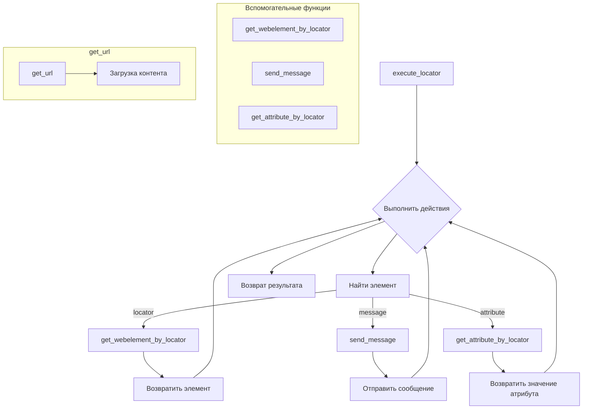

```MD
# <input code>

```python
подробные описания для каждой функции модуля `executor`:\n\n### 1. `execute_locator`\n```python\ndef execute_locator(locator: dict, message: str = \'\', typing_speed: float = 0.0, continue_on_error: bool = True) -> any:\n    """ Executes actions on a web element based on the provided locator.\n\n    @param locator: A dictionary or object containing locator information (e.g., type, selector).\n    @param message: Optional message to send to the web element (e.g., text to enter).\n    @param typing_speed: Speed of typing when sending a message (in seconds between keystrokes).\n    @param continue_on_error: Flag indicating whether to continue execution if an error occurs.\n    \n    @return: The result of the locator execution, which could be the web element, a list of elements, an attribute value, or action result.\n    """\n    ...\n```\n- **Назначение**: Выполняет действия на веб-элементе, используя указанный локатор.\n- **Параметры**:\n  - `locator`: Словарь или объект с информацией о локаторе (например, тип поиска и селектор).\n  - `message`: Сообщение для отправки элементу (например, текст для ввода).\n  - `typing_speed`: Скорость набора текста, если отправляется сообщение.\n  - `continue_on_error`: Флаг для продолжения выполнения в случае ошибки.\n- **Возвращаемое значение**: Результат выполнения локатора, который может быть веб-элементом, списком элементов, значением атрибута или результатом действия.\n\n### 2. `get_webelement_by_locator`\n```python\ndef get_webelement_by_locator(locator: dict) -> any:\n    """ Finds and returns a web element based on the provided locator.\n\n    @param locator: A dictionary or object containing locator information (e.g., type, selector).\n    \n    @return: The found web element or a list of elements, depending on the locator\'s specification.\n    """\n    ...\n```\n- **Назначение**: Находит и возвращает веб-элемент(ы) на странице, используя локатор.\n- **Параметры**:\n  - `locator`: Словарь или объект с информацией о локаторе.\n- **Возвращаемое значение**: Один или несколько веб-элементов, найденных по локатору.\n\n### 3. `get_attribute_by_locator`\n```python\ndef get_attribute_by_locator(locator: dict, message: str = \'\') -> any:\n    """ Retrieves the attribute value of a web element identified by the locator.\n\n    @param locator: A dictionary or object containing locator information (e.g., type, selector).\n    @param message: Optional message to send to the web element (e.g., text to enter before retrieving attribute).\n    \n    @return: The value of the attribute of the found web element, or None if an error occurs.\n    """\n    ...\n```\n- **Назначение**: Получает значение атрибута веб-элемента, найденного по локатору.\n- **Параметры**:\n  - `locator`: Словарь или объект с информацией о локаторе.\n  - `message`: Сообщение для отправки элементу перед получением атрибута (необязательно).\n- **Возвращаемое значение**: Значение атрибута веб-элемента.\n\n### 4. `send_message`\n```python\ndef send_message(locator: dict, message: str, typing_speed: float = 0.0, continue_on_error: bool = True) -> bool:\n    """ Sends a message (e.g., text) to a web element identified by the locator.\n\n    @param locator: A dictionary or object containing locator information (e.g., type, selector).\n    @param message: The message to send to the web element.\n    @param typing_speed: Speed of typing when sending the message (in seconds between keystrokes).\n    @param continue_on_error: Flag indicating whether to continue execution if an error occurs.\n    \n    @return: True if the message is sent successfully, otherwise False.\n    """\n    ...\n```\n- **Назначение**: Отправляет сообщение (например, текст) веб-элементу, используя локатор.\n- **Параметры**:\n  - `locator`: Словарь или объект с информацией о локаторе.\n  - `message`: Сообщение для отправки элементу.\n  - `typing_speed`: Скорость набора текста, если сообщение отправляется по частям.\n  - `continue_on_error`: Флаг для продолжения выполнения в случае ошибки.\n- **Возвращаемое значение**: `True`, если сообщение успешно отправлено, или `False`, если произошла ошибка.\n\n### 5. `get_url`\n```python\ndef get_url(url: str, protocol: str = \'https://\') -> bool:\n    """ Retrieves HTML content from a specified URL or file path.\n\n    @param url: The URL or file path to fetch the HTML content from.\n    @param protocol: The protocol to use for URL (default is \'https://\').\n    \n    @return: True if the content is successfully fetched, otherwise False.\n    """\n    ...\n```\n- **Назначение**: Загружает HTML-контент с указанного URL-адреса или локального файла.\n- **Параметры**:\n  - `url`: URL-адрес или путь к файлу для получения HTML-контента.\n  - `protocol`: Протокол для URL (по умолчанию `https://`).\n- **Возвращаемое значение**: `True`, если контент успешно загружен, или `False`, если произошла ошибка.
```



# <algorithm>

**execute_locator**:

1. Принимает `locator`, `message`, `typing_speed`, `continue_on_error`.
2. **Найти элемент**: Использует `get_webelement_by_locator` для поиска элемента по локатору.
3. **Отправить сообщение**: Если `message` задано, то использует `send_message` для отправки сообщения элементу.
4. **Получить атрибут**: Если необходимо получить атрибут, то использует `get_attribute_by_locator`.
5. Возвращает результат (`element`, `attribute` или `action result`).


**get_webelement_by_locator**:

1. Принимает `locator`.
2. Находит элемент(ы) на странице по заданному локатору.
3. Возвращает найденный элемент(ы).


**get_attribute_by_locator**:

1. Принимает `locator`, `message`.
2. Ищет элемент по локатору.
3. Извлекает значение атрибута у найденного элемента.
4. Возвращает значение атрибута или `None` при ошибке.


**send_message**:

1. Принимает `locator`, `message`, `typing_speed`, `continue_on_error`.
2. Ищет элемент по локатору.
3. Отправляет `message` элементу с заданной скоростью.
4. Возвращает `True` при успехе, `False` при ошибке.


**get_url**:

1. Принимает `url`, `protocol`.
2. Загружает HTML-контент с указанного `url` или `file path` используя заданный `protocol`.
3. Возвращает `True` в случае успеха, `False` - в случае ошибки.

**Пример (execute_locator):**

`execute_locator({'type': 'id', 'selector': 'myElement'}, 'Hello')`  ищет элемент с id `myElement` и отправляет ему сообщение "Hello".


# <explanation>

**Импорты:**

Код не содержит импортов, но предполагается, что эти функции являются частью модуля `webdriver.executor`, где определяются необходимые для работы функции и методы из других модулей.

**Классы:**

Код не содержит определений классов. Все операции выполняются через функции.

**Функции:**

* **`execute_locator`**:  Выполняет различные действия над веб-элементом, делегируя их другим функциям (`get_webelement_by_locator`, `send_message`, `get_attribute_by_locator`).  Ключевым элементом является `locator`, который определяет, какой элемент обрабатывать.
* **`get_webelement_by_locator`**:  Находит веб-элемент по указанному локатору. Важно, что эта функция должна использовать драйвер Selenium или аналогичный инструмент для работы с браузером.
* **`get_attribute_by_locator`**: Получает значение атрибута конкретного веб-элемента.  `message` здесь используется для предварительного действия над элементом (например, ввод текста), перед чтением атрибута.
* **`send_message`**: Отправляет сообщение (например, ввод текста) на веб-элемент. Параметр `typing_speed` позволяет управлять скоростью ввода.
* **`get_url`**: Загружает контент с URL или файла. Важно, что для загрузки содержимого веб-страницы необходимы соответствующие библиотеки, такие как `requests` или подобные им, работающие с HTTP-запросами.

**Переменные:**

Переменные `locator`, `message`, `typing_speed` и `continue_on_error` используются в качестве параметров функций.

**Возможные ошибки и улучшения:**

* **Обработка ошибок:** Функции `execute_locator`, `send_message`, `get_attribute_by_locator` должны включать обработку исключений (`try...except` блоки).  Например, элемент может не быть найден, или у него может отсутствовать запрашиваемый атрибут.
* **Типизация:** Хотя в коде указаны типы параметров (например, `locator: dict`),  необходимо убедиться в корректности ввода.
* **`typing_speed`:**  Это полезный параметр, но логика его использования должна быть расширена.  Вместо прямого использования `time.sleep`, желательно использовать механизмы для управления задержкой, которые учитывают скорость и возможности драйвера (например, избегать слишком частых запросов к браузеру).
* **Детализация локаторов:** Локатор должен быть описан более подробно (например, в нём должны быть конкретные параметры).
* **Обработка списков элементов:** Функции `get_webelement_by_locator` и `execute_locator` должны уметь обрабатывать случаи, когда по локатору находятся несколько элементов, предоставляя удобный механизм выбора.
* **`get_url`**: Эта функция должна учитывать возможные исключения при загрузке (`requests` или `urllib` модули содержат обработку ошибок, которые необходимо использовать).


**Взаимосвязи с другими частями проекта:**

Данный модуль (`executor`)  предполагает зависимость от драйвера веб-драйвера (Selenium, Playwright, etc.) для взаимодействия с браузером, а также от библиотеки для работы с HTTP-запросами, если `get_url` выполняется удалённо.  Он также зависит от `hypotez/src/...` (предполагая организацию проекта), вероятно от модулей, которые предоставляют необходимые структуры данных (`locator`) и контекст для работы с веб-драйвером.